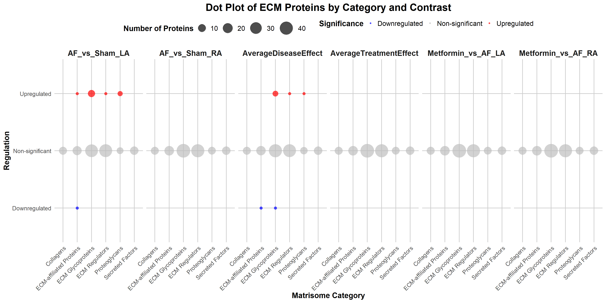
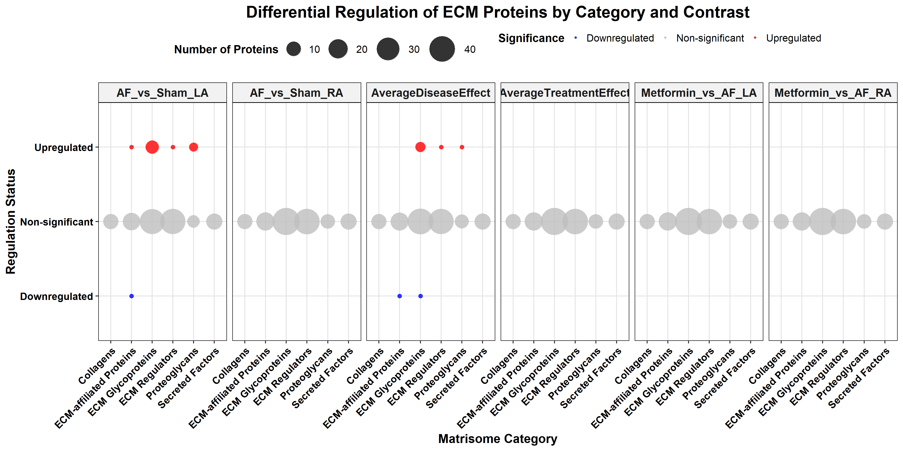
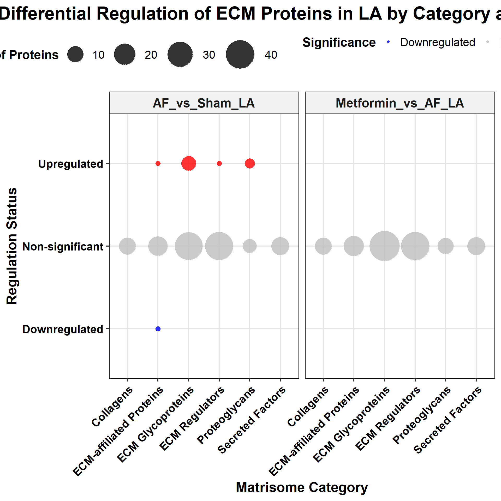
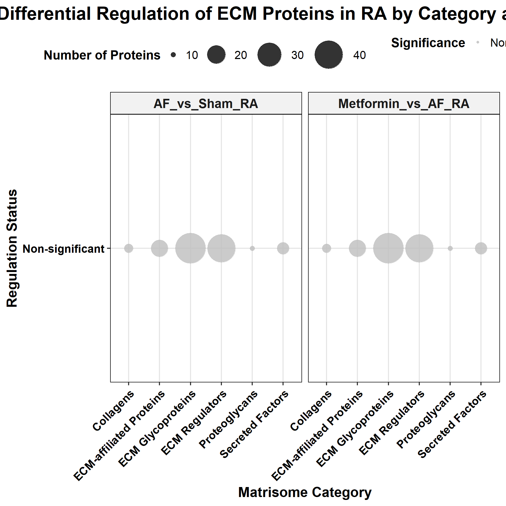
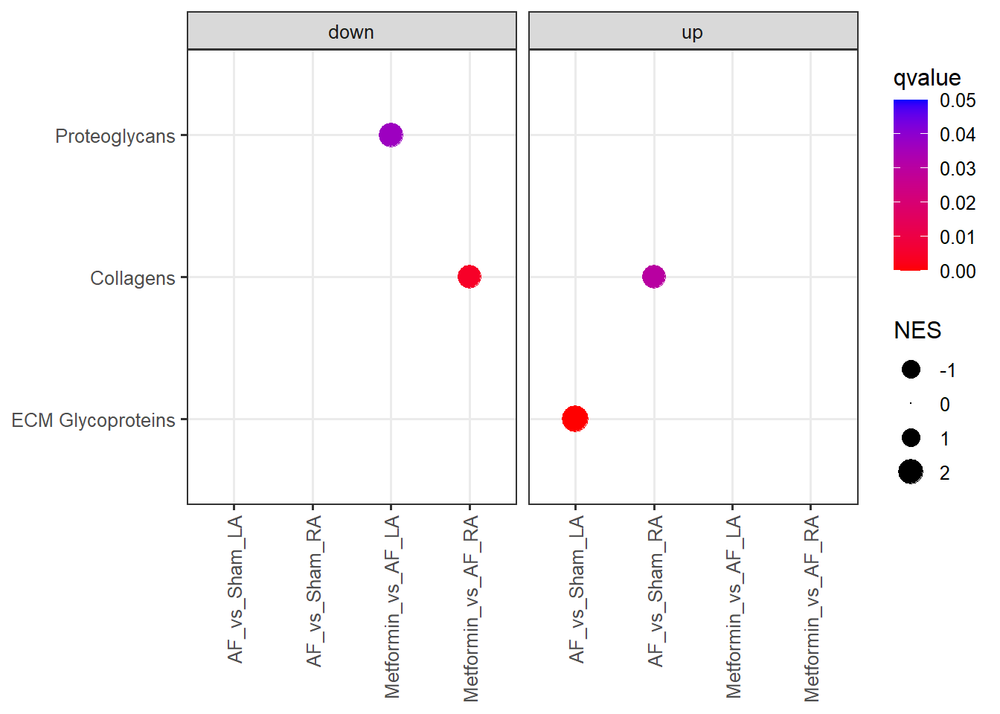
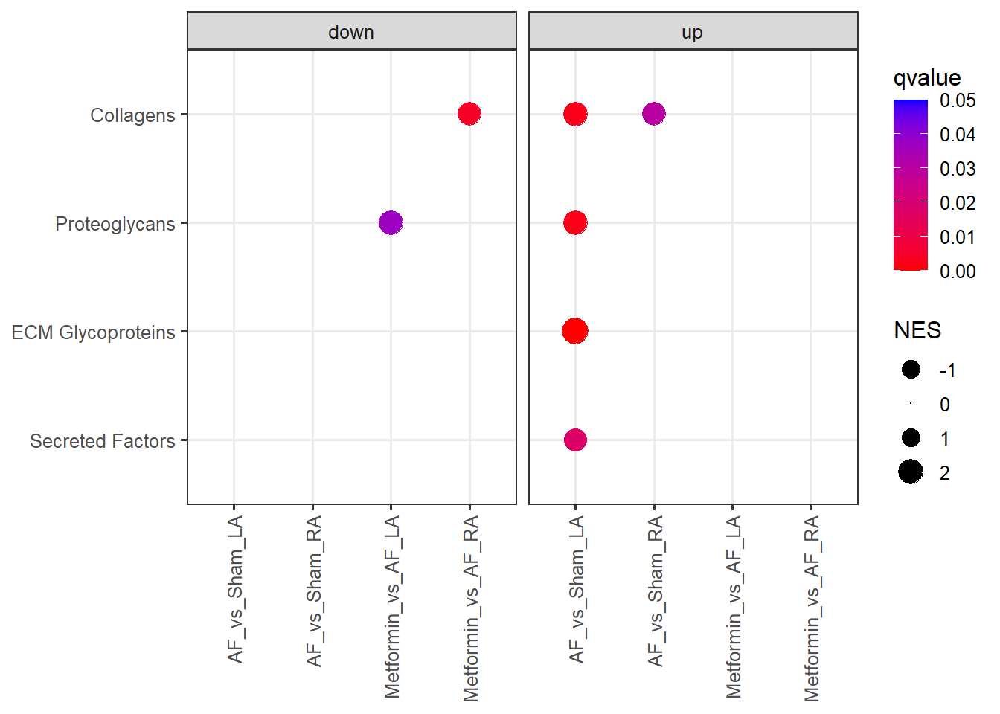

# Required R libraries

``` r
if (!require("pacman")) install.packages("pacman")
```

```
## Indlæser krævet pakke: pacman
```

``` r
pacman::p_load("edgeR")
pacman::p_load("readr")
pacman::p_load("readxl")
pacman::p_load("biomaRt")
pacman::p_load("magrittr")
pacman::p_load("tibble")
pacman::p_load("stringr")
pacman::p_load("ggplot2")
pacman::p_load("data.table")
pacman::p_load("ggplot2", "patchwork")
pacman::p_load("openxlsx")
pacman::p_load("clusterProfiler")
library(dplyr)
```

```
## 
## Vedhæfter pakke: 'dplyr'
```

```
## De følgende objekter er maskerede fra 'package:data.table':
## 
##     between, first, last
```

```
## Det følgende objekt er maskeret fra 'package:biomaRt':
## 
##     select
```

```
## De følgende objekter er maskerede fra 'package:stats':
## 
##     filter, lag
```

```
## De følgende objekter er maskerede fra 'package:base':
## 
##     intersect, setdiff, setequal, union
```

``` r
library(missForest)
library(RColorBrewer)
library(ggplot2)
library(ggpubr)
library(tidyr)
```

```
## 
## Vedhæfter pakke: 'tidyr'
```

```
## Det følgende objekt er maskeret fra 'package:magrittr':
## 
##     extract
```

``` r
library(SummarizedExperiment)
```

```
## Indlæser krævet pakke: MatrixGenerics
```

```
## Indlæser krævet pakke: matrixStats
```

```
## 
## Vedhæfter pakke: 'matrixStats'
```

```
## Det følgende objekt er maskeret fra 'package:dplyr':
## 
##     count
```

```
## 
## Vedhæfter pakke: 'MatrixGenerics'
```

```
## De følgende objekter er maskerede fra 'package:matrixStats':
## 
##     colAlls, colAnyNAs, colAnys, colAvgsPerRowSet, colCollapse,
##     colCounts, colCummaxs, colCummins, colCumprods, colCumsums,
##     colDiffs, colIQRDiffs, colIQRs, colLogSumExps, colMadDiffs,
##     colMads, colMaxs, colMeans2, colMedians, colMins, colOrderStats,
##     colProds, colQuantiles, colRanges, colRanks, colSdDiffs, colSds,
##     colSums2, colTabulates, colVarDiffs, colVars, colWeightedMads,
##     colWeightedMeans, colWeightedMedians, colWeightedSds,
##     colWeightedVars, rowAlls, rowAnyNAs, rowAnys, rowAvgsPerColSet,
##     rowCollapse, rowCounts, rowCummaxs, rowCummins, rowCumprods,
##     rowCumsums, rowDiffs, rowIQRDiffs, rowIQRs, rowLogSumExps,
##     rowMadDiffs, rowMads, rowMaxs, rowMeans2, rowMedians, rowMins,
##     rowOrderStats, rowProds, rowQuantiles, rowRanges, rowRanks,
##     rowSdDiffs, rowSds, rowSums2, rowTabulates, rowVarDiffs, rowVars,
##     rowWeightedMads, rowWeightedMeans, rowWeightedMedians,
##     rowWeightedSds, rowWeightedVars
```

```
## Indlæser krævet pakke: GenomicRanges
```

```
## Indlæser krævet pakke: stats4
```

```
## Indlæser krævet pakke: BiocGenerics
```

```
## 
## Vedhæfter pakke: 'BiocGenerics'
```

```
## De følgende objekter er maskerede fra 'package:dplyr':
## 
##     combine, intersect, setdiff, union
```

```
## Det følgende objekt er maskeret fra 'package:limma':
## 
##     plotMA
```

```
## De følgende objekter er maskerede fra 'package:stats':
## 
##     IQR, mad, sd, var, xtabs
```

```
## De følgende objekter er maskerede fra 'package:base':
## 
##     anyDuplicated, aperm, append, as.data.frame, basename, cbind,
##     colnames, dirname, do.call, duplicated, eval, evalq, Filter, Find,
##     get, grep, grepl, intersect, is.unsorted, lapply, Map, mapply,
##     match, mget, order, paste, pmax, pmax.int, pmin, pmin.int,
##     Position, rank, rbind, Reduce, rownames, sapply, saveRDS, setdiff,
##     table, tapply, union, unique, unsplit, which.max, which.min
```

```
## Indlæser krævet pakke: S4Vectors
```

```
## 
## Vedhæfter pakke: 'S4Vectors'
```

```
## Det følgende objekt er maskeret fra 'package:tidyr':
## 
##     expand
```

```
## De følgende objekter er maskerede fra 'package:dplyr':
## 
##     first, rename
```

```
## Det følgende objekt er maskeret fra 'package:clusterProfiler':
## 
##     rename
```

```
## De følgende objekter er maskerede fra 'package:data.table':
## 
##     first, second
```

```
## Det følgende objekt er maskeret fra 'package:utils':
## 
##     findMatches
```

```
## De følgende objekter er maskerede fra 'package:base':
## 
##     expand.grid, I, unname
```

```
## Indlæser krævet pakke: IRanges
```

```
## 
## Vedhæfter pakke: 'IRanges'
```

```
## De følgende objekter er maskerede fra 'package:dplyr':
## 
##     collapse, desc, slice
```

```
## Det følgende objekt er maskeret fra 'package:clusterProfiler':
## 
##     slice
```

```
## Det følgende objekt er maskeret fra 'package:data.table':
## 
##     shift
```

```
## Det følgende objekt er maskeret fra 'package:grDevices':
## 
##     windows
```

```
## Indlæser krævet pakke: GenomeInfoDb
```

```
## 
## Vedhæfter pakke: 'GenomicRanges'
```

```
## Det følgende objekt er maskeret fra 'package:magrittr':
## 
##     subtract
```

```
## Indlæser krævet pakke: Biobase
```

```
## Welcome to Bioconductor
## 
##     Vignettes contain introductory material; view with
##     'browseVignettes()'. To cite Bioconductor, see
##     'citation("Biobase")', and for packages 'citation("pkgname")'.
```

```
## 
## Vedhæfter pakke: 'Biobase'
```

```
## Det følgende objekt er maskeret fra 'package:MatrixGenerics':
## 
##     rowMedians
```

```
## De følgende objekter er maskerede fra 'package:matrixStats':
## 
##     anyMissing, rowMedians
```

``` r
library(pheatmap)
```

#Read and Convert data

``` r
# Define file paths
matrisome <- "../../../data/gene_annotation/Hs_Matrisome_Masterlist_downloaded_08_09_2024.csv"
dge_file <- "../../01_dge/output/dge_results.tsv.gz"
matrisome <- fread(matrisome)
dge <- fread(dge_file)
dge[, Direction := ifelse(logFC > 0, "up", "down")]


# Subset relevant contrasts and filter by P-value
relevant_contrasts <- c("AF_vs_Sham_RA", "AF_vs_Sham_LA", "Metformin_vs_AF_RA", "Metformin_vs_AF_LA", "AverageTreatmentEffect", "AverageDiseaseEffect")
dge <- dge[Contrast %in% relevant_contrasts]

# Ensure that the Gene Symbol column in matrisome data is clean and consistent
matrisome <- matrisome %>%
  dplyr::rename(GeneSymbol = `Gene Symbol`) %>%  # Rename for consistency
  dplyr::mutate(GeneSymbol = trimws(GeneSymbol))  # Remove any leading/trailing whitespace

# Merge dge with matrisome data to annotate ECM proteins
ecm_dge <- dge %>%
  dplyr::inner_join(matrisome, by = c("GeneName" = "GeneSymbol"))

# Save the annotated ECM data to a CSV file
write.csv(ecm_dge, file = "ECM_Annotated_DGE.csv", row.names = FALSE)
openxlsx::write.xlsx(x = ecm_dge, file = "../../../../Terminal/analysis/04_matrisome/output/ECM_Annotated_DGE.xlsx", asTable = TRUE)

# Subset to include only ECM core matrisome proteins
ecm_core <- ecm_dge %>% 
    dplyr::filter(`Matrisome Division` == "Core matrisome")

# Define significant matrisome genes
significant_matrisome_genes <- ecm_core$GeneName
```
#Overall look at matrisome between groups

```
## `summarise()` has grouped output by 'Matrisome Category', 'Significance'. You
## can override using the `.groups` argument.
```



```
## Significant Upregulated Proteins:
```

```
## # A tibble: 7 × 3
##   Contrast             `Matrisome Category`    Upregulated_Proteins             
##   <chr>                <chr>                   <chr>                            
## 1 AF_vs_Sham_LA        ECM Glycoproteins       LAMA4, SMOC1, LTBP4, MFAP5, TNXB…
## 2 AF_vs_Sham_LA        ECM Regulators          SERPINH1                         
## 3 AF_vs_Sham_LA        ECM-affiliated Proteins ANXA2                            
## 4 AF_vs_Sham_LA        Proteoglycans           OGN, VCAN, LUM                   
## 5 AverageDiseaseEffect ECM Glycoproteins       MFAP5, LAMA4, SMOC1, FBN1        
## 6 AverageDiseaseEffect ECM Regulators          SERPINH1                         
## 7 AverageDiseaseEffect Proteoglycans           VCAN
```

```
## 
## Significant Downregulated Proteins:
```

```
## # A tibble: 3 × 3
##   Contrast             `Matrisome Category`    Downregulated_Proteins
##   <chr>                <chr>                   <chr>                 
## 1 AF_vs_Sham_LA        ECM-affiliated Proteins ANXA6                 
## 2 AverageDiseaseEffect ECM Glycoproteins       THBS4                 
## 3 AverageDiseaseEffect ECM-affiliated Proteins ANXA6
```


#Seperate plots for publication


# Enrichment analysis 

``` r
# Add a new column to categorize upregulated and downregulated genes based on log fold-change (logFC)
dge[, Direction := ifelse(logFC > 0, "up", "down")]

# Read gene annotation data from a specified file path
geneinfo_file <- "../../../data/gene_annotation/horse_gene_annotation.tsv.gz"
geneinfo <- fread(geneinfo_file)

# Set new column names for better clarity
setnames(geneinfo, new = c("ENSEMBL", "ENSEMBLv", "Description_detailed", 
                           "Chr", "Start", "End", "Strand", "GENENAME", "ENTREZID", "Description"))

# Remove unwanted columns and duplicated entries based on ENSEMBL IDs
geneinfo <- geneinfo[, c("ENSEMBLv", "Description_detailed") := NULL]  # Remove columns not needed
geneinfo <- geneinfo[!duplicated(ENSEMBL), ]                           # Retain only unique entries

# Extract gene names (GENENAME) from DGE data, assuming "GeneName" column exists in DGE file
dge[, GENENAME := sub(".*_", "", GeneName)]

# Merge DGE data with gene annotation data based on GENENAME
# The merge is performed to align DGE results with additional annotation information
dge <- merge(dge, geneinfo[, .(ENSEMBL, GENENAME, ENTREZID)], by = "GENENAME", all.x = TRUE)
dge <- dge[!is.na(ENSEMBL), ]

# Reorder columns to prioritize key identifiers (ENSEMBL, GENENAME, ENTREZID)
setcolorder(dge, c("ENSEMBL", "GENENAME", "ENTREZID", setdiff(names(dge), c("ENSEMBL", "GENENAME", "ENTREZID"))))

# Convert ENTREZID column to character for downstream compatibility
dge[, ENTREZID := as.character(ENTREZID)]

# Filter the DGE results for specific relevant contrasts of interest
dge <- dge[Contrast %in% c("AF_vs_Sham_RA", "AF_vs_Sham_LA", 
                           "Metformin_vs_AF_RA", "Metformin_vs_AF_LA", 
                           "AverageTreatmentEffect", "AverageDiseaseEffect")]

# Keep only entries with valid Entrez IDs for enrichment analysis
dge_entrez <- dge[!is.na(ENTREZID),]

# Define statistical cutoffs for differential gene expression and enrichment analysis
dge_cut <- 0.05        # Significance cutoff for differential gene expression (p-value)
enrich_cut <- 0.05     # Significance cutoff for enrichment analysis (q-value)
```

The analysis will be performed according to following statistical cutoffs.

- *Differential gene expression:* p-value < 0.05
- *Enrichment analysis:* adjusted p-value (Q-value) < 0.05

# Matrisome Enrichment

``` r
# Read & Clean Matrisome data
matrisome <- "../../../data/gene_annotation/Hs_Matrisome_Masterlist_downloaded_08_09_2024.csv"
matrisome <- fread(matrisome)
matrisome <- matrisome %>%
  dplyr::rename(GeneSymbol = `Gene Symbol`) %>%  # Rename for consistency
  dplyr::mutate(GeneSymbol = trimws(GeneSymbol))  # Remove any leading/trailing whitespace

# Map GeneSymbol to ENSEMBL using geneinfo
matrisome_ensembl <- merge(matrisome, geneinfo, by.x = "GeneSymbol", by.y = "GENENAME", all.x = TRUE)
matrisome_ensembl <- matrisome_ensembl[!is.na(ENSEMBL)]

# Create TERM2GENE
term2gene_matrisome <- matrisome_ensembl[, .(`Matrisome Category`, ENSEMBL)]

# Initialize matrisome_gsea list
matrisome_gsea <- list()

# Split differential gene expression (DGE) data into separate lists by contrast
dge_split <- split(dge, f = dge$Contrast)

# Loop through DGE contrasts
for (contrast in names(dge_split)) {
    message(paste0("Running GSEA for contrast '", contrast, "'"))

    # Prepare geneList
    geneList <- dge_split[[contrast]]$logFC
    names(geneList) <- dge_split[[contrast]]$ENSEMBL
    geneList <- sort(geneList, decreasing = TRUE)

    # Run GSEA
    gsea_result <- GSEA(
        geneList = geneList, 
        TERM2GENE = term2gene_matrisome, 
        TERM2NAME = NULL,  # Not required since categories are already descriptive
        pvalueCutoff = 0.05,
        minGSSize = 10, 
        maxGSSize = 500, 
        eps = 0, 
        nPermSimple = 10000
    )@result

    # Add metadata and save results
    if (nrow(gsea_result) > 0) {
        gsea_result$Contrast <- contrast
    } else {
        gsea_result <- data.frame(Contrast = character(), Database = character())
    }
    matrisome_gsea[[contrast]] <- gsea_result
}
```

```
## Running GSEA for contrast 'AF_vs_Sham_LA'
```

```
## using 'fgsea' for GSEA analysis, please cite Korotkevich et al (2019).
```

```
## preparing geneSet collections...
```

```
## GSEA analysis...
```

```
## Warning in preparePathwaysAndStats(pathways, stats, minSize, maxSize, gseaParam, : There are ties in the preranked stats (0.66% of the list).
## The order of those tied genes will be arbitrary, which may produce unexpected results.
```

```
## leading edge analysis...
```

```
## done...
```

```
## Running GSEA for contrast 'AF_vs_Sham_RA'
```

```
## using 'fgsea' for GSEA analysis, please cite Korotkevich et al (2019).
```

```
## preparing geneSet collections...
```

```
## GSEA analysis...
```

```
## Warning in preparePathwaysAndStats(pathways, stats, minSize, maxSize, gseaParam, : There are ties in the preranked stats (0.66% of the list).
## The order of those tied genes will be arbitrary, which may produce unexpected results.
```

```
## leading edge analysis...
```

```
## done...
```

```
## Running GSEA for contrast 'AverageDiseaseEffect'
```

```
## using 'fgsea' for GSEA analysis, please cite Korotkevich et al (2019).
```

```
## preparing geneSet collections...
```

```
## GSEA analysis...
```

```
## Warning in preparePathwaysAndStats(pathways, stats, minSize, maxSize, gseaParam, : There are ties in the preranked stats (0.66% of the list).
## The order of those tied genes will be arbitrary, which may produce unexpected results.
```

```
## leading edge analysis...
```

```
## done...
```

```
## Running GSEA for contrast 'AverageTreatmentEffect'
```

```
## using 'fgsea' for GSEA analysis, please cite Korotkevich et al (2019).
```

```
## preparing geneSet collections...
```

```
## GSEA analysis...
```

```
## Warning in preparePathwaysAndStats(pathways, stats, minSize, maxSize, gseaParam, : There are ties in the preranked stats (0.66% of the list).
## The order of those tied genes will be arbitrary, which may produce unexpected results.
```

```
## leading edge analysis...
```

```
## done...
```

```
## Running GSEA for contrast 'Metformin_vs_AF_LA'
```

```
## using 'fgsea' for GSEA analysis, please cite Korotkevich et al (2019).
```

```
## preparing geneSet collections...
```

```
## GSEA analysis...
```

```
## Warning in preparePathwaysAndStats(pathways, stats, minSize, maxSize, gseaParam, : There are ties in the preranked stats (0.66% of the list).
## The order of those tied genes will be arbitrary, which may produce unexpected results.
```

```
## leading edge analysis...
```

```
## done...
```

```
## Running GSEA for contrast 'Metformin_vs_AF_RA'
```

```
## using 'fgsea' for GSEA analysis, please cite Korotkevich et al (2019).
```

```
## preparing geneSet collections...
```

```
## GSEA analysis...
```

```
## Warning in preparePathwaysAndStats(pathways, stats, minSize, maxSize, gseaParam, : There are ties in the preranked stats (0.66% of the list).
## The order of those tied genes will be arbitrary, which may produce unexpected results.
```

```
## leading edge analysis...
```

```
## done...
```

``` r
# Combine all results
matrisome_gsea_res <- do.call(rbind, matrisome_gsea) %>% setDT
matrisome_gsea_res[, direction := ifelse(NES < 0, "down", "up")]

# Split results by contrast
matrisome_gsea_res_split <- split(matrisome_gsea_res, f = matrisome_gsea_res$Contrast)

# Save results
openxlsx::write.xlsx(matrisome_gsea_res_split, file = "../output/matrisome_gsea_results.xlsx", asTable = TRUE)
fwrite(matrisome_gsea_res, file = "../output/matrisome_gsea_results.tsv.gz", sep = "\t")

# Define contrasts for plotting
# Filter the contrasts for the combined plot
selected_contrasts <- c("AF_vs_Sham_RA", "AF_vs_Sham_LA", "Metformin_vs_AF_RA", "Metformin_vs_AF_LA")

# Subset results for selected contrasts
combined_results <- matrisome_gsea_res[Contrast %in% selected_contrasts]

# Plotting function for combined visualization
# Function to plot all contrasts in a single dot plot
plot_combined_dotplot <- function(data_split, contrasts, topn = 10, topn.pref = "qval", qcut = enrich_cut, nchar = 60,
                                  direction = "direction", group = "Contrast", dot = "NES", qval = "qvalue", 
                                  term.id = "ID", term.name = "Description") {
  
  # Combine all selected contrasts into one data.table
  combined_data <- rbindlist(lapply(contrasts, function(contrast) {
    if (contrast %in% names(data_split)) {
      filtered_data <- data_split[[contrast]]
      if (nrow(filtered_data) > 0) {
        # Add the contrast name to the data
        filtered_data[, Contrast := contrast]
        return(filtered_data)
      }
    }
    NULL
  }), use.names = TRUE, fill = TRUE)
  
  # Check if data is available
  if (is.null(combined_data) || nrow(combined_data) == 0) {
    message("No data available for the selected contrasts.")
    return(NULL)
  }
  
  # Filter for top terms per contrast
  top_terms <- combined_data[, .SD[order(get(topn.pref))[1:topn]], by = Contrast]
  
  # Plot using aamisc::dotplotEnrich
  return(aamisc::dotplotEnrich(dt = top_terms, 
                               topn = topn, 
                               topn.pref = topn.pref, 
                               qcut = qcut, 
                               nchar = nchar, 
                               direction = direction, 
                               group = group, 
                               dot = dot, 
                               qval = qval, 
                               term.id = term.id, 
                               term.name = term.name))
  
  
}

# Plot the combined results
plot_combined_dotplot(data_split = matrisome_gsea_res_split, contrasts = selected_contrasts)
```



``` r
# Combine all selected contrasts into one data.table for inspection
combined_data <- rbindlist(lapply(selected_contrasts, function(contrast) {
  if (contrast %in% names(matrisome_gsea_res_split)) {
    filtered_data <- matrisome_gsea_res_split[[contrast]]
    if (nrow(filtered_data) > 0) {
      # Add the contrast name to the data
      filtered_data[, Contrast := contrast]
      return(filtered_data)
    }
  }
  NULL
}), use.names = TRUE, fill = TRUE)


# Select the top 5 terms per contrast and direction
topn <- 5
filtered_data <- combined_data[, .SD[order(qvalue)][1:topn], by = .(Contrast, direction)]
filtered_data <- filtered_data[!is.na(ID) & !is.na(Description)]

# Check the filtered data
print(filtered_data)
```

```
##              Contrast direction                ID       Description setSize
##                <char>    <char>            <char>            <char>   <int>
## 1:      AF_vs_Sham_RA        up         Collagens         Collagens      11
## 2:      AF_vs_Sham_LA        up ECM Glycoproteins ECM Glycoproteins      44
## 3:      AF_vs_Sham_LA        up     Proteoglycans     Proteoglycans      10
## 4:      AF_vs_Sham_LA        up         Collagens         Collagens      11
## 5:      AF_vs_Sham_LA        up  Secreted Factors  Secreted Factors      10
## 6: Metformin_vs_AF_RA      down         Collagens         Collagens      11
## 7: Metformin_vs_AF_LA      down     Proteoglycans     Proteoglycans      10
##    enrichmentScore       NES       pvalue     p.adjust       qvalue  rank
##              <num>     <num>        <num>        <num>        <num> <num>
## 1:       0.7191340  1.747880 5.781499e-03 3.468900e-02 3.042894e-02   306
## 2:       0.6069102  2.271378 4.423359e-06 2.654015e-05 9.312334e-06   395
## 3:       0.7554525  1.907834 2.256042e-03 6.717629e-03 2.357063e-03   300
## 4:       0.7190475  1.878812 3.358814e-03 6.717629e-03 2.357063e-03   315
## 5:       0.6360304  1.606243 3.318019e-02 4.977029e-02 1.746326e-02   310
## 6:      -0.7821346 -1.822425 8.749470e-04 5.249682e-03 4.604984e-03   371
## 7:      -0.7427088 -1.859567 7.032349e-03 4.219409e-02 3.701236e-02   253
##                      leading_edge
##                            <char>
## 1: tags=55%, list=14%, signal=47%
## 2: tags=57%, list=17%, signal=48%
## 3: tags=80%, list=13%, signal=70%
## 4: tags=55%, list=14%, signal=47%
## 5: tags=50%, list=14%, signal=43%
## 6: tags=73%, list=16%, signal=61%
## 7: tags=80%, list=11%, signal=71%
##                                                                                                                                                                                                                                                                                                                                                                                                                                                                               core_enrichment
##                                                                                                                                                                                                                                                                                                                                                                                                                                                                                        <char>
## 1:                                                                                                                                                                                                                                                                                                                                                                          ENSECAG00000022731/ENSECAG00000020887/ENSECAG00000016169/ENSECAG00000019436/ENSECAG00000021314/ENSECAG00000013693
## 2: ENSECAG00000021663/ENSECAG00000020789/ENSECAG00000015369/ENSECAG00000038712/ENSECAG00000018584/ENSECAG00000018455/ENSECAG00000021047/ENSECAG00000000480/ENSECAG00000017905/ENSECAG00000008303/ENSECAG00000010778/ENSECAG00000045989/ENSECAG00000008859/ENSECAG00000019691/ENSECAG00000000701/ENSECAG00000016615/ENSECAG00000013874/ENSECAG00000023141/ENSECAG00000023844/ENSECAG00000019633/ENSECAG00000018101/ENSECAG00000021766/ENSECAG00000023841/ENSECAG00000013087/ENSECAG00000021805
## 3:                                                                                                                                                                                                                                                                                                                                    ENSECAG00000019596/ENSECAG00000017802/ENSECAG00000018248/ENSECAG00000018126/ENSECAG00000017668/ENSECAG00000018717/ENSECAG00000020413/ENSECAG00000007047
## 4:                                                                                                                                                                                                                                                                                                                                                                          ENSECAG00000024769/ENSECAG00000013693/ENSECAG00000020887/ENSECAG00000025065/ENSECAG00000022731/ENSECAG00000009462
## 5:                                                                                                                                                                                                                                                                                                                                                                                             ENSECAG00000008221/ENSECAG00000009742/ENSECAG00000012395/ENSECAG00000022440/ENSECAG00000024049
## 6:                                                                                                                                                                                                                                                                                                                                    ENSECAG00000021211/ENSECAG00000013693/ENSECAG00000016169/ENSECAG00000024769/ENSECAG00000019436/ENSECAG00000022731/ENSECAG00000021314/ENSECAG00000020887
## 7:                                                                                                                                                                                                                                                                                                                                    ENSECAG00000007047/ENSECAG00000019596/ENSECAG00000020413/ENSECAG00000018717/ENSECAG00000018126/ENSECAG00000018248/ENSECAG00000017802/ENSECAG00000017864
```

``` r
plot_combined_dotplot <- function(filtered_data, topn = 5, topn.pref = "qvalue", qcut = 0.05, nchar = 60,
                                  direction = "direction", group = "Contrast", dot = "NES", qval = "qvalue", 
                                  term.id = "ID", term.name = "Description") {
  
  # Check if topn.pref is valid
  if (!topn.pref %in% names(filtered_data)) {
    stop(paste("Column", topn.pref, "not found in data. Available columns:", paste(names(filtered_data), collapse = ", ")))
  }
  
  # Plot using aamisc::dotplotEnrich
  return(aamisc::dotplotEnrich(dt = filtered_data, 
                               topn = topn,  # Use the topn parameter
                               topn.pref = topn.pref,  # Explicitly set topn.pref
                               qcut = qcut, 
                               nchar = nchar, 
                               direction = direction, 
                               group = group, 
                               dot = dot, 
                               qval = qval, 
                               term.id = term.id, 
                               term.name = term.name))
}

# Clean filtered data
filtered_data <- filtered_data[!is.na(ID) & !is.na(Description)]
filtered_data[, qval := qvalue]

# Generate the plot
combined_plot <- plot_combined_dotplot(filtered_data, topn = 5, topn.pref = "qval")
print(combined_plot)
```



``` r
ggsave("../output/combined_dotplot_hq.png", plot = combined_plot, width = 12, height = 8, dpi = 600)
```


# Session Info

``` r
sessionInfo()
```

```
## R version 4.4.2 (2024-10-31 ucrt)
## Platform: x86_64-w64-mingw32/x64
## Running under: Windows 10 x64 (build 19045)
## 
## Matrix products: default
## 
## 
## locale:
## [1] LC_COLLATE=Danish_Denmark.utf8  LC_CTYPE=Danish_Denmark.utf8   
## [3] LC_MONETARY=Danish_Denmark.utf8 LC_NUMERIC=C                   
## [5] LC_TIME=Danish_Denmark.utf8    
## 
## time zone: Europe/Copenhagen
## tzcode source: internal
## 
## attached base packages:
## [1] stats4    stats     graphics  grDevices utils     datasets  methods  
## [8] base     
## 
## other attached packages:
##  [1] pheatmap_1.0.12             SummarizedExperiment_1.36.0
##  [3] Biobase_2.66.0              GenomicRanges_1.58.0       
##  [5] GenomeInfoDb_1.42.0         IRanges_2.40.0             
##  [7] S4Vectors_0.44.0            BiocGenerics_0.52.0        
##  [9] MatrixGenerics_1.18.0       matrixStats_1.4.1          
## [11] tidyr_1.3.1                 ggpubr_0.6.0               
## [13] RColorBrewer_1.1-3          missForest_1.5             
## [15] dplyr_1.1.4                 clusterProfiler_4.14.3     
## [17] openxlsx_4.2.7.1            patchwork_1.3.0            
## [19] data.table_1.16.2           ggplot2_3.5.1              
## [21] stringr_1.5.1               tibble_3.2.1               
## [23] magrittr_2.0.3              biomaRt_2.62.0             
## [25] readxl_1.4.3                readr_2.1.5                
## [27] edgeR_4.4.0                 limma_3.62.1               
## [29] pacman_0.5.1               
## 
## loaded via a namespace (and not attached):
##   [1] splines_4.4.2           ggplotify_0.1.2         filelock_1.0.3         
##   [4] R.oo_1.27.0             cellranger_1.1.0        lifecycle_1.0.4        
##   [7] httr2_1.0.6             rstatix_0.7.2           MASS_7.3-61            
##  [10] lattice_0.22-6          backports_1.5.0         sass_0.4.9             
##  [13] rmarkdown_2.29          jquerylib_0.1.4         yaml_2.3.10            
##  [16] ggtangle_0.0.4          doRNG_1.8.6             zip_2.3.1              
##  [19] cowplot_1.1.3           DBI_1.2.3               abind_1.4-8            
##  [22] zlibbioc_1.52.0         purrr_1.0.2             R.utils_2.12.3         
##  [25] HarmonicRegression_1.0  itertools_0.1-3         yulab.utils_0.1.8      
##  [28] rappdirs_0.3.3          GenomeInfoDbData_1.2.13 enrichplot_1.26.2      
##  [31] ggrepel_0.9.6           tidytree_0.4.6          aamisc_0.1.5           
##  [34] codetools_0.2-20        DelayedArray_0.32.0     DOSE_4.0.0             
##  [37] xml2_1.3.6              tidyselect_1.2.1        aplot_0.2.3            
##  [40] UCSC.utils_1.2.0        farver_2.1.2            gmp_0.7-5              
##  [43] BiocFileCache_2.14.0    jsonlite_1.8.9          multtest_2.62.0        
##  [46] Formula_1.2-5           survival_3.7-0          iterators_1.0.14       
##  [49] systemfonts_1.1.0       foreach_1.5.2           tools_4.4.2            
##  [52] progress_1.2.3          ragg_1.3.3              treeio_1.30.0          
##  [55] snow_0.4-4              Rcpp_1.0.13-1           glue_1.8.0             
##  [58] SparseArray_1.6.0       xfun_0.49               qvalue_2.38.0          
##  [61] withr_3.0.2             fastmap_1.2.0           fansi_1.0.6            
##  [64] digest_0.6.37           R6_2.5.1                gridGraphics_0.5-1     
##  [67] textshaping_0.4.0       colorspace_2.1-1        GO.db_3.20.0           
##  [70] RSQLite_2.3.8           R.methodsS3_1.8.2       utf8_1.2.4             
##  [73] generics_0.1.3          prettyunits_1.2.0       httr_1.4.7             
##  [76] S4Arrays_1.6.0          pkgconfig_2.0.3         NISTunits_1.0.1        
##  [79] gtable_0.3.6            blob_1.2.4              XVector_0.46.0         
##  [82] htmltools_0.5.8.1       carData_3.0-5           fgsea_1.32.0           
##  [85] rain_1.40.0             scales_1.3.0            png_0.1-8              
##  [88] ggfun_0.1.7             knitr_1.49              rstudioapi_0.17.1      
##  [91] tzdb_0.4.0              reshape2_1.4.4          nlme_3.1-166           
##  [94] curl_6.0.1              cachem_1.1.0            parallel_4.4.2         
##  [97] AnnotationDbi_1.68.0    pillar_1.9.0            grid_4.4.2             
## [100] vctrs_0.6.5             randomForest_4.7-1.2    car_3.1-3              
## [103] dbplyr_2.5.0            evaluate_1.0.1          cli_3.6.3              
## [106] locfit_1.5-9.10         compiler_4.4.2          rlang_1.1.4            
## [109] crayon_1.5.3            rngtools_1.5.2          ggsignif_0.6.4         
## [112] labeling_0.4.3          plyr_1.8.9              fs_1.6.5               
## [115] stringi_1.8.4           BiocParallel_1.40.0     munsell_0.5.1          
## [118] Biostrings_2.74.0       lazyeval_0.2.2          GOSemSim_2.32.0        
## [121] Matrix_1.7-1            hms_1.1.3               bit64_4.5.2            
## [124] KEGGREST_1.46.0         statmod_1.5.0           igraph_2.1.1           
## [127] broom_1.0.7             memoise_2.0.1           bslib_0.8.0            
## [130] ggtree_3.14.0           fastmatch_1.1-4         bit_4.5.0              
## [133] ape_5.8                 gson_0.1.0
```

