# Required R libraries

``` r
if (!require("pacman")) install.packages("pacman")
```

```
## Indlæser krævet pakke: pacman
```

``` r
pacman::p_load("edgeR")
pacman::p_load("readr")
pacman::p_load("readxl")
pacman::p_load("biomaRt")
pacman::p_load("magrittr")
pacman::p_load("tibble")
pacman::p_load("stringr")
pacman::p_load("ggplot2")
pacman::p_load("data.table")
pacman::p_load("ggplot2", "patchwork")
pacman::p_load("openxlsx")
pacman::p_load("dplyr")
pacman::p_load("data.table")
pacman::p_load("ggvenn")
pacman::p_load("pheatmap")
pacman::p_load_gh("altintasali/aamisc")

# install aamisc package for MDS and Volcano plots
#pacman::p_load("qvalue", "rain", "limma", "devtools")
#url <- "https://cran.r-project.org/src/contrib/Archive/HarmonicRegression/HarmonicRegression_1.0.tar.gz"
#pkgFile <- "HarmonicRegression_1.0.tar.gz"
#download.file(url = url, destfile = pkgFile)
#install.packages(pkgs=pkgFile, type="source", repos=NULL)
#file.remove(pkgFile)
#pacman::p_load_gh("altintasali/aamisc")

# Colours for publication
publication_colors <- c("AF" = "#285291", "Metformin" = "#7C1516", "Sham" = "#9B9B9B")
```

# Read data
## Count matrix and metadata

``` r
# Load count data from a local file and metadata through Excel
count_file <- "../../../../RNA-seq/data/count/gene-expression-all-reverse-stranded-countReadPairs.tsv"
count <- readr::read_delim(count_file)
```

```
## Rows: 38849 Columns: 66
## ── Column specification ────────────────────────────────────────────────────────
## Delimiter: "\t"
## chr  (5): Geneid, Chr, Start, End, Strand
## dbl (61): Length, Dorado_LA, Dorado_RA, Im_A_Mets_Fan_LA, Im_A_Mets_Fan_RA, ...
## 
## ℹ Use `spec()` to retrieve the full column specification for this data.
## ℹ Specify the column types or set `show_col_types = FALSE` to quiet this message.
```

``` r
#remove natural AF horses
count <- count%>%
  select(-c(Dorado_LA, Dorado_RA, Im_A_Mets_Fan_LA, Im_A_Mets_Fan_RA, 
            Jytte_LA, Jytte_RA, Kevin_Cook_LA, Kevin_Cook_RA, 
            San_Diego_LA, San_Diego_RA, Styles_LA, Styles_RA))

meta_file <- "../../../../RNA-seq/data/metadata/meta.xlsx" 
meta <- readxl::read_excel(meta_file)

# Gene annotation
geneinfo_file <- "../../../../RNA-seq/data/gene_annotation/horse_gene_annotation.tsv.gz"
geneinfo <- fread(geneinfo_file)
colnames(geneinfo)
```

```
##  [1] "Gene stable ID"                             
##  [2] "Gene stable ID version"                     
##  [3] "Gene description"                           
##  [4] "Chromosome/scaffold name"                   
##  [5] "Gene start (bp)"                            
##  [6] "Gene end (bp)"                              
##  [7] "Strand"                                     
##  [8] "Gene name"                                  
##  [9] "NCBI gene (formerly Entrezgene) ID"         
## [10] "NCBI gene (formerly Entrezgene) description"
```

``` r
setnames(geneinfo, new = c("ENSEMBL", "ENSEMBLv", "Description_detailed", 
                           "Chr", "Start", "End", "Strand", "GENENAME", "ENTREZID", "Description"))
geneinfo <- geneinfo[, c("ENSEMBLv", "Description_detailed") := NULL]
geneinfo <- geneinfo[!duplicated(ENSEMBL), ]
annot <- merge(x = count[,c("Geneid", "Length")], 
               y = geneinfo, 
               by.x = "Geneid",
               by.y = "ENSEMBL", 
               all.x = TRUE, 
               all.y = FALSE)
setnames(annot, old = "Geneid", new = "ENSEMBL")
annot <- data.frame(annot)
rownames(annot) <- annot$ENSEMBL

fwrite(x = annot, 
       file = "../../../../RNA-seq/data/gene_annotation/horse_gene_annotation_filtered.tsv.gz", 
       sep = "\t")

# Cleaning metadata and remove irrelevant columns
meta <- meta %>% remove_rownames %>% column_to_rownames(var="Sample_ID")
head(meta)
```

```
##        Horse Region     Group    Condition
## M1_LA     M1     LA Metformin LA_Metformin
## M1_RA     M1     RA Metformin RA_Metformin
## M10_LA   M10     LA        AF        LA_AF
## M10_RA   M10     RA        AF        RA_AF
## M11_LA   M11     LA Metformin LA_Metformin
## M11_RA   M11     RA Metformin RA_Metformin
```

``` r
count <- count[, -c(2:6)]
count <- count %>% remove_rownames %>% column_to_rownames(var="Geneid")
head(count)
```

```
##                    M10_LA M10_RA M11_LA M11_RA M12_LA M12_RA M13_LA M13_RA
## ENSECAG00000013298    115    171    173    180    198    196    130    133
## ENSECAG00000019402      0      0      0      0      0      0      0      0
## ENSECAG00000052423    788   1131   1085    796    914   1091   1323    912
## ENSECAG00000011978      8      7      2     11     16      9      6     14
## ENSECAG00000005166    174    358    184    343    204    309    323    252
## ENSECAG00000032916    406    567    434    416    403    594    548    426
##                    M14_LA M14_RA M15_LA M15_RA M16_LA M16_RA M17_LA M17_RA
## ENSECAG00000013298    195    184    147    164    192    186    171    159
## ENSECAG00000019402      0      0      0      0      0      0      0      0
## ENSECAG00000052423    817    949    966   1328   1009   1193   1310    932
## ENSECAG00000011978     10     13      4     15      7     13      5     10
## ENSECAG00000005166    278    193    256    237    259    314    303    256
## ENSECAG00000032916    355    520    362    733    435    717    485    433
##                    M18_LA M18_RA M19_LA M19_RA M1_LA M1_RA M20_LA M20_RA M22_LA
## ENSECAG00000013298    122    188    148    155   179   197    304    172    131
## ENSECAG00000019402      0      0      0      0     0     0      0      0      0
## ENSECAG00000052423   1037   1185   1187    838   827   687   1900   1466    843
## ENSECAG00000011978      7     17      6     11    13    10      4      9      7
## ENSECAG00000005166    305    279    304    255   266   264    410    189    252
## ENSECAG00000032916    450    455    448    378   431   314    999   1021    431
##                    M22_RA M23_LA M23_RA M24_LA M24_RA M25_LA M25_RA M2_LA M2_RA
## ENSECAG00000013298    175    185    173    201    182    183    171   161   156
## ENSECAG00000019402      0      0      0      0      0      0      0     0     0
## ENSECAG00000052423    957    933    921   1012    826   1152    953   959  1324
## ENSECAG00000011978     11      8      6      4      4      5      9     8    12
## ENSECAG00000005166    250    258    263    250    247    276    244   264   247
## ENSECAG00000032916    569    420    509    427    447    451    555   542   694
##                    M3_LA M3_RA M4_LA M4_RA M5_LA M5_RA M6_LA M6_RA M7_LA M7_RA
## ENSECAG00000013298   133   198   134   201   131   182   134   171   130   162
## ENSECAG00000019402     0     0     0     0     0     0     0     0     0     0
## ENSECAG00000052423   670   818   726   980   908   761   839   864   926  1496
## ENSECAG00000011978     6    13     4     6     8     5     6     5    10     9
## ENSECAG00000005166   161   269   198   281   175   240   300   165   287   243
## ENSECAG00000032916   324   402   280   468   527   460   470   494   427   942
##                    M8_LA M8_RA M9_LA M9_RA
## ENSECAG00000013298   200   188   157   210
## ENSECAG00000019402     0     0     0     0
## ENSECAG00000052423   833   788   856  1004
## ENSECAG00000011978    12    20    13    18
## ENSECAG00000005166   246   213   182   241
## ENSECAG00000032916   460   526   343   426
```


# `edgeR` differential expression analysis for multilevel designs
## Read count matrix


``` r
#Remove the .## of the gene names - needed for later gene name annotation
rownames(count) <- stringr::str_split_fixed(string = rownames(count), 
                                        pattern = '[.]',
                                        n = 2)[,1]

column_order <- names(count)
meta_reordered <- meta[column_order, , drop = FALSE]

annot_order <- rownames(count)
annot_reordered <- annot[annot_order, ]

# DGEList object for edgeR
d <- DGEList(counts = count, genes = annot_reordered, samples = meta_reordered)
```

## Filtering

``` r
keep <- filterByExpr(d)
table(keep)
```

```
## keep
## FALSE  TRUE 
## 26832 12017
```

``` r
y <- d[keep, ,keep.lib.sizes=FALSE]
```

## Normalization

``` r
# calculate normalization factors
y <- calcNormFactors(y)


#Write filtered and normalized data for multiomics dataintegration
norm_counts <- cpm(y, normalized.lib.sizes=TRUE)

#write.table(norm_counts, file="../../../../RNA-seq/analysis/01_dge/output/rna_seq_data.txt", sep="\t", col.names=NA, quote=FALSE)

## As above, but with genename for multi-omics integration
norm_counts_genenames <- as.data.frame(norm_counts)
norm_counts_genenames$ENSEMBL <- rownames(norm_counts_genenames)
norm_counts_genenames <- merge(norm_counts_genenames, annot[, c("ENSEMBL", "GENENAME")], by = "ENSEMBL")
norm_counts_genenames$ID <- ifelse(is.na(norm_counts_genenames$GENENAME) | norm_counts_genenames$GENENAME == "", 
                                   norm_counts_genenames$ENSEMBL, 
                                   norm_counts_genenames$GENENAME)
duplicates <- norm_counts_genenames$ID[duplicated(norm_counts_genenames$ID)]
norm_counts_genenames$ID <- ifelse(norm_counts_genenames$ID %in% duplicates, 
                                   paste(norm_counts_genenames$ID, norm_counts_genenames$ENSEMBL, sep = "_"), 
                                   norm_counts_genenames$ID)
rownames(norm_counts_genenames) <- norm_counts_genenames$ID
norm_counts_genenames <- norm_counts_genenames[, !colnames(norm_counts_genenames) %in% c("ENSEMBL", "GENENAME", "ID")]

#write.table(norm_counts_genenames, file="../../../../RNA-seq/analysis/01_dge/output/rna_seq_data_genenames.txt", sep="\t", col.names=NA, quote=FALSE)


# create design matrix
design <- model.matrix(~0 + Condition , y$samples)
colnames(design) <- gsub("Condition", "", colnames(design))
design
```

```
##        LA_AF LA_Metformin LA_Sham RA_AF RA_Metformin RA_Sham
## M10_LA     1            0       0     0            0       0
## M10_RA     0            0       0     1            0       0
## M11_LA     0            1       0     0            0       0
## M11_RA     0            0       0     0            1       0
## M12_LA     1            0       0     0            0       0
## M12_RA     0            0       0     1            0       0
## M13_LA     0            1       0     0            0       0
## M13_RA     0            0       0     0            1       0
## M14_LA     1            0       0     0            0       0
## M14_RA     0            0       0     1            0       0
## M15_LA     1            0       0     0            0       0
## M15_RA     0            0       0     1            0       0
## M16_LA     1            0       0     0            0       0
## M16_RA     0            0       0     1            0       0
## M17_LA     0            1       0     0            0       0
## M17_RA     0            0       0     0            1       0
## M18_LA     0            0       1     0            0       0
## M18_RA     0            0       0     0            0       1
## M19_LA     0            1       0     0            0       0
## M19_RA     0            0       0     0            1       0
## M1_LA      0            1       0     0            0       0
## M1_RA      0            0       0     0            1       0
## M20_LA     1            0       0     0            0       0
## M20_RA     0            0       0     1            0       0
## M22_LA     1            0       0     0            0       0
## M22_RA     0            0       0     1            0       0
## M23_LA     0            1       0     0            0       0
## M23_RA     0            0       0     0            1       0
## M24_LA     0            0       1     0            0       0
## M24_RA     0            0       0     0            0       1
## M25_LA     0            0       1     0            0       0
## M25_RA     0            0       0     0            0       1
## M2_LA      1            0       0     0            0       0
## M2_RA      0            0       0     1            0       0
## M3_LA      0            1       0     0            0       0
## M3_RA      0            0       0     0            1       0
## M4_LA      0            0       1     0            0       0
## M4_RA      0            0       0     0            0       1
## M5_LA      0            1       0     0            0       0
## M5_RA      0            0       0     0            1       0
## M6_LA      1            0       0     0            0       0
## M6_RA      0            0       0     1            0       0
## M7_LA      0            1       0     0            0       0
## M7_RA      0            0       0     0            1       0
## M8_LA      1            0       0     0            0       0
## M8_RA      0            0       0     1            0       0
## M9_LA      0            1       0     0            0       0
## M9_RA      0            0       0     0            1       0
## attr(,"assign")
## [1] 1 1 1 1 1 1
## attr(,"contrasts")
## attr(,"contrasts")$Condition
## [1] "contr.treatment"
```

``` r
# estimate dispersions
y <- estimateDisp(y, design)

# normalized expression levels
CPM <- cpm(y)
logCPM <- cpm(y, log = TRUE)
```

### Count distributions

``` r
# Prepare data
logCPM_melted <- data.table::melt(logCPM)
```

```
## Warning in data.table::melt(logCPM): The melt generic in data.table has been
## passed a matrix and will attempt to redirect to the relevant reshape2 method;
## please note that reshape2 is deprecated, and this redirection is now deprecated
## as well. To continue using melt methods from reshape2 while both libraries are
## attached, e.g. melt.list, you can prepend the namespace like
## reshape2::melt(logCPM). In the next version, this warning will become an error.
```

``` r
setnames(x = logCPM_melted, 
         old = c("Var1", "Var2", "value"),
         new = c("Gene", "Sample", "logCPM"))
logCPM_melted <- data.table::merge.data.table(x = logCPM_melted, 
                                              y = data.table(Sample = rownames(meta), meta), 
                                              by = "Sample")
# Box-plot
ggplot(logCPM_melted, aes(x = Sample, y = logCPM)) + 
  geom_boxplot(aes(color = Condition)) +
  theme_bw() + 
  theme(axis.text.x = element_text(angle = 90, vjust = 0.5, hjust = 1)) +
  ggtitle("logCPM boxplots")
```

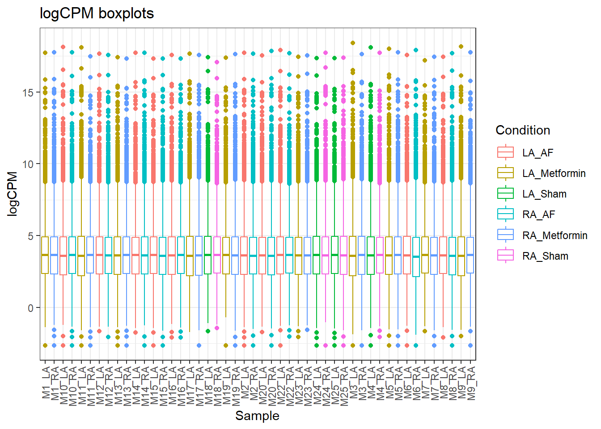

``` r
# Density-plot
ggplot(logCPM_melted, aes(x = logCPM)) + 
  geom_density(aes(group = Sample, color = Condition)) +
  theme_bw() +
  ggtitle("logCPM density distributions")
```

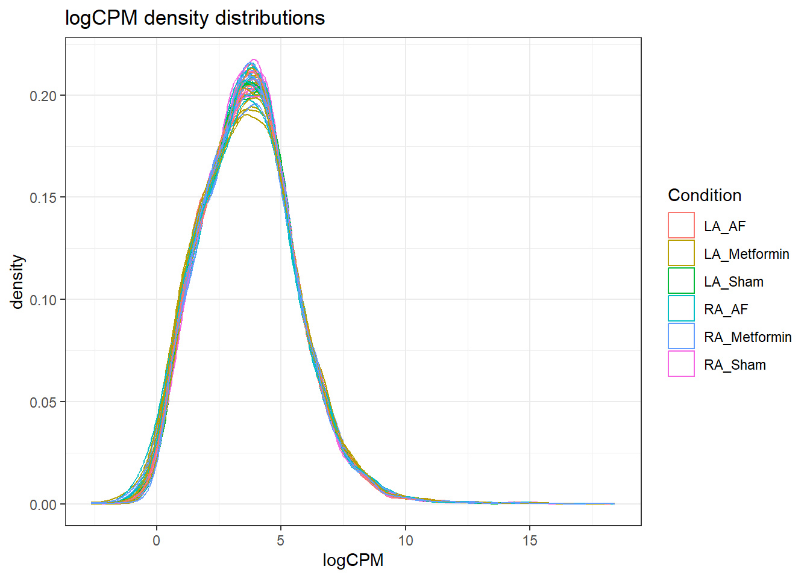

## Dimension reduction
### MDS plot

``` r
mds <- plotMDS(y, plot = FALSE)

dims <- list(p1 = c(1,2), p2 = c(1,3), p3 = c(2,3))
mds_plot <- list()

# without labels
for (i in seq_along(dims)){
  mds_plot[[i]] <- aamisc::ggMDS(mds = mds,
                                 meta = meta, 
                                 dim = dims[[i]], 
                                 color.by = "Group", 
                                 shape.by = "Region",
                                 legend.position = "right"
                                 # text.by = "Horse",
                                 # text.size = 1.5
                                 )
}


patchwork::wrap_plots(mds_plot, ncol = 2) + patchwork::plot_layout(guides = 'collect')
```

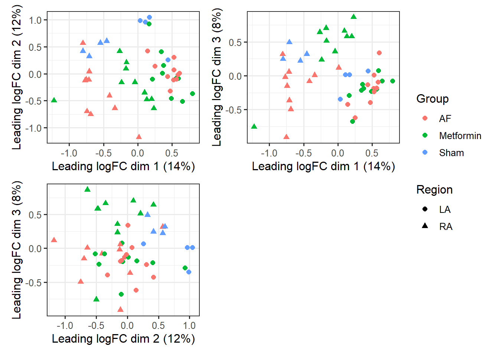

``` r
# with labels
for (i in seq_along(dims)){
  mds_plot[[i]] <- aamisc::ggMDS(mds = mds,
                                 meta = meta, 
                                 dim = dims[[i]], 
                                 color.by = "Group", 
                                 shape.by = "Region",
                                 legend.position = "right",
                                 text.by = "Horse",
                                 text.size = 1.5
                                 )
}

patchwork::wrap_plots(mds_plot, ncol = 2) + patchwork::plot_layout(guides = 'collect')
```

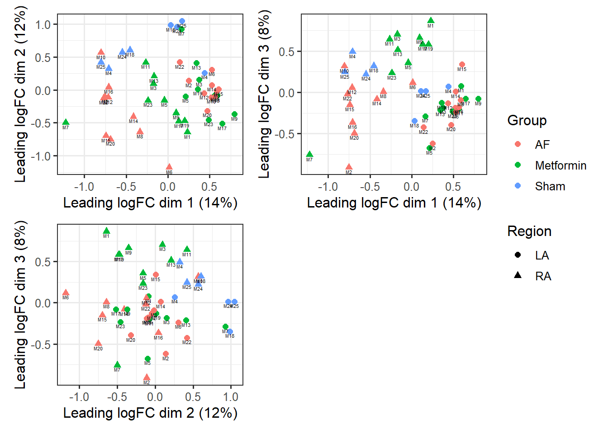

### MDS plot (batch "horse ID" removed)

``` r
logCPM_batchRemoved <- removeBatchEffect(logCPM, 
                                         batch = as.factor(y$samples$Horse), 
                                         design = design)
```

```
## Coefficients not estimable: batch22 batch23
```

```
## Warning: Partial NA coefficients for 12017 probe(s)
```

``` r
mds <- plotMDS(logCPM_batchRemoved, plot = FALSE)

dims <- list(p1 = c(1,2), p2 = c(1,3), p3 = c(2,3))
mds_plot <- list()
meta$Group <- factor(meta$Group, levels = names(publication_colors))

# without labels
for (i in seq_along(dims)){
  mds_plot[[i]] <- aamisc::ggMDS(mds = mds,
                                 meta = meta, 
                                 dim = dims[[i]], 
                                 color.by = "Group", 
                                 shape.by = "Region",
                                 legend.position = "right"
                                 # text.by = "Horse",
                                 # text.size = 1.5
                                 ) + 
                  scale_color_manual(values = publication_colors)
}

patchwork::wrap_plots(mds_plot, ncol = 2) + patchwork::plot_layout(guides = 'collect')
```

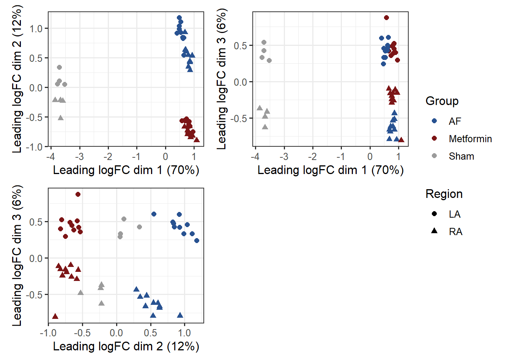

``` r
# with labels
for (i in seq_along(dims)){
  mds_plot[[i]] <- aamisc::ggMDS(mds = mds,
                                 meta = meta, 
                                 dim = dims[[i]], 
                                 color.by = "Group", 
                                 shape.by = "Region",
                                 legend.position = "right",
                                 text.by = "Horse",
                                 text.size = 1.5
                                 ) + 
                  scale_color_manual(values = publication_colors)
}
mds_plot[1]
```

```
## [[1]]
```

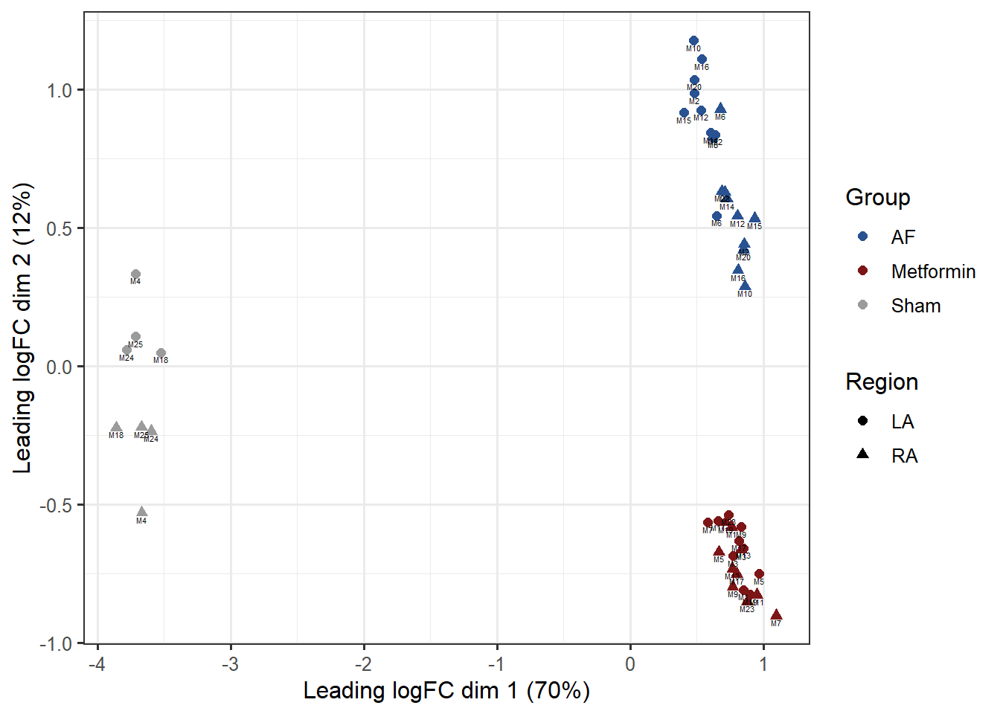

``` r
patchwork::wrap_plots(mds_plot, ncol = 2) + patchwork::plot_layout(guides = 'collect')
```

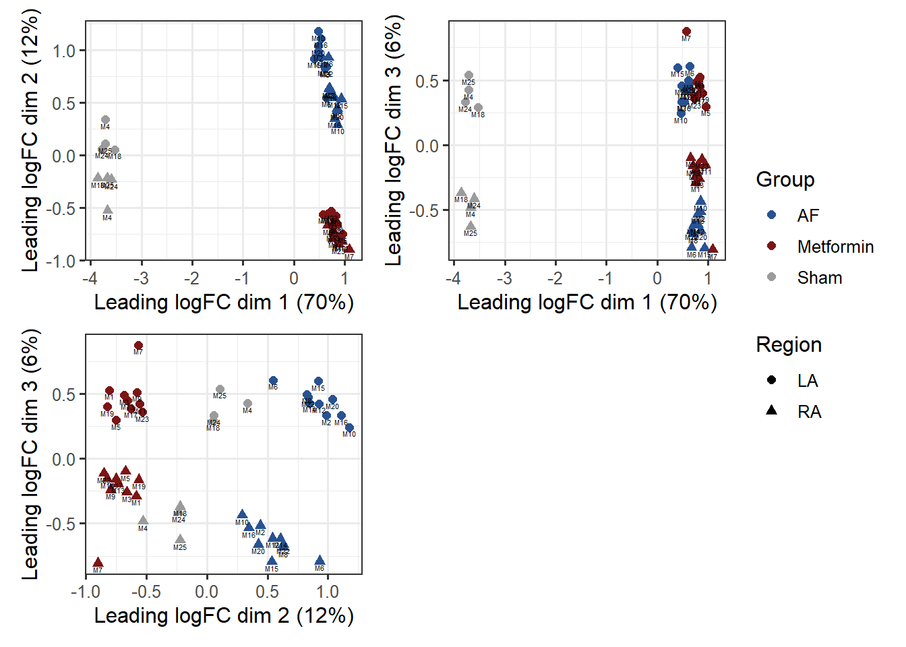

``` r
library(ggplot2)

# Define the colors
publication_colors <- c("AF" = "#285291", "Metformin" = "#7C1516", "Sham" = "#9B9B9B")
```


# Differential expression analysis 
## Create contrast for multilevel design

``` r
# create contrasts to test
colnames(design)
```

```
## [1] "LA_AF"        "LA_Metformin" "LA_Sham"      "RA_AF"        "RA_Metformin"
## [6] "RA_Sham"
```

``` r
con <- makeContrasts(
  # Metformin vs Placebo contrasts
  met_vs_placebo_RA = RA_Metformin - RA_AF,
  met_vs_placebo_LA = LA_Metformin - LA_AF,
  RA_vs_LA_placebo = RA_AF - LA_AF,
  RA_vs_LA_met = RA_Metformin - LA_Metformin,
  AverageTreatmentEffect = (LA_Metformin + RA_Metformin)/2 - (LA_AF + RA_AF)/2,
  met.vs.placebo_vs_RA.LA = (RA_Metformin - RA_AF) - (LA_Metformin - LA_AF),
  
  # AF vs Sham contrasts
  AF_vs_sham_RA = RA_AF - RA_Sham,
  AF_vs_sham_LA = LA_AF - LA_Sham,
  RA_vs_LA_sham = RA_Sham - LA_Sham,
  RA_vs_LA_AF = RA_AF - LA_AF,
  AverageDiseaseEffect = (LA_AF + RA_AF)/2 - (LA_Sham + RA_Sham)/2,
  placebo.vs.sham_vs_RA.LA = (RA_AF - RA_Sham) - (LA_AF - LA_Sham),
  
  levels = design
)

con
```

```
##               Contrasts
## Levels         met_vs_placebo_RA met_vs_placebo_LA RA_vs_LA_placebo
##   LA_AF                        0                -1               -1
##   LA_Metformin                 0                 1                0
##   LA_Sham                      0                 0                0
##   RA_AF                       -1                 0                1
##   RA_Metformin                 1                 0                0
##   RA_Sham                      0                 0                0
##               Contrasts
## Levels         RA_vs_LA_met AverageTreatmentEffect met.vs.placebo_vs_RA.LA
##   LA_AF                   0                   -0.5                       1
##   LA_Metformin           -1                    0.5                      -1
##   LA_Sham                 0                    0.0                       0
##   RA_AF                   0                   -0.5                      -1
##   RA_Metformin            1                    0.5                       1
##   RA_Sham                 0                    0.0                       0
##               Contrasts
## Levels         AF_vs_sham_RA AF_vs_sham_LA RA_vs_LA_sham RA_vs_LA_AF
##   LA_AF                    0             1             0          -1
##   LA_Metformin             0             0             0           0
##   LA_Sham                  0            -1            -1           0
##   RA_AF                    1             0             0           1
##   RA_Metformin             0             0             0           0
##   RA_Sham                 -1             0             1           0
##               Contrasts
## Levels         AverageDiseaseEffect placebo.vs.sham_vs_RA.LA
##   LA_AF                         0.5                       -1
##   LA_Metformin                  0.0                        0
##   LA_Sham                      -0.5                        1
##   RA_AF                         0.5                        1
##   RA_Metformin                  0.0                        0
##   RA_Sham                      -0.5                       -1
```

``` r
#Explanation:  The "average disease effect" is not the same as the main disease effect, but we will leave that for now as we are only interesting in the region-wise comparisons. 
```

## Differential analysis

``` r
# V is the result of my linear model fitted using voom transformation
y_raw <- d[keep, ,keep.lib.sizes=FALSE]
v <- voomLmFit(counts = y_raw, 
               design = design, 
               block = as.factor(y_raw$samples$Horse), 
               sample.weights = TRUE, 
               plot = TRUE) 
```

```
## First sample weights (min/max) 0.2037813/1.8751727
```

```
## First intra-block correlation  0.2684471
```

```
## Final sample weights (min/max) 0.2035692/1.8656543
```

```
## Final intra-block correlation  0.2680694
```

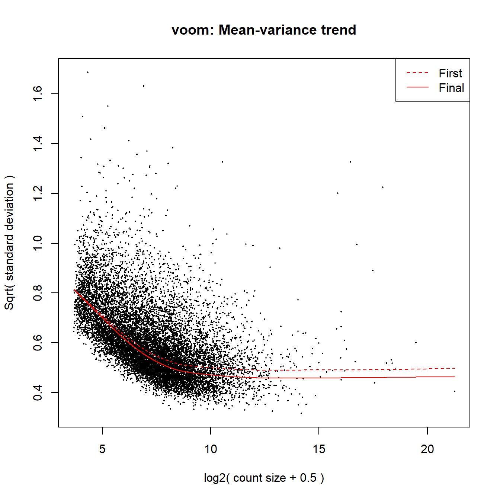

``` r
res <- list() # list for DGE results
for (i in colnames(con)) {
  fit <- contrasts.fit(v, contrasts = con)
  fit <- eBayes(fit, robust = TRUE)
  res[[i]] <- topTable(fit, coef = i, number = Inf)
  res[[i]] <- data.frame(res[[i]], Contrast = i)
  n <- res[[i]] %>% dplyr::filter(adj.P.Val < 0.05) %>% nrow 
  print(paste('number of DE genes for',i, '=', n))
}
```

```
## [1] "number of DE genes for met_vs_placebo_RA = 4428"
## [1] "number of DE genes for met_vs_placebo_LA = 0"
## [1] "number of DE genes for RA_vs_LA_placebo = 5174"
## [1] "number of DE genes for RA_vs_LA_met = 1684"
## [1] "number of DE genes for AverageTreatmentEffect = 878"
## [1] "number of DE genes for met.vs.placebo_vs_RA.LA = 4043"
## [1] "number of DE genes for AF_vs_sham_RA = 1950"
## [1] "number of DE genes for AF_vs_sham_LA = 643"
## [1] "number of DE genes for RA_vs_LA_sham = 761"
## [1] "number of DE genes for RA_vs_LA_AF = 5174"
## [1] "number of DE genes for AverageDiseaseEffect = 1975"
## [1] "number of DE genes for placebo.vs.sham_vs_RA.LA = 19"
```

``` r
res_all <- do.call(rbind, res)

# Create output Excel file
openxlsx::write.xlsx(x = res, file = "../../../../RNA-seq/analysis/01_dge/output/dge_results.xlsx", asTable = TRUE)

# Create output TSV file
data.table::fwrite(x = res_all, file = "../../../../RNA-seq/analysis/01_dge/output/dge_results.tsv.gz", sep = "\t")
```
## Diagnostics for differential analysis
### p-value histograms

``` r
ggplot(res_all, aes(x = P.Value)) + 
  geom_histogram(fill = "lightgray",
                 color = "black",
                 breaks = seq(0, 1, by = 0.05),
                 closed = "right",
                 lwd = 0.2) + 
  facet_wrap(~ Contrast, nrow = 3, scales = "free") + 
  theme_bw()
```

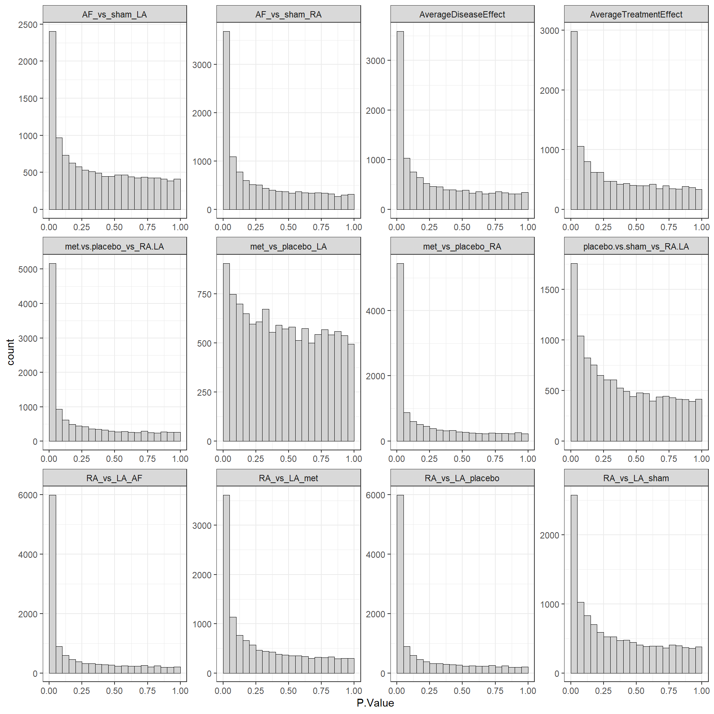

### Volcano plots

``` r
volcano_plots <- list()
for (i in names(res)){
  volcano_plots[[i]] <- ggVolcano(x = res[[i]], 
                                  fdr = 0.05,
                                  fdr.column = "adj.P.Val", 
                                  pvalue.column = "P.Value", 
                                  logFC = 0, 
                                  logFC.column = "logFC", 
                                  text.size = 2) + 
    theme_bw(base_size = 10) + 
    ggtitle(i)
}
```

```
## Warning in max(x[get(fdr.column) <= .fdr][, get(pvalue.column)]): no
## non-missing arguments to max; returning -Inf
```

``` r
patchwork::wrap_plots(volcano_plots, ncol = 3)
```

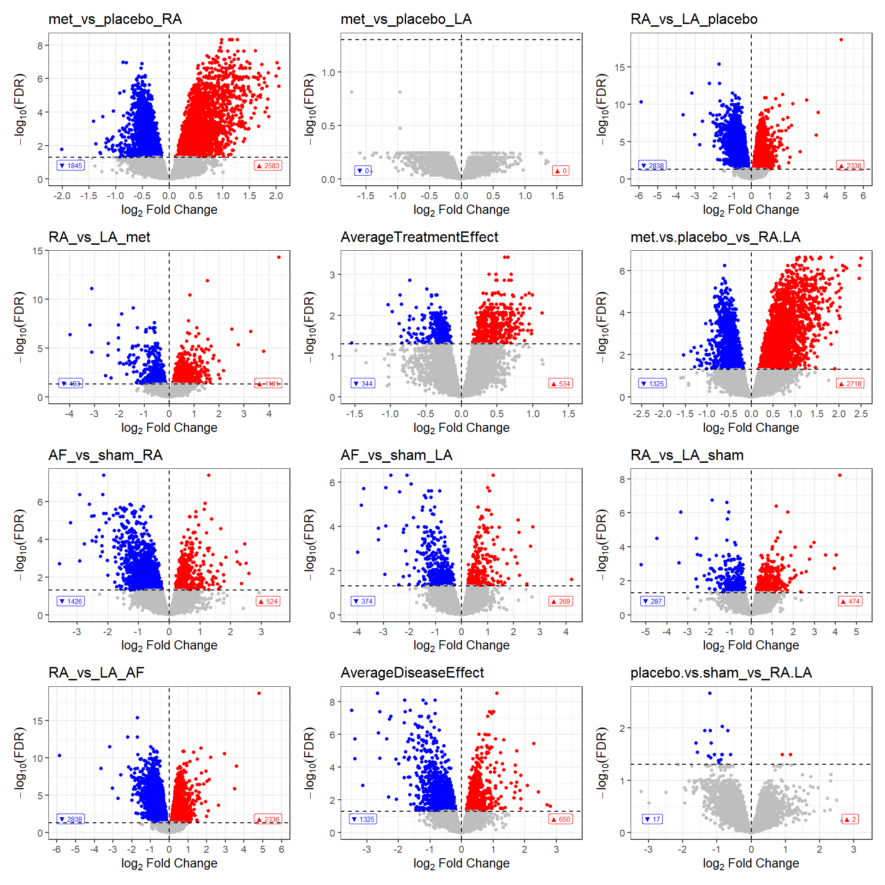

``` r
print(volcano_plots[["AF_vs_sham_RA"]])
```

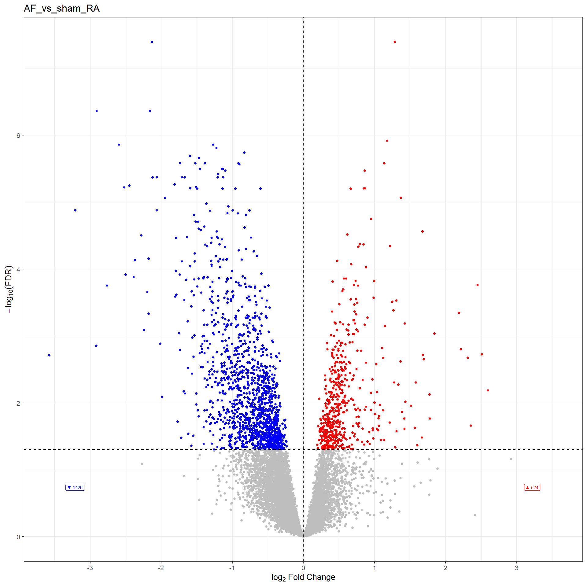

``` r
print(volcano_plots[["AF_vs_sham_LA"]])
```

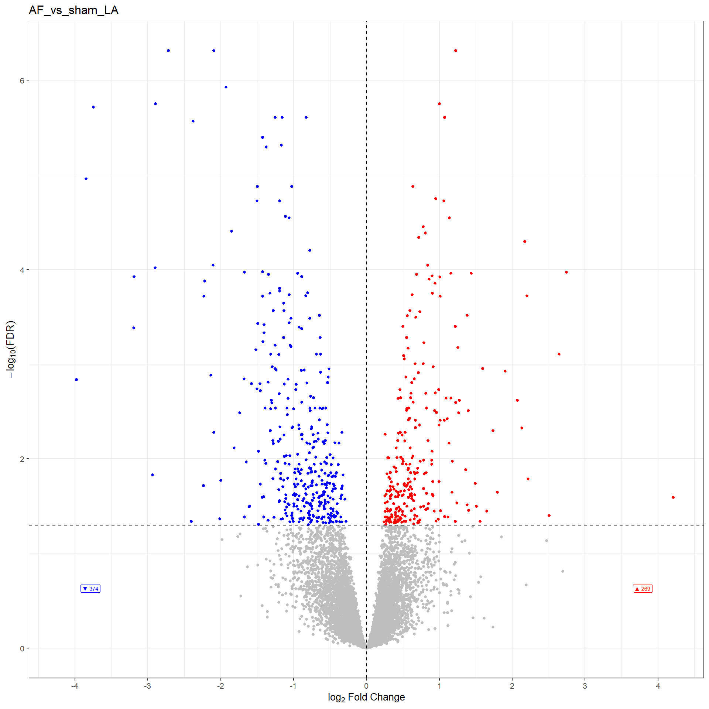

``` r
print(volcano_plots[["met_vs_placebo_RA"]])
```

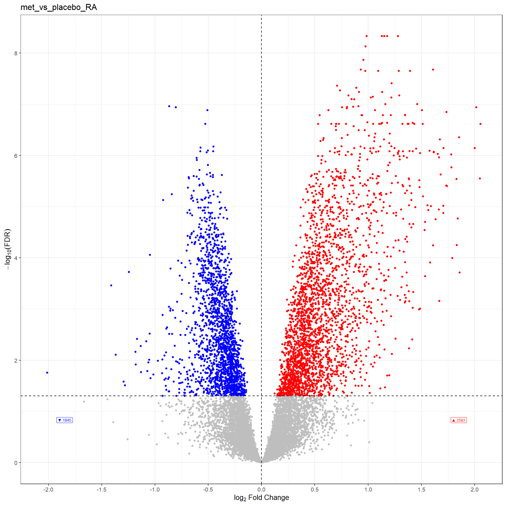

``` r
print(volcano_plots[["met_vs_placebo_LA"]])
```

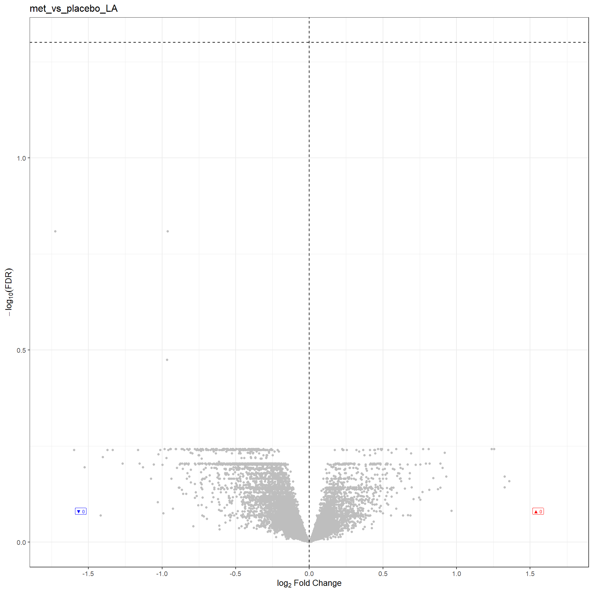

``` r
combined_plot <- ((volcano_plots[["AF_vs_sham_RA"]]) | (volcano_plots[["AF_vs_sham_LA"]])) / ((volcano_plots[["met_vs_placebo_RA"]]) | (volcano_plots[["met_vs_placebo_LA"]]))
print(combined_plot)
```

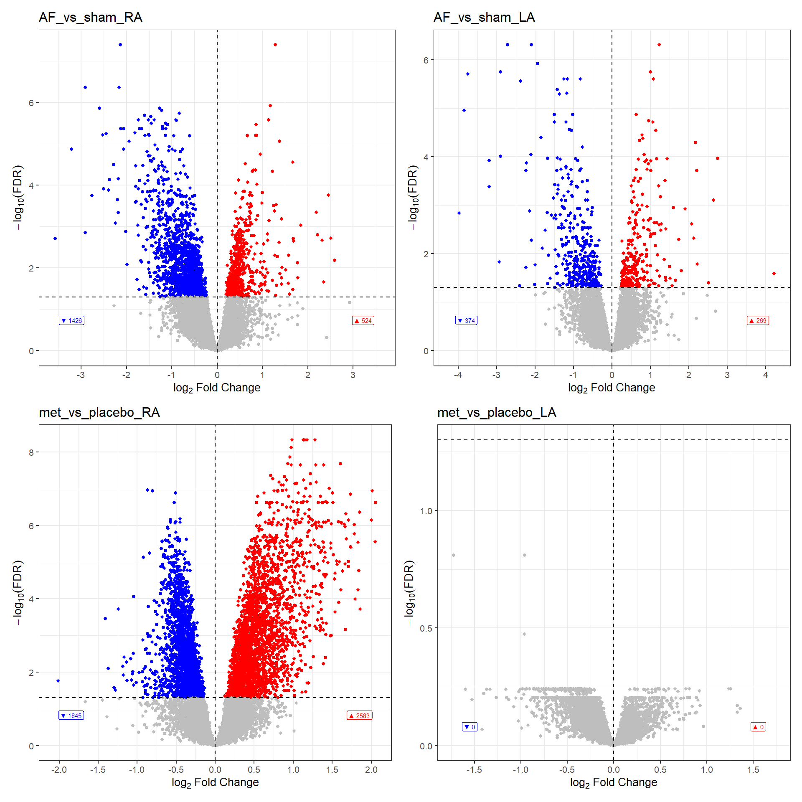
# Heatmap Generator

**#TODO:** Just suggestions below. It is up to you if you would like to organize accordingly. 

- Starting from this section, it seems like you started running some exploratory data analysis. I would make a separate script for the section below as it is no more related to differential analysis. 
- These sections are still relevant to keep in this document:
    - Venn diagrams
    - Heatmaps with only differentially expressed gene results


``` r
# Function to generate pheatmap for a given GO term based on only significant genes
generate_pheatmap_for_goid <- function(go_file, annot, logCPM_batchRemoved, res_all, meta, meta_reordered, goid, contrast1, contrast2, region1, region2) {
  # Get GO annotation
  go <- fread(go_file)
  go <- go[, c("Gene stable ID", "GO term accession", "GO term name", "GO domain")]
  setnames(go, new = c("ENSEMBL", "GOID", "Description", "GOdomain"))
  go <- go[GOdomain != "", ]
  
  # Filter for specified GO term
  go_activity <- go[GOID == goid, "ENSEMBL"]
  go_ensembl <- annot[annot$ENSEMBL %in% go_activity$ENSEMBL, c("GENENAME", "ENSEMBL")]
  subset_logCPM <- logCPM_batchRemoved[rownames(logCPM_batchRemoved) %in% go_ensembl$ENSEMBL, ]
  rownames(subset_logCPM) <- go_ensembl$GENENAME[match(rownames(subset_logCPM), go_ensembl$ENSEMBL)]
  
  # Significant genes
  sig_genes <- res_all[res_all$ENSEMBL %in% go_ensembl$ENSEMBL & res_all$adj.P.Val < 0.05, ]
  sig_contrast1_genes <- sig_genes[sig_genes$Contrast == contrast1, "GENENAME"]
  sig_contrast2_genes <- sig_genes[sig_genes$Contrast == contrast2, "GENENAME"]
  
  # Generate heatmap for the first region
  region1_subset_logCPM <- subset_logCPM[, row.names(meta)[meta$Region == region1]]
  region1_subset_logCPM <- region1_subset_logCPM[row.names(region1_subset_logCPM) %in% sig_contrast1_genes, ]
  pheatmap(region1_subset_logCPM,
           annotation_col = meta_reordered[, "Group", drop=FALSE],
           scale = "row",
           show_rownames = TRUE,
           fontsize = 10,
           fontsize_row = 8,
           fontsize_col = 8,
           color = colorRampPalette(c("navy", "white", "firebrick3"))(50),
           main = paste("Heatmap for", goid, "in", region1))
  
  # Generate heatmap for the second region
  region2_subset_logCPM <- subset_logCPM[, row.names(meta)[meta$Region == region2]]
  region2_subset_logCPM <- region2_subset_logCPM[row.names(region2_subset_logCPM) %in% sig_contrast2_genes, ]
  pheatmap(region2_subset_logCPM,
           annotation_col = meta_reordered[, "Group", drop=FALSE],
           scale = "row",
           show_rownames = TRUE,
           fontsize = 10,
           fontsize_row = 8,
           fontsize_col = 8,
           color = colorRampPalette(c("navy", "white", "firebrick3"))(50),
           main = paste("Heatmap for", goid, "in", region2))
}

# Example usage for protein kinases
generate_pheatmap_for_goid(
  go_file = "../../../data/gene_annotation/horse_GO.tsv.gz",
  annot = annot,
  logCPM_batchRemoved = logCPM_batchRemoved,
  res_all = res_all,
  meta = meta,
  meta_reordered = meta_reordered,
  goid = "GO:0004672",          # Example GOID
  contrast1 = "AF_vs_sham_RA",  # Example Contrast 1
  contrast2 = "AF_vs_sham_LA",  # Example Contrast 2
  region1 = "RA",               # Example Region 1
  region2 = "LA"                # Example Region 2
)
```


``` r
# Example usage
generate_pheatmap_for_goid(
  go_file = "../../../data/gene_annotation/horse_GO.tsv.gz",
  annot = annot,
  logCPM_batchRemoved = logCPM_batchRemoved,
  res_all = res_all,
  meta = meta,
  meta_reordered = meta_reordered,
  goid = "GO:0004672",          # Example GOID
  contrast1 = "AF_vs_sham_RA",  # Example Contrast 1
  contrast2 = "AF_vs_sham_LA",  # Example Contrast 2
  region1 = "RA",               # Example Region 1
  region2 = "LA"                # Example Region 2
)
```

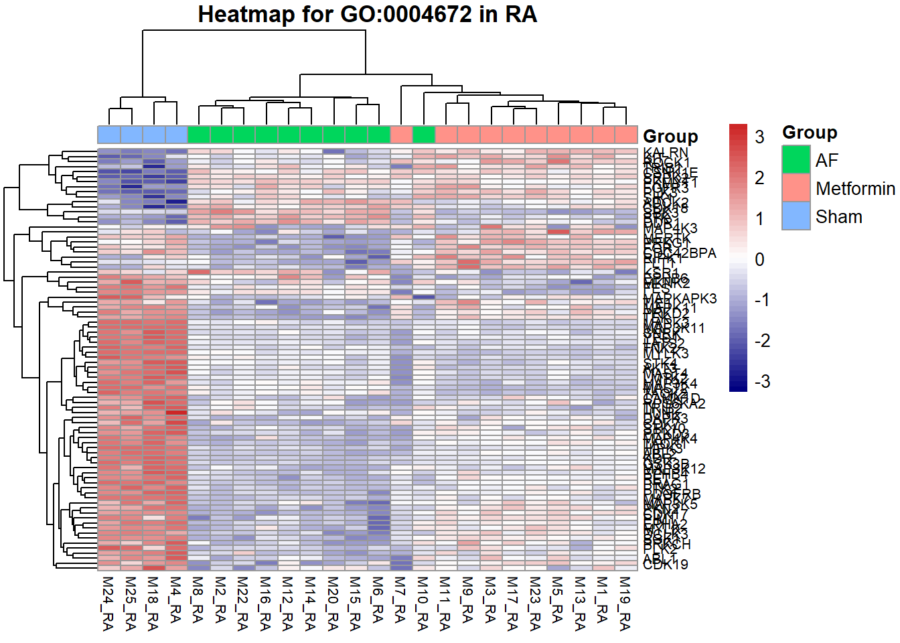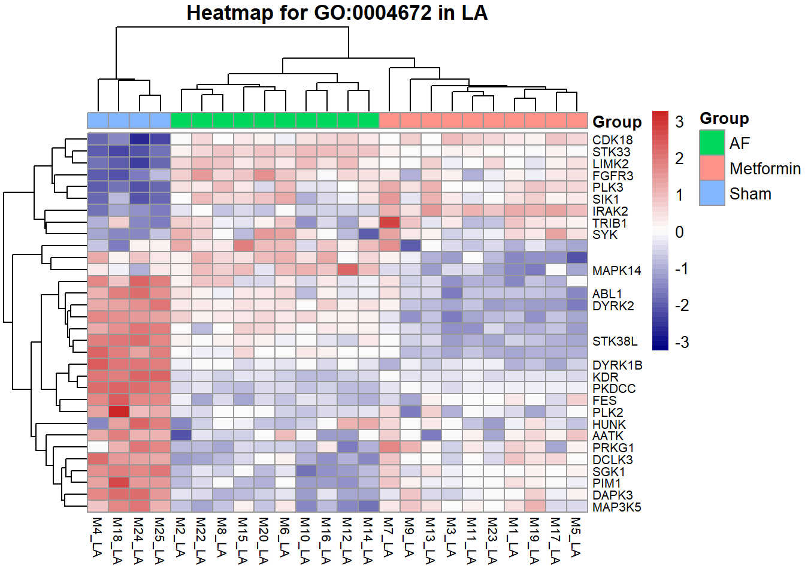

``` r
# Example usage for protein kinases
generate_pheatmap_for_goid(
  go_file = "../../../data/gene_annotation/horse_GO.tsv.gz",
  annot = annot,
  logCPM_batchRemoved = logCPM_batchRemoved,
  res_all = res_all,
  meta = meta,
  meta_reordered = meta_reordered,
  goid = "GO:0004672",          # Example GOID
  contrast1 = "AF_vs_sham_RA",  # Example Contrast 1
  contrast2 = "AF_vs_sham_LA",  # Example Contrast 2
  region1 = "RA",               # Example Region 1
  region2 = "LA"                # Example Region 2
)
```


``` r
#Example for Collagen containing ECM GO:0062023
generate_pheatmap_for_goid(
  go_file = "../../../data/gene_annotation/horse_GO.tsv.gz",
  annot = annot,
  logCPM_batchRemoved = logCPM_batchRemoved,
  res_all = res_all,
  meta = meta,
  meta_reordered = meta_reordered,
  goid = "GO:0062023",          # Example GOID
  contrast1 = "AF_vs_sham_RA",  # Example Contrast 1
  contrast2 = "AF_vs_sham_LA",  # Example Contrast 2
  region1 = "RA",               # Example Region 1
  region2 = "LA"                # Example Region 2
)
```

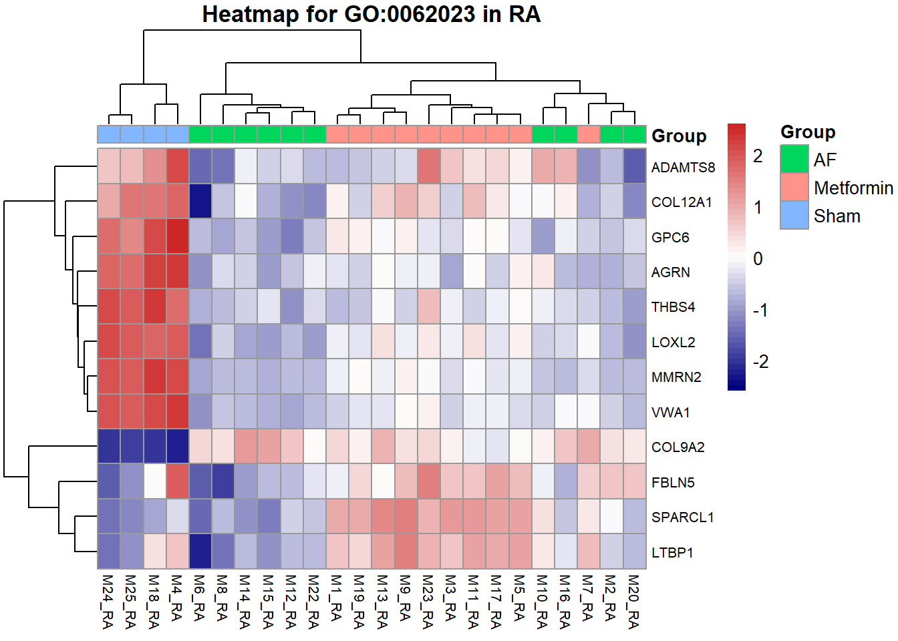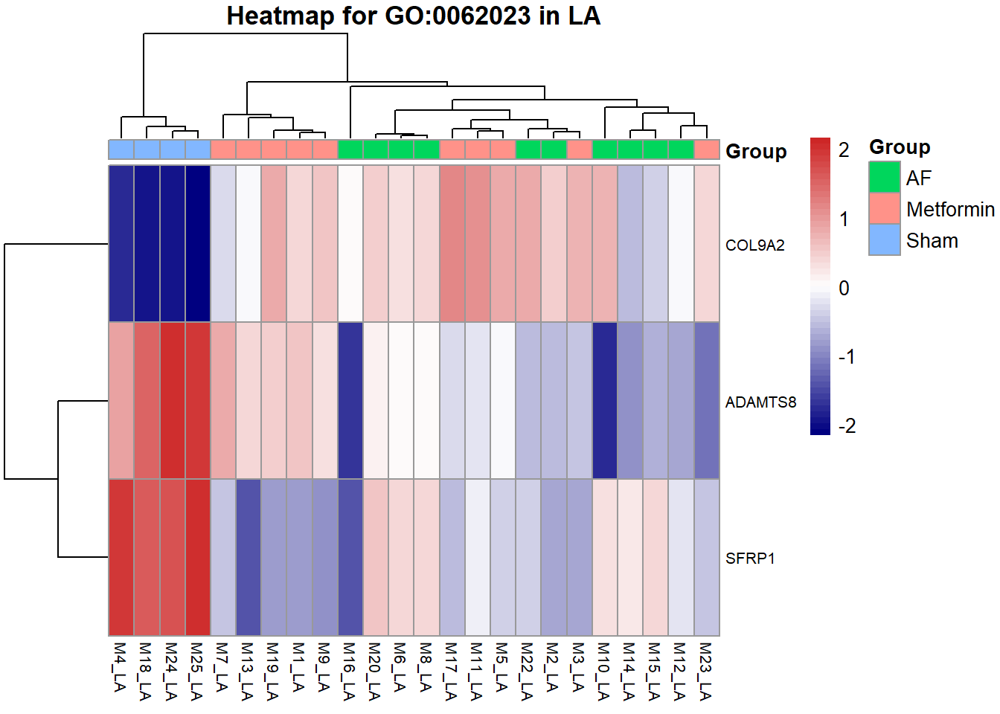

``` r
#Example for mitochondrial matrix GO:0005759
generate_pheatmap_for_goid(
  go_file = "../../../data/gene_annotation/horse_GO.tsv.gz",
  annot = annot,
  logCPM_batchRemoved = logCPM_batchRemoved,
  res_all = res_all,
  meta = meta,
  meta_reordered = meta_reordered,
  goid = "GO:0005759",          # Example GOID
  contrast1 = "AF_vs_sham_RA",  # Example Contrast 1
  contrast2 = "AF_vs_sham_LA",  # Example Contrast 2
  region1 = "RA",               # Example Region 1
  region2 = "LA"                # Example Region 2
)
```

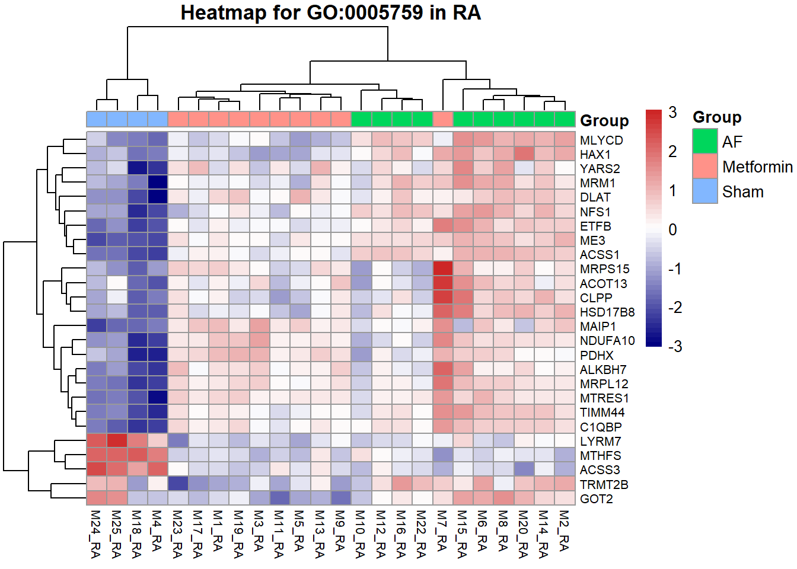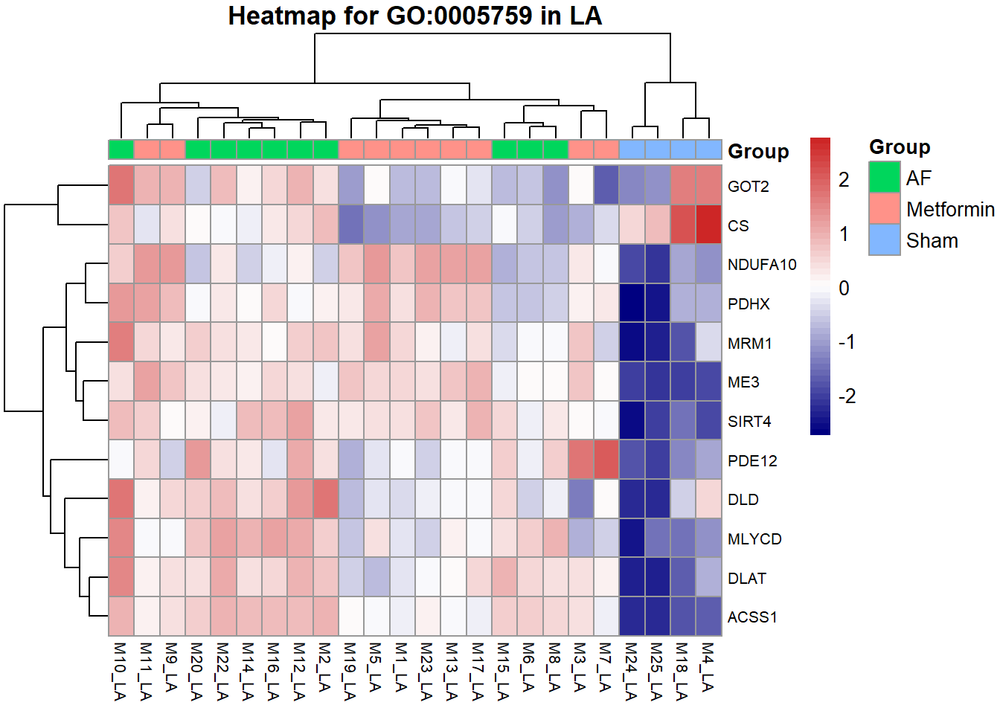
#Venn-diagrams to understand effect of disease and treatment in RA

``` r
# Ensure res_all is a data.table
res_all <- as.data.table(res_all)

# Filter genes function
filter_genes <- function(contrast, direction) {
  res_all[Contrast == contrast & ((logFC > 0 & direction == "up") | (logFC < 0 & direction == "down")) & adj.P.Val < 0.05, GENENAME]
}

# Effect of treatment and disease
met_up_RA <- filter_genes("met_vs_placebo_RA", "up")
met_down_RA <- filter_genes("met_vs_placebo_RA", "down")
af_up_RA <- filter_genes("AF_vs_sham_RA", "up")
af_down_RA <- filter_genes("AF_vs_sham_RA", "down")

# Extract intersecting genes
up_in_AF_down_in_met <- intersect(af_up_RA, met_down_RA)
down_in_AF_up_in_met <- intersect(af_down_RA, met_up_RA)
even_more_up_met <- intersect(af_up_RA, met_up_RA)
even_more_down_met <- intersect(af_down_RA, met_down_RA)

# Print results with captions
cat("Genes upregulated in AF and downregulated in Metformin:\n", paste(up_in_AF_down_in_met, collapse = ", "), "\n\n")
```

```
## Genes upregulated in AF and downregulated in Metformin:
##  , TNNC1, POPDC3, NDUFA12, MRPL37, ENDOG, COQ10A, TIMM10, CMC2, TIMM23, BAD, FAM136A, SMIM20, TIMM22, UQCRFS1, BDH1, MPC1, KIF22, MRPL2, ADORA1, CYP2D84, SMIM4, CD320, TPI1, NDUFA6, HOMER2, LRRC8E, ADCY10, LDHB, DNAJC4, MAD2L2, PPP1R12C, ATP5PB, PRDX2, SPR, RHBDD3, ATP5IF1, ME3, HDDC3, MICOS13, GTF3A, SLC25A4, MKKS, NDUFS8, MRPL14, NDUFB11, NDUFA10, GPD1, UBE2F, PLEKHO1, MRPL16, COX4I1, ARHGAP9, ATP5MC1, ZCRB1, HINT2, FABP3, TCAP, MRPS26, TPT1, SNAPC2, MTFP1, TMEM70, NDUFS7, MMACHC, NUDT22, MRPL30, NPM3, MRPL43, WDR90, SEC31B, HMGN3, ACADVL, MRPL12, NDUFS5, SLC35F3, MRPL41, WDR45, NDUFAB1, DUSP23, MPV17, FAHD2A, ARL3, NDUFB7, NDUFB4, NME2, MRPS14, SLC25A26, LAMTOR2, IAH1, NDUFV3, NDUFB10, TMEM120A, HINT1, MGMT, PYCR2, MOCS2, TNNI3, MRPS24, RANGRF, SHISA4, ATP5F1D, BCS1L, MRPL4, TOPORS, MFSD3, CORO6, PRADC1, GTF2H5, ZCCHC17, DPCD, NDUFB3, TIMM8B, CEBPZOS, PWP2, RGS3, TUT7, ISOC2, ZNF771, MTLN, RWDD1, STAR, COX5B, BCAS4, ATPAF2, MGST3, PITHD1, RBIS, GSTM3, ACADS, GAPDH, HYKK, CRYL1, TMEM38A, TXNDC17, MRM1, MRPL36, NDRG2, CCDC51, ADGRB1, RNLS, SMOC1, IFT20, UBE2D4, PTGES2, ATP5MC3, CKM, IFT88, PSMD13, POLR3K, MRPL34, SLC49A3, JTB, SAP18, LMNB2, MCAT, ADCK2, MTRES1, LAMTOR1, DIS3L, COQ7, PPP1R11, CAV3, TXN2, SLX9, FDX2, COMMD3, MCEE, UBL5, SEM1, REX1BD, PSAP, NDUFC2, ARHGEF33, PHB1, C1QBP, AKIP1, BOLA1, CCNE1, DIABLO, RAB5IF, ALKBH7, MIEN1, PTPMT1, POMC, C7H19orf53, HAX1, COX7A2, ELOB, STOML2, NDUFS6, CLPP, MRPL11, NR2F6, OCEL1, SCO2, COX7B, WDR38, RNF7, ACOT8, MISP3, COA1, NDUFS3, NDUFA7, SLC25A3, NIT1, GADD45GIP1, ATP5PO, KXD1, TEN1, SDHD, RTRAF, TSR2, TUFM, CYC1, CARD9, MICOS10, NDUFV2, ABHD8, TOMM34, NDUFS2, FBXW5, BCCIP, GPNMB, TRAPPC3, COX16, ESRRA, NAT14, ANAPC16, TMEM126A, PET100, ZNHIT3, TOMM7, UQCRB, DNAJC30, FAAP20, COX7A2L, BLOC1S2, PEX2, CIAO3, HPRT1, PLGRKT, EMG1, ETFB, GET3, PRDX5, MRPS23, PLEKHA4, RNF181, CCDC90B, MRPS15, COMMD8, GTPBP3, ATP5MF, MRPL51, MARCHF2, NDUFB5, KLHDC4, PTRHD1, DNAJC19, ETHE1, ARL6IP4, SMPX, GTF2E2, MRPS34, CCDC28A, TRAPPC4, GAR1, MUL1, SPINT2, HMBS, FKBPL, MRPS27, DHPS, MORC2, AK2, MED7, HSD17B8, TIMM44, ATP5PD, TIMM17B, SMTN, SNTA1
```

``` r
cat("Genes downregulated in AF and upregulated in Metformin:\n", paste(down_in_AF_up_in_met, collapse = ", "), "\n")
```

```
## Genes downregulated in AF and upregulated in Metformin:
##  EHBP1, KIF5B, RAPGEF5, , ATP1B4, TM4SF18, SOX7, ATP2C1, SHLD1, DUSP16, ANTXR2, LIN7C, TSC22D2, DCUN1D3, ZNF366, SNTB1, NRARP, SHROOM4, FLI1, STIM2, EPAS1, DIXDC1, NOL4L, RAPGEF2, NOS3, TMCC1, AFDN, CREB5, ZBTB46, PPARGC1A, ZNF24, CD93, KCTD7, GPM6A, DNAJB4, RIPOR1, SPTBN1, MTMR1, S1PR1, STARD8, GPC6, NUP98, COL4A1, PTK2, ZRANB1, NUS1, USP10, ARID5B, HIPK3, KDM6A, ARL15, AKT3, KLF7, FBXW8, PALM2AKAP2, MRTFB, LMO7, PITPNM2, DCBLD2, FRYL, SEMA6D, JPH1, ITPRIP, GARRE1, ORMDL1, HIP1, CCDC149, FBXO34, SOAT1, SUCO, NDFIP2, KBTBD2, CASP2, RAB11A, AGPS, GPR160, RNF152, RGS6, ETS1, ZBTB10, SERINC3, ITPRID2, CDC42BPA, MAGI3, KLF3, TMC7, PRKAR1A, ZBTB21, LMTK2, LRP4, SH2B3, HMG20A, CBL, C2CD2, HPS3, PLXNA2, PUM1, WWC2, EFNB2, ETV1, MEF2C, FZD6, TP53INP2, DNMBP, AMOT, POGZ, UBA6, LATS2, HNRNPUL2, CTTNBP2NL, ITGA6, PRKG1, COL4A5, PRRC2B, RASGRF2, GASK1B, CALD1, TJP1, WBP2, GIT2, ADGRL4, MAN2A2, CDK17, SETD5, RAB30, ATAD2, GNAO1, SPRED2, GCC2, ZBTB34, SLC5A3, PHLDB2, PRRG3, LUZP1, ELK4, CLCN3, ERO1A, TMCC3, PKN2, SNRK, GUCY1B1, NT5DC3, MIER1, NOTCH1, RALGAPA1, ABL1, UBA2, KIAA1217, GBF1, RBMS2, SLCO5A1, SALL4, ARID1A, SPATA13, KAT6B, PIK3C2A, DLC1, SMG7, AFF4, KLHL24, MDC1, FBXW2, ZCCHC8, PIP5K1A, GNA13, ZKSCAN1, PTPRB, TENM2, SHE, STARD13, TTC28, FARP1, MACF1, STAG2, CAMTA2, HEG1, TMEM182, APOLD1, PIP4K2B, UTRN, PTPN11, SYAP1, NPR3, SIPA1L1, FGFR1OP2, HGSNAT, RAP2A, SECISBP2L, SPAG9, LRCH3, FZD5, FGF1, MAST4, NR3C2, ZMIZ1, TTC17, PANK1, CHD6, CDS2, MYO1B, VPS53, CERT1, IRS2, CLIP1, YES1, ZBED4, SEPTIN2, TEAD1, NCOA3, HDAC4, DOCK1, ADARB1, CD2AP, RET, CRK, MTHFS, TMOD3, ARMCX4, CEMIP2, SHROOM2, RNF19A, GPRASP1, STXBP1, CEP170, CRTC3, AKAP13, ADD3, KCNJ2, PHF8, MGAT3, CTNND1, AJUBA, TMPO, CHRM2, EDA, SFPQ, F8, INPP1, MAGI1, CNOT6L, KLF12, KCNAB1, LUC7L2, SPTLC2, FOXN2, PCDHB14, KRBA1, SMYD1, PPP1R9A, JMJD6, SEMA5A, GAN, ZBTB44, PALS1, CLIC4, ADGRF5, PRKD3, RAB3GAP1, CBFA2T2, SOS2, PICALM, PRRC2C, AZIN1, CBLB, GUCY1A2, RBM20, RIT1, ZSWIM8, FAM168A, NEDD4L, PLEKHG1, RAVER2, ELF1, ADCY5, TANC2, MFSD6, RIC1, PDZD2, USP33, TET2, TGFBRAP1, ADK, NRAS, ATN1, TMTC1, ITPKB, LDB2, LRP5, EP400, KLHL31, RALGAPA2, FBXO42, ATP6V0A1, MCTP1, RC3H2, BCORL1, RGS5, NF1, PPP1R16B, TNKS2, SEC24B, VIRMA, GREB1L, MED14, RNF44, RPRD1B, MLEC, PHLPP2, APPL2, CSGALNACT1, SASH1, CCDC82, USP37, TULP4, MAGT1, ZEB1, MAP4K4, RNF214, SEC16A, CNTN5, MAP3K4, SLC39A9, NCOA1, PTPRM, DCAF1, PKP2, ATXN1L, CLASP1, USP34, FLT1, RNF11, ARNT, CREBBP, NUP50, PHACTR2, CECR2, FNIP2, JCAD, MINDY2, ATRN, LTN1, CDK19, ZFR, ZNF462, ASB15, PAQR9, FZD4, GSK3B, NCOA6, FAT1, TRRAP, ARHGAP31, UNC13C, MDFIC, ERCC6, NID2, HMBOX1, SOGA1, AHNAK, MID1, ZBTB43, BIRC3, ASAP2, VAMP3, FUT10, JADE2, TEK, TCF20, OSBP, TPR, SLMAP, RANBP10, ZNF770, MEF2D, SRSF10, UBR5, CCSER2, NR3C1, FRY, PLCL1, KAT6A, PTBP3, VCL, TNRC18, PCMTD2, ATXN7, ANKRD17, PPP1R13B, CNOT6, SMG1, WDR37, FOXJ2, HACE1, RICTOR, ZNF407, ABL2, GLG1, MSH6, EP300, ZC3H4, JMJD1C, SIPA1L2, CDC73, GPR63, SMAD3, CLTC, RLF, ZNF660, HAO1, PHF2, MCM3AP, BTAF1, RBFOX1, MON2, DENND5B, IGSF9B, SMARCA5, SACS, SAMD4A, GPR146, SORL1, NCOA4, ADGRL2, MLXIP, TNS1, PBRM1, MBNL2, DDX3X, ZNF609, ATP11B, EPC1, UBAP2L, NIBAN1, BCLAF1, PHACTR4, MED13L, HSPG2, AKAP6, POLR2A, LEMD3, CADPS2, TET3, PIK3R1, PRRC2A, TWSG1, RLIM, ZBTB38, SPARCL1, PARVA, TAOK1, ZEB2, GOPC, MUC15, NAV2, RHOBTB1, NUDT3, MAPRE2, ATL3, HIVEP2, NDST1, OGA, SC5D, PKP4, FNIP1, XRN1, CD38, DGKH, SUN1, PTPN21, SPIRE1, ADAMTSL3, DSE, KMT2C, DDX17, TXLNB, CCDC85A, KIAA0930, NUP153, AP3M1, LYST, TAF2, DSG2, GIGYF2, AP1G1, DNAAF9, EDNRB, TMEM185B, RAB3GAP2, TAPT1, SATB1, B4GALT6, GPD2, ZNF341, ZNF445, MAP4K3, KIAA1109, GPCPD1, BICRAL, SEC23IP, MYO9A, GNL3L, RIMKLB, HS2ST1, ETV3, TCAF1, BTBD3, CHD2, SOCS5, FBXO11, ZFPM2, NUFIP2, CCNT1, TARDBP, GUCY1A1, MCC, ASH1L, SPG11, DPH6, ARID1B, UBR1, CACNB2, WDR26, ATP13A3, ZNF644, PAFAH1B2, BTRC, CASC3, ATP2B4, WWTR1, CPEB4, RABGAP1L, SUPT6H, MEGF8, PEG3, NIPAL3
```

``` r
cat("Genes upregulated in AF and but even more upregulated in Metformin:\n", paste(even_more_up_met, collapse = ", "), "\n\n")
```

```
## Genes upregulated in AF and but even more upregulated in Metformin:
##  , H2BC20, BCAT1, FAM171B, OSBPL11, HIF3A, ANKRD34B, ST8SIA5, DLAT, CDH13, GNPTAB, TBC1D1, NCEH1, GBE1
```

``` r
cat("Genes downregulated in AF and but even more downregulated in Metformin:\n", paste(even_more_down_met, collapse = ", "), "\n")
```

```
## Genes downregulated in AF and but even more downregulated in Metformin:
##  , DDIT3, REM1, GNAI2, LSMEM2, ISYNA1, FOXS1, DHCR24, LENG1, RGL2, TFEB, ARHGDIA, ACTB, MAP1S, TK2, AGPAT1, NSFL1C, DTX1, CCND3, TUBB, APOE, HSPA8, KIF18B
```

``` r
# Generate Venn diagram
ggvenn(list(Up_met = met_up_RA, Down_met = met_down_RA, AF_up = af_up_RA, AF_down = af_down_RA), 
       fill_color = c("#E69F00", "#56B4E9", "#009E73", "#F0E442"))
```


#Heatmaps for genes inversely regulated in metformin treatment and AF

``` r
# Load GO annotations
go_file <- "../../../data/gene_annotation/horse_GO.tsv.gz"
go <- fread(go_file)
go <- go[, c("Gene stable ID", "GO term accession", "GO term name", "GO domain")]
setnames(go, new = c("ENSEMBL", "GOID", "Description", "GOdomain"))

# Map GENENAMES to ENSEMBL IDs using the annot file
up_in_AF_down_in_met_ensembl <- annot[annot$GENENAME %in% up_in_AF_down_in_met, "ENSEMBL"]
down_in_AF_up_in_met_ensembl <- annot[annot$GENENAME %in% down_in_AF_up_in_met, "ENSEMBL"]

# Ensure res_all is a data.frame
res_all <- as.data.frame(res_all)

# Function to generate pheatmap for a given GO term and region
generate_pheatmap_for_goid <- function(goid, go_annotations, go_data, annot, logCPM_batchRemoved, res_all, meta, meta_reordered, region) {
  # Filter for specified GO term
  go_activity <- go_annotations[GOID == goid, "ENSEMBL"]
  go_ensembl <- annot[annot$ENSEMBL %in% go_activity$ENSEMBL, c("GENENAME", "ENSEMBL")]
  subset_logCPM <- logCPM_batchRemoved[rownames(logCPM_batchRemoved) %in% go_ensembl$ENSEMBL, ]
  rownames(subset_logCPM) <- go_ensembl$GENENAME[match(rownames(subset_logCPM), go_ensembl$ENSEMBL)]
  
  # Significant genes
  sig_genes <- res_all[res_all$ENSEMBL %in% go_ensembl$ENSEMBL & res_all$adj.P.Val < 0.05, ]
  sig_genes_up_in_AF_down_in_met <- sig_genes[sig_genes$ENSEMBL %in% go_data$up_in_AF_down_in_met_ensembl, "GENENAME"]
  sig_genes_down_in_AF_up_in_met <- sig_genes[sig_genes$ENSEMBL %in% go_data$down_in_AF_up_in_met_ensembl, "GENENAME"]
  
  # Combine and deduplicate gene names
  combined_sig_genes <- unique(c(sig_genes_up_in_AF_down_in_met, sig_genes_down_in_AF_up_in_met))
  
  # Subset samples based on the specified region
  subset_logCPM_combined <- subset_logCPM[rownames(subset_logCPM) %in% combined_sig_genes, ]
  region_samples <- row.names(meta)[meta$Region == region]
  subset_logCPM_combined_region <- subset_logCPM_combined[, region_samples]
  
  # Generate heatmap for the specified region
  pheatmap(subset_logCPM_combined_region,
           annotation_col = meta_reordered[region_samples, "Group", drop=FALSE],
           scale = "row",
           show_rownames = TRUE,
           fontsize = 10,
           fontsize_row = 8,
           fontsize_col = 8,
           color = colorRampPalette(c("navy", "white", "firebrick3"))(50),
           main = paste("Heatmap for", goid, "in", region))
}

# Example usage for protein kinases in RA
generate_pheatmap_for_goid(
  goid = "GO:0004672",                    # Example GOID
  go_annotations = go,                    # GO annotations
  go_data = list(up_in_AF_down_in_met_ensembl = up_in_AF_down_in_met_ensembl, down_in_AF_up_in_met_ensembl = down_in_AF_up_in_met_ensembl),
  annot = annot,
  logCPM_batchRemoved = logCPM_batchRemoved,
  res_all = res_all,
  meta = meta,
  meta_reordered = meta_reordered,
  region = "RA"                           # Specified region (RA)
)
```

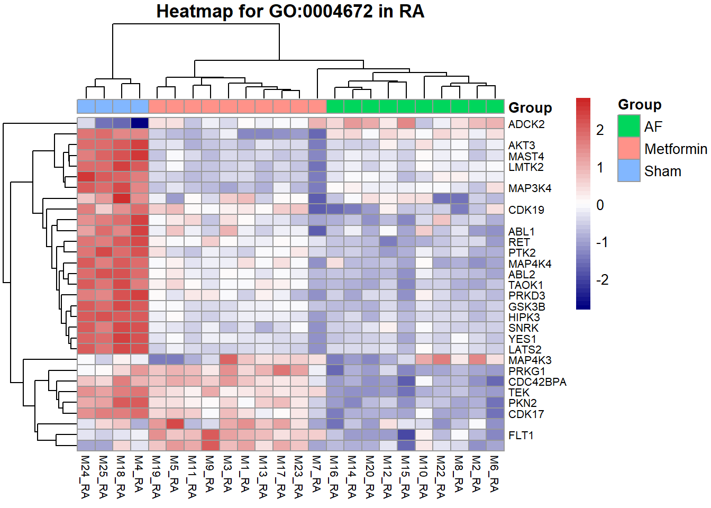

``` r
# Example usage for mitochondrial matrix in RA
generate_pheatmap_for_goid(
  goid = "GO:0005759",                    # Example GOID
  go_annotations = go,                    # GO annotations
  go_data = list(up_in_AF_down_in_met_ensembl = up_in_AF_down_in_met_ensembl, down_in_AF_up_in_met_ensembl = down_in_AF_up_in_met_ensembl),
  annot = annot,
  logCPM_batchRemoved = logCPM_batchRemoved,
  res_all = res_all,
  meta = meta,
  meta_reordered = meta_reordered,
  region = "RA"                           # Specified region (RA)
)
```

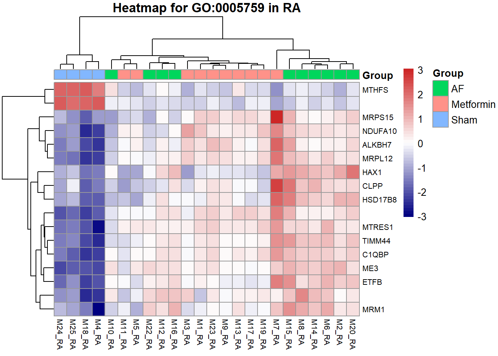

``` r
# GO:0016301 Kinase Activity
generate_pheatmap_for_goid(
  goid = "GO:0016301",                    # Example GOID
  go_annotations = go,                    # GO annotations
  go_data = list(up_in_AF_down_in_met_ensembl = up_in_AF_down_in_met_ensembl, down_in_AF_up_in_met_ensembl = down_in_AF_up_in_met_ensembl),
  annot = annot,
  logCPM_batchRemoved = logCPM_batchRemoved,
  res_all = res_all,
  meta = meta,
  meta_reordered = meta_reordered,
  region = "RA"                           # Specified region (RA)
)
```


``` r
# GO:0005912 Adherens Junction
generate_pheatmap_for_goid(
  goid = "GO:0005912",                    # Example GOID
  go_annotations = go,                    # GO annotations
  go_data = list(up_in_AF_down_in_met_ensembl = up_in_AF_down_in_met_ensembl, down_in_AF_up_in_met_ensembl = down_in_AF_up_in_met_ensembl),
  annot = annot,
  logCPM_batchRemoved = logCPM_batchRemoved,
  res_all = res_all,
  meta = meta,
  meta_reordered = meta_reordered,
  region = "RA"                           # Specified region (RA)
)
```

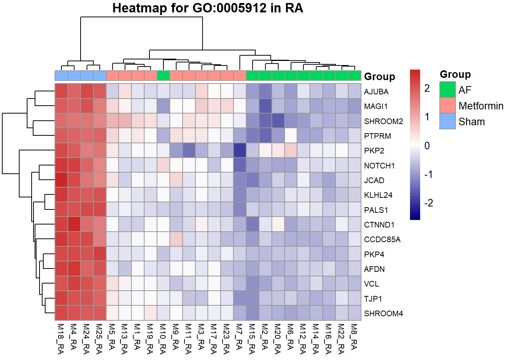
