# Gene enrichment analysis

## Required R libraries

``` r
if (!require("pacman")) install.packages("pacman")
```

```
## Indlæser krævet pakke: pacman
```

``` r
pacman::p_load("magrittr")
pacman::p_load("data.table")
pacman::p_load("clusterProfiler")
library(jsonlite)
library(httr)
library(data.table)
library(stringi)
```


## Read data

``` r
# read data
dge_file <- "../../01_dge/output/dge_results.tsv.gz"
dge <- fread(dge_file)
dge[, Direction := ifelse(logFC > 0, "up", "down")]
dge[, ENTREZID := as.character(ENTREZID)]

# subset relevant contrasts
contrasts <- c("AF_vs_sham_RA", "AF_vs_sham_LA", "met_vs_placebo_RA", "met_vs_placebo_LA", "AverageTreatmentEffect", "AverageDiseaseEffect")
dge <- dge[Contrast %in% contrasts]
# TODO: Feel free to update this part accordingly

# DGE results with only valid Entrez IDs
dge_entrez <- dge[!is.na(ENTREZID),]

# significance cut-off
dge_cut <- 0.05
enrich_cut <- 0.05
```

The analysis will be performed according to following statistical cutoffs.

- *Differential gene expression:* adjusted p-value (FDR) < 0.05
- *Enrichment analysis:* adjusted p-value (Q-value) < 0.05

# GO

We can use "ENSEMBL" IDs for **GO** enrichment analysis as the downloaded ontology information has more ENSEMBL IDs within a GO ontology more than ENTREZ (NCBI Gene) IDs. Normally, majority of ontology databases still use ENTREZ IDs. 


``` r
# Read & clean GO data
go_file <- "../../../data/gene_annotation/horse_GO.tsv.gz"
go <- fread(go_file)
go <- go[, c("Gene stable ID", "GO term accession", "GO term name", "GO domain")]
setnames(go, new = c("ENSEMBL", "GOID", "Description", "GOdomain"))
go <- go[GOdomain != "", ]

term2gene <- split(go[,c("GOID", "ENSEMBL")], f = go$GOdomain)
term2name <- split(go[,c("GOID", "Description")], f = go$GOdomain)
```

## ORA


``` r
dge_split <- split(dge, f = dge$Contrast)

go_ora <- list()

for(k in c("all", "up", "down")){
  for (j in names(term2gene)){
    for (i in names(dge_split)){
      message(paste0("Running GO ORA for '", i, "'", " within ", j, " ('", k, "' genes)"))

      if(k == "all"){
        gene <- dge_split[[i]][adj.P.Val < dge_cut,ENSEMBL]
      }else if(k == "up"){
        gene <- dge_split[[i]][adj.P.Val < dge_cut & Direction == "up",ENSEMBL]
      }else if(k == "down"){
        gene <- dge_split[[i]][adj.P.Val < dge_cut & Direction == "down",ENSEMBL]
      }
      
      if(length(gene) == 0){
        warning("No DEG found, skipping...\n")
        next
      }
      
      universe <- dge_split[[i]][,ENSEMBL]
      
      go_ora[[i]][[j]][[k]] <- enricher(gene = gene, 
                                     TERM2GENE = term2gene[[j]],
                                     TERM2NAME = term2name[[j]],
                                     pAdjustMethod = "BH",
                                     pvalueCutoff = 1, 
                                     qvalueCutoff = 1,
                                     minGSSize = 10, 
                                     maxGSSize = 500, 
                                     universe = universe
      )@result
      go_ora[[i]][[j]][[k]]$Contrast <- i
      go_ora[[i]][[j]][[k]]$Database <- j
      go_ora[[i]][[j]][[k]]$Direction <- k
      
    }
  }
}
```

```
## Running GO ORA for 'AF_vs_sham_LA' within biological_process ('all' genes)
```

```
## Running GO ORA for 'AF_vs_sham_RA' within biological_process ('all' genes)
```

```
## Running GO ORA for 'AverageDiseaseEffect' within biological_process ('all' genes)
```

```
## Running GO ORA for 'AverageTreatmentEffect' within biological_process ('all' genes)
```

```
## Running GO ORA for 'met_vs_placebo_LA' within biological_process ('all' genes)
```

```
## Warning: No DEG found, skipping...
```

```
## Running GO ORA for 'met_vs_placebo_RA' within biological_process ('all' genes)
```

```
## Running GO ORA for 'AF_vs_sham_LA' within cellular_component ('all' genes)
```

```
## Running GO ORA for 'AF_vs_sham_RA' within cellular_component ('all' genes)
```

```
## Running GO ORA for 'AverageDiseaseEffect' within cellular_component ('all' genes)
```

```
## Running GO ORA for 'AverageTreatmentEffect' within cellular_component ('all' genes)
```

```
## Running GO ORA for 'met_vs_placebo_LA' within cellular_component ('all' genes)
```

```
## Warning: No DEG found, skipping...
```

```
## Running GO ORA for 'met_vs_placebo_RA' within cellular_component ('all' genes)
```

```
## Running GO ORA for 'AF_vs_sham_LA' within molecular_function ('all' genes)
```

```
## Running GO ORA for 'AF_vs_sham_RA' within molecular_function ('all' genes)
```

```
## Running GO ORA for 'AverageDiseaseEffect' within molecular_function ('all' genes)
```

```
## Running GO ORA for 'AverageTreatmentEffect' within molecular_function ('all' genes)
```

```
## Running GO ORA for 'met_vs_placebo_LA' within molecular_function ('all' genes)
```

```
## Warning: No DEG found, skipping...
```

```
## Running GO ORA for 'met_vs_placebo_RA' within molecular_function ('all' genes)
```

```
## Running GO ORA for 'AF_vs_sham_LA' within biological_process ('up' genes)
```

```
## Running GO ORA for 'AF_vs_sham_RA' within biological_process ('up' genes)
```

```
## Running GO ORA for 'AverageDiseaseEffect' within biological_process ('up' genes)
```

```
## Running GO ORA for 'AverageTreatmentEffect' within biological_process ('up' genes)
```

```
## Running GO ORA for 'met_vs_placebo_LA' within biological_process ('up' genes)
```

```
## Warning: No DEG found, skipping...
```

```
## Running GO ORA for 'met_vs_placebo_RA' within biological_process ('up' genes)
```

```
## Running GO ORA for 'AF_vs_sham_LA' within cellular_component ('up' genes)
```

```
## Running GO ORA for 'AF_vs_sham_RA' within cellular_component ('up' genes)
```

```
## Running GO ORA for 'AverageDiseaseEffect' within cellular_component ('up' genes)
```

```
## Running GO ORA for 'AverageTreatmentEffect' within cellular_component ('up' genes)
```

```
## Running GO ORA for 'met_vs_placebo_LA' within cellular_component ('up' genes)
```

```
## Warning: No DEG found, skipping...
```

```
## Running GO ORA for 'met_vs_placebo_RA' within cellular_component ('up' genes)
```

```
## Running GO ORA for 'AF_vs_sham_LA' within molecular_function ('up' genes)
```

```
## Running GO ORA for 'AF_vs_sham_RA' within molecular_function ('up' genes)
```

```
## Running GO ORA for 'AverageDiseaseEffect' within molecular_function ('up' genes)
```

```
## Running GO ORA for 'AverageTreatmentEffect' within molecular_function ('up' genes)
```

```
## Running GO ORA for 'met_vs_placebo_LA' within molecular_function ('up' genes)
```

```
## Warning: No DEG found, skipping...
```

```
## Running GO ORA for 'met_vs_placebo_RA' within molecular_function ('up' genes)
```

```
## Running GO ORA for 'AF_vs_sham_LA' within biological_process ('down' genes)
```

```
## Running GO ORA for 'AF_vs_sham_RA' within biological_process ('down' genes)
```

```
## Running GO ORA for 'AverageDiseaseEffect' within biological_process ('down' genes)
```

```
## Running GO ORA for 'AverageTreatmentEffect' within biological_process ('down' genes)
```

```
## Running GO ORA for 'met_vs_placebo_LA' within biological_process ('down' genes)
```

```
## Warning: No DEG found, skipping...
```

```
## Running GO ORA for 'met_vs_placebo_RA' within biological_process ('down' genes)
```

```
## Running GO ORA for 'AF_vs_sham_LA' within cellular_component ('down' genes)
```

```
## Running GO ORA for 'AF_vs_sham_RA' within cellular_component ('down' genes)
```

```
## Running GO ORA for 'AverageDiseaseEffect' within cellular_component ('down' genes)
```

```
## Running GO ORA for 'AverageTreatmentEffect' within cellular_component ('down' genes)
```

```
## Running GO ORA for 'met_vs_placebo_LA' within cellular_component ('down' genes)
```

```
## Warning: No DEG found, skipping...
```

```
## Running GO ORA for 'met_vs_placebo_RA' within cellular_component ('down' genes)
```

```
## Running GO ORA for 'AF_vs_sham_LA' within molecular_function ('down' genes)
```

```
## Running GO ORA for 'AF_vs_sham_RA' within molecular_function ('down' genes)
```

```
## Running GO ORA for 'AverageDiseaseEffect' within molecular_function ('down' genes)
```

```
## Running GO ORA for 'AverageTreatmentEffect' within molecular_function ('down' genes)
```

```
## Running GO ORA for 'met_vs_placebo_LA' within molecular_function ('down' genes)
```

```
## Warning: No DEG found, skipping...
```

```
## Running GO ORA for 'met_vs_placebo_RA' within molecular_function ('down' genes)
```

``` r
go_ora_res <- do.call(rbind, go_ora %>% unlist(recursive=FALSE) %>% unlist(recursive = F)) %>% setDT
head(go_ora_res)
```

```
##            ID                                          Description GeneRatio
## 1: GO:0035914                 skeletal muscle cell differentiation    10/516
## 2: GO:0042391                     regulation of membrane potential     8/516
## 3: GO:0050680 negative regulation of epithelial cell proliferation     8/516
## 4: GO:0005977                           glycogen metabolic process     7/516
## 5: GO:0060070                      canonical Wnt signaling pathway    10/516
## 6: GO:0006366                   transcription by RNA polymerase II    15/516
##     BgRatio       pvalue     p.adjust       qvalue
## 1:  27/9839 5.421312e-07 0.0005540581 0.0005078914
## 2:  27/9839 4.959632e-05 0.0253437197 0.0232319606
## 3:  30/9839 1.137352e-04 0.0387457917 0.0355173083
## 4:  26/9839 2.878174e-04 0.0735373478 0.0674098667
## 5:  56/9839 5.792863e-04 0.1184061271 0.1085399661
## 6: 113/9839 7.914371e-04 0.1348081152 0.1235752627
##                                                                                                                                                                                                                                                                                          geneID
## 1:                                                                                                ENSECAG00000011486/ENSECAG00000016661/ENSECAG00000016983/ENSECAG00000012006/ENSECAG00000000551/ENSECAG00000017203/ENSECAG00000018490/ENSECAG00000014260/ENSECAG00000010818/ENSECAG00000014338
## 2:                                                                                                                                      ENSECAG00000000558/ENSECAG00000021367/ENSECAG00000039849/ENSECAG00000018739/ENSECAG00000003033/ENSECAG00000000749/ENSECAG00000023797/ENSECAG00000025010
## 3:                                                                                                                                      ENSECAG00000010347/ENSECAG00000023118/ENSECAG00000022350/ENSECAG00000022037/ENSECAG00000051604/ENSECAG00000008830/ENSECAG00000021358/ENSECAG00000011671
## 4:                                                                                                                                                         ENSECAG00000011086/ENSECAG00000013703/ENSECAG00000022048/ENSECAG00000024000/ENSECAG00000010571/ENSECAG00000011213/ENSECAG00000017228
## 5:                                                                                                ENSECAG00000012987/ENSECAG00000022037/ENSECAG00000004159/ENSECAG00000010613/ENSECAG00000008830/ENSECAG00000012006/ENSECAG00000017132/ENSECAG00000020592/ENSECAG00000021358/ENSECAG00000011671
## 6: ENSECAG00000015998/ENSECAG00000021201/ENSECAG00000016661/ENSECAG00000017114/ENSECAG00000014175/ENSECAG00000020693/ENSECAG00000022037/ENSECAG00000010613/ENSECAG00000014232/ENSECAG00000024914/ENSECAG00000011011/ENSECAG00000012006/ENSECAG00000019837/ENSECAG00000014260/ENSECAG00000006931
##    Count      Contrast           Database Direction
## 1:    10 AF_vs_sham_LA biological_process       all
## 2:     8 AF_vs_sham_LA biological_process       all
## 3:     8 AF_vs_sham_LA biological_process       all
## 4:     7 AF_vs_sham_LA biological_process       all
## 5:    10 AF_vs_sham_LA biological_process       all
## 6:    15 AF_vs_sham_LA biological_process       all
```

``` r
go_ora_res[qvalue < enrich_cut,]
```

```
##              ID                                          Description GeneRatio
##   1: GO:0035914                 skeletal muscle cell differentiation    10/516
##   2: GO:0042391                     regulation of membrane potential     8/516
##   3: GO:0050680 negative regulation of epithelial cell proliferation     8/516
##   4: GO:0035914                 skeletal muscle cell differentiation     8/304
##   5: GO:0042127          regulation of cell population proliferation    11/304
##  ---                                                                          
## 775: GO:0003899           DNA-directed 5'-3' RNA polymerase activity   10/1435
## 776: GO:0008137             NADH dehydrogenase (ubiquinone) activity    9/1435
## 777: GO:0003746               translation elongation factor activity    9/1435
## 778: GO:0003755         peptidyl-prolyl cis-trans isomerase activity   13/1435
## 779: GO:0016853                                   isomerase activity   22/1435
##      BgRatio       pvalue     p.adjust       qvalue
##   1: 27/9839 5.421312e-07 0.0005540581 0.0005078914
##   2: 27/9839 4.959632e-05 0.0253437197 0.0232319606
##   3: 30/9839 1.137352e-04 0.0387457917 0.0355173083
##   4: 27/9839 1.007712e-06 0.0008313622 0.0007117627
##   5: 77/9839 2.217771e-05 0.0076160480 0.0065204060
##  ---                                               
## 775: 19/9560 1.416635e-04 0.0072248401 0.0069526970
## 776: 17/9560 2.921579e-04 0.0132444894 0.0127456000
## 777: 18/9560 5.068091e-04 0.0206778112 0.0198989256
## 778: 33/9560 5.614198e-04 0.0208235722 0.0200391962
## 779: 76/9560 1.348263e-03 0.0458409298 0.0441142075
##                                                                                                                                                                                                                                                                                                                                                                                                                                 geneID
##   1:                                                                                                                                                                                                                                     ENSECAG00000011486/ENSECAG00000016661/ENSECAG00000016983/ENSECAG00000012006/ENSECAG00000000551/ENSECAG00000017203/ENSECAG00000018490/ENSECAG00000014260/ENSECAG00000010818/ENSECAG00000014338
##   2:                                                                                                                                                                                                                                                                           ENSECAG00000000558/ENSECAG00000021367/ENSECAG00000039849/ENSECAG00000018739/ENSECAG00000003033/ENSECAG00000000749/ENSECAG00000023797/ENSECAG00000025010
##   3:                                                                                                                                                                                                                                                                           ENSECAG00000010347/ENSECAG00000023118/ENSECAG00000022350/ENSECAG00000022037/ENSECAG00000051604/ENSECAG00000008830/ENSECAG00000021358/ENSECAG00000011671
##   4:                                                                                                                                                                                                                                                                           ENSECAG00000011486/ENSECAG00000016661/ENSECAG00000016983/ENSECAG00000017203/ENSECAG00000018490/ENSECAG00000014260/ENSECAG00000010818/ENSECAG00000014338
##   5:                                                                                                                                                                                                                  ENSECAG00000024055/ENSECAG00000022037/ENSECAG00000051604/ENSECAG00000010613/ENSECAG00000013998/ENSECAG00000006609/ENSECAG00000053524/ENSECAG00000020592/ENSECAG00000000836/ENSECAG00000011671/ENSECAG00000014981
##  ---                                                                                                                                                                                                                                                                                                                                                                                                                                  
## 775:                                                                                                                                                                                                                                     ENSECAG00000015919/ENSECAG00000013654/ENSECAG00000024929/ENSECAG00000011124/ENSECAG00000055819/ENSECAG00000005828/ENSECAG00000015818/ENSECAG00000023516/ENSECAG00000019715/ENSECAG00000021095
## 776:                                                                                                                                                                                                                                                        ENSECAG00000010175/ENSECAG00000017656/ENSECAG00000013454/ENSECAG00000000402/ENSECAG00000017188/ENSECAG00000009102/ENSECAG00000021477/ENSECAG00000009904/ENSECAG00000021275
## 777:                                                                                                                                                                                                                                                        ENSECAG00000019763/ENSECAG00000010480/ENSECAG00000016653/ENSECAG00000007976/ENSECAG00000014334/ENSECAG00000016565/ENSECAG00000010520/ENSECAG00000011347/ENSECAG00000025109
## 778:                                                                                                                                                                            ENSECAG00000010601/ENSECAG00000017167/ENSECAG00000018538/ENSECAG00000017164/ENSECAG00000012306/ENSECAG00000006687/ENSECAG00000016673/ENSECAG00000008069/ENSECAG00000022373/ENSECAG00000000364/ENSECAG00000000738/ENSECAG00000007349/ENSECAG00000018299
## 779: ENSECAG00000006248/ENSECAG00000013968/ENSECAG00000010601/ENSECAG00000017167/ENSECAG00000024945/ENSECAG00000018888/ENSECAG00000000302/ENSECAG00000012306/ENSECAG00000006687/ENSECAG00000016673/ENSECAG00000019571/ENSECAG00000010086/ENSECAG00000007811/ENSECAG00000031485/ENSECAG00000022373/ENSECAG00000015581/ENSECAG00000000364/ENSECAG00000007349/ENSECAG00000018093/ENSECAG00000018299/ENSECAG00000019902/ENSECAG00000010786
##      Count          Contrast           Database Direction
##   1:    10     AF_vs_sham_LA biological_process       all
##   2:     8     AF_vs_sham_LA biological_process       all
##   3:     8     AF_vs_sham_LA biological_process       all
##   4:     8     AF_vs_sham_LA biological_process      down
##   5:    11     AF_vs_sham_LA biological_process      down
##  ---                                                     
## 775:    10 met_vs_placebo_RA molecular_function      down
## 776:     9 met_vs_placebo_RA molecular_function      down
## 777:     9 met_vs_placebo_RA molecular_function      down
## 778:    13 met_vs_placebo_RA molecular_function      down
## 779:    22 met_vs_placebo_RA molecular_function      down
```

``` r
#Create output data
fwrite(x = go_ora_res, file = "../output/GO_ora.tsv.gz", sep = "\t")
go_ora_split <- split(go_ora_res, f = go_ora_res$Contrast)
openxlsx::write.xlsx(x = go_ora_split, file = "../output/GO_ora.xlsx", asTable = TRUE)

#Plot results
aamisc::dotplotEnrich(dt = go_ora_res, 
                      topn = 10, 
                      topn.pref = "qval", 
                      qcut = enrich_cut, 
                      nchar = 60, 
                      direction = "Direction", 
                      group = "Contrast", 
                      dot = "GeneRatio", 
                      qval = "qvalue", 
                      term.id = "ID",
                      term.name = "Description")
```

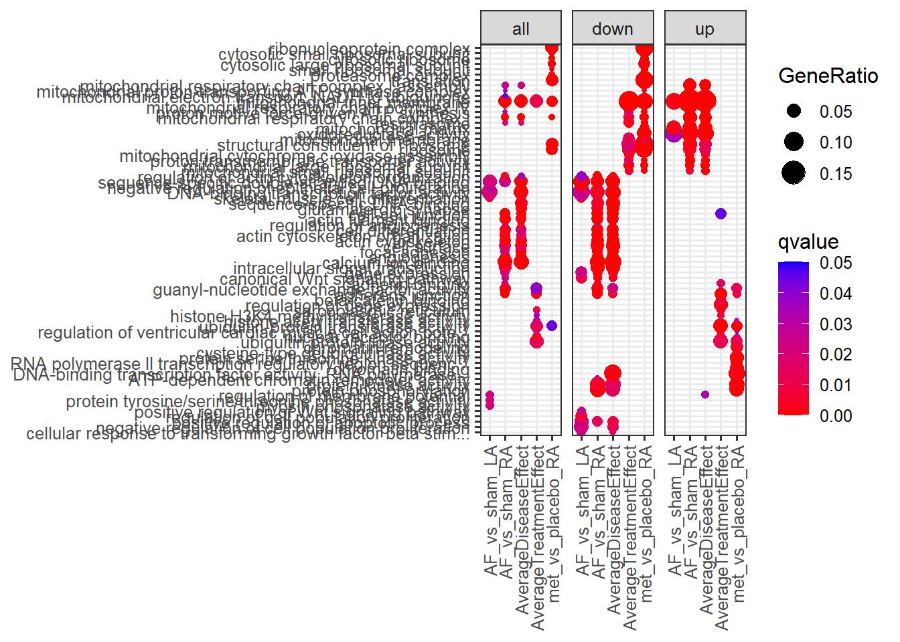

``` r
#Plot results without "all" direction as it seems redundant
##First RA
filtered_go_ora_res <- go_ora_res %>% 
  filter(Direction != "all")
aamisc::dotplotEnrich(dt = filtered_go_ora_res %>% 
                        filter(Contrast == "AF_vs_sham_RA"), 
                      topn = 10, 
                      topn.pref = "qval", 
                      qcut = enrich_cut, 
                      nchar = 60, 
                      direction = "Direction", 
                      group = "Contrast", 
                      dot = "GeneRatio", 
                      qval = "qvalue", 
                      term.id = "ID",
                      term.name = "Description")
```

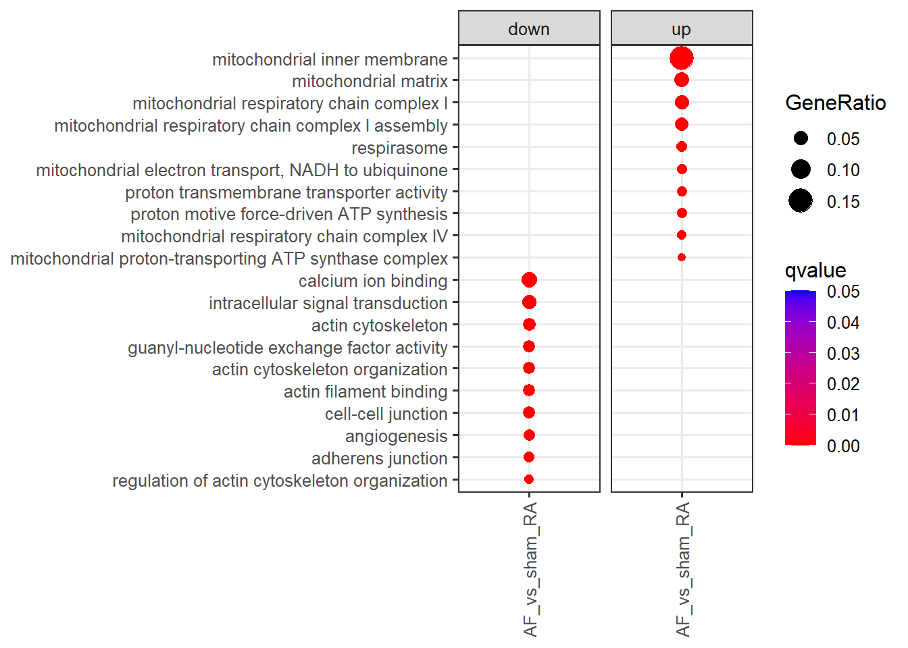

``` r
aamisc::dotplotEnrich(dt = filtered_go_ora_res %>% 
                        filter(Contrast == "AF_vs_sham_LA"), 
                      topn = 10, 
                      topn.pref = "qval", 
                      qcut = enrich_cut, 
                      nchar = 60, 
                      direction = "Direction", 
                      group = "Contrast", 
                      dot = "GeneRatio", 
                      qval = "qvalue", 
                      term.id = "ID",
                      term.name = "Description")
```

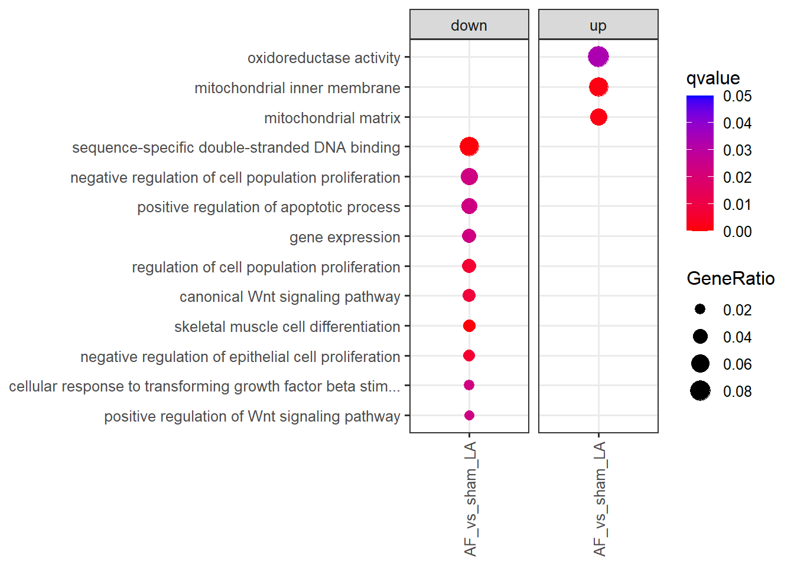

``` r
aamisc::dotplotEnrich(dt = filtered_go_ora_res %>% 
                        filter(Contrast == "met_vs_placebo_RA"), 
                      topn = 10, 
                      topn.pref = "qval", 
                      qcut = enrich_cut, 
                      nchar = 60, 
                      direction = "Direction", 
                      group = "Contrast", 
                      dot = "GeneRatio", 
                      qval = "qvalue", 
                      term.id = "ID",
                      term.name = "Description")
```

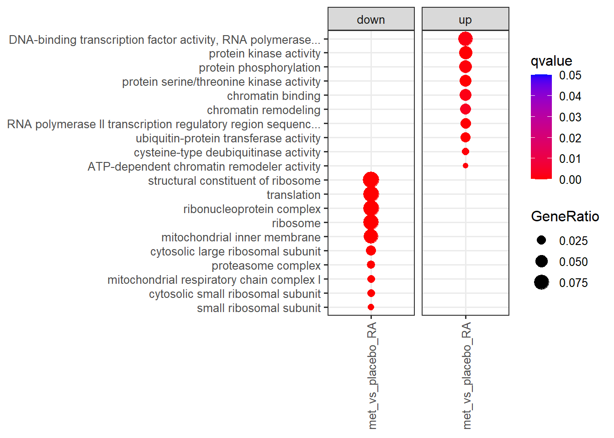

``` r
aamisc::dotplotEnrich(dt = filtered_go_ora_res %>% 
                        filter(Contrast == "AverageTreatmentEffect"), 
                      topn = 10, 
                      topn.pref = "qval", 
                      qcut = enrich_cut, 
                      nchar = 60, 
                      direction = "Direction", 
                      group = "Contrast", 
                      dot = "GeneRatio", 
                      qval = "qvalue", 
                      term.id = "ID",
                      term.name = "Description")
```

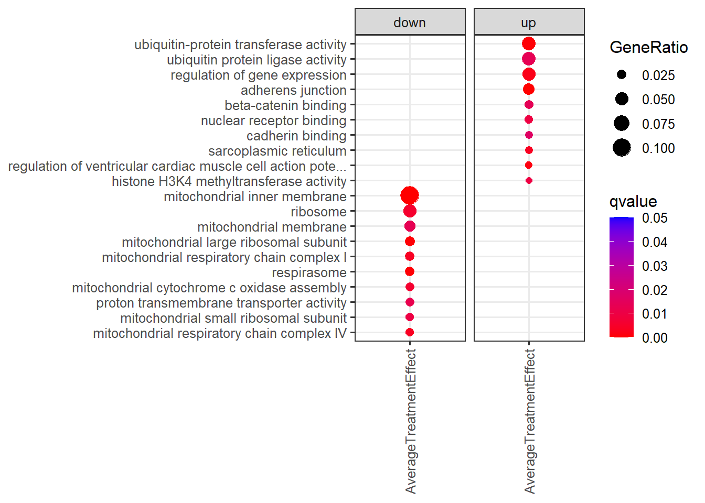

``` r
aamisc::dotplotEnrich(dt = filtered_go_ora_res %>% 
                        filter(Contrast == "AverageDiseaseEffect"), 
                      topn = 10, 
                      topn.pref = "qval", 
                      qcut = enrich_cut, 
                      nchar = 60, 
                      direction = "Direction", 
                      group = "Contrast", 
                      dot = "GeneRatio", 
                      qval = "qvalue", 
                      term.id = "ID",
                      term.name = "Description")
```

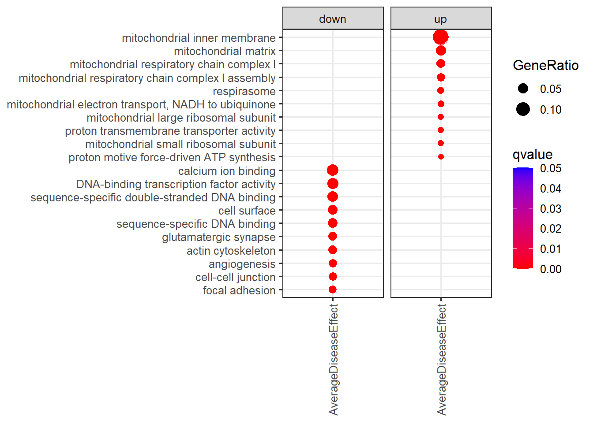

###Revigo - reduce redundant terms and plot

``` r
fetch_and_process_revigo <- function(data, cutoff, valueType = "pvalue", speciesTaxon = "0", measure = "SIMREL", enrich_cut = 0.05, contrasts = c("AF_vs_sham_RA", "AF_vs_sham_LA")) {
  # Filter significant terms and create submission string
  significant_terms <- data[p.adjust < 0.05, ]
  go_list_string <- paste(significant_terms$ID, significant_terms$p.adjust, sep=" ", collapse="\n")
  
  # Submit to Revigo
  response <- POST("http://revigo.irb.hr/StartJob", body = list(
    cutoff = cutoff,
    valueType = valueType,
    speciesTaxon = speciesTaxon,
    measure = measure,
    goList = go_list_string
  ), encode = "form")
  job_id <- fromJSON(content(response, type = "text", encoding = "UTF-8"))$jobid
  
  # Wait for job completion
  while ((running <- fromJSON(content(GET("http://revigo.irb.hr/QueryJob", query = list(jobid = job_id, type="jstatus")), type = "text", encoding = "UTF-8"))$running) != "0") {
    Sys.sleep(1)
  }
  
  # Fetch results for all namespaces and combine
  namespaces <- c("1", "2", "3")
  results <- lapply(namespaces, function(ns) {
    response <- GET("http://revigo.irb.hr/QueryJob", query = list(jobid = job_id, namespace = ns, type = "table"))
    fread(text = content(response, type = "text", encoding = "UTF-8"))
  })
  combined_results <- rbindlist(results, use.names = TRUE, fill = TRUE)
  
  # Filter null terms and match with original data
  null_term_ids <- combined_results[Representative == "null", .(TermID)]
  final_terms <- data[ID %in% null_term_ids$TermID]
  final_terms <- final_terms[!(Direction %in% c("all")), ]
  
  # Plot results for all specified contrasts
  lapply(contrasts, function(contrast) {
    plot_data <- final_terms %>% filter(Contrast == contrast)
    aamisc::dotplotEnrich(
      dt = plot_data,
      topn = 10,
      topn.pref = "qval",
      qcut = enrich_cut,
      nchar = 60,
      direction = "Direction",
      group = "Contrast",
      dot = if ("GeneRatio" %in% names(plot_data)) "GeneRatio" else "setSize",
      qval = "qvalue",
      term.id = "ID",
      term.name = "Description"
    )
  })
}

# Example usage
fetch_and_process_revigo(filtered_go_ora_res, cutoff = 0.5, enrich_cut = 0.05, contrasts = c("AF_vs_sham_LA"))
```

```
## [[1]]
```

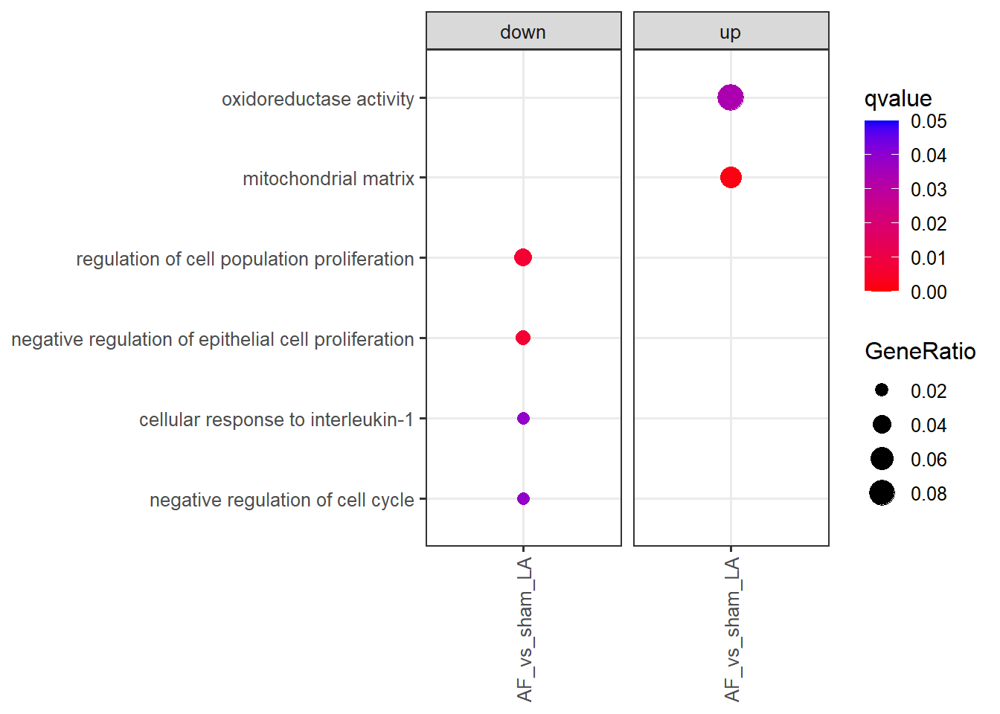

``` r
fetch_and_process_revigo(filtered_go_ora_res, cutoff = 0.5, enrich_cut = 0.05, contrasts = c("AF_vs_sham_RA"))
```

```
## [[1]]
```

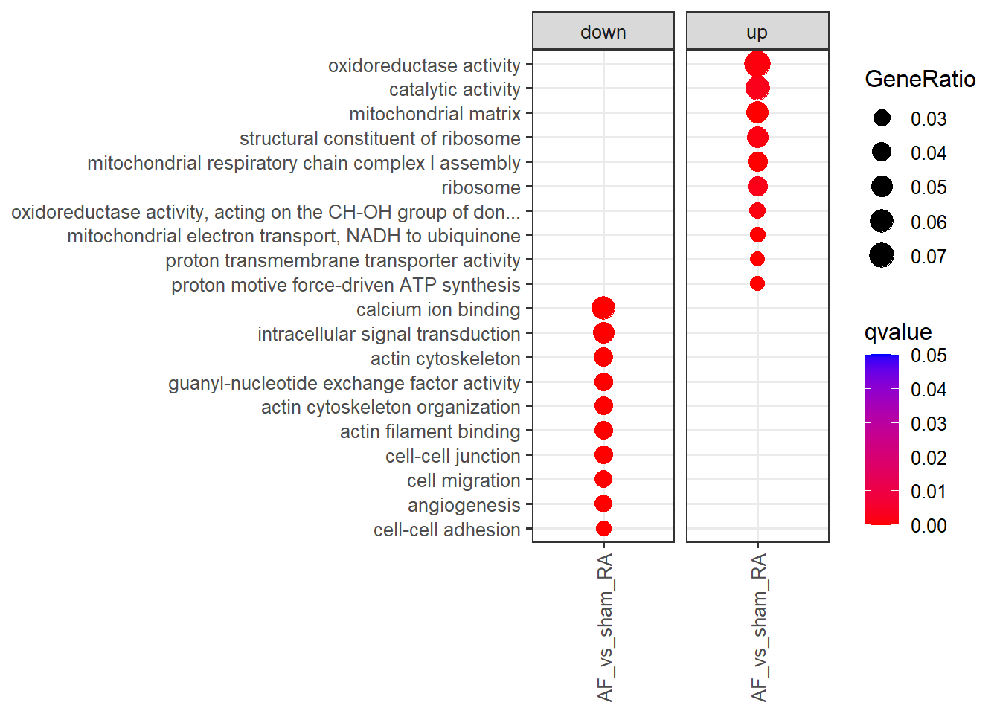

``` r
fetch_and_process_revigo(filtered_go_ora_res, cutoff = 0.5, enrich_cut = 0.05, contrasts = c("met_vs_placebo_RA"))
```

```
## [[1]]
```

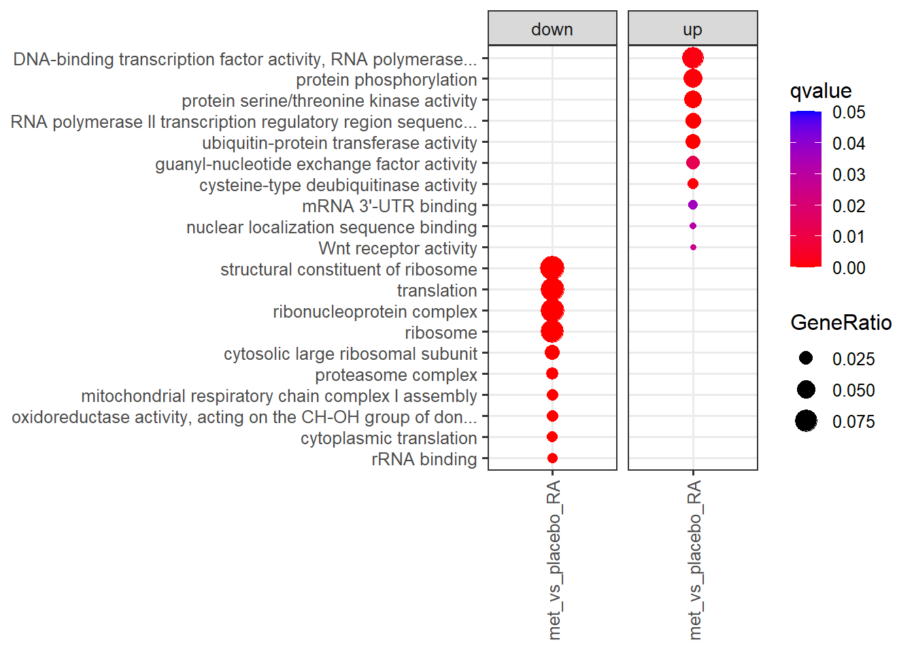

``` r
fetch_and_process_revigo(filtered_go_ora_res, cutoff = 0.5, enrich_cut = 0.05, contrasts = c("AverageTreatmentEffect"))
```

```
## [[1]]
```

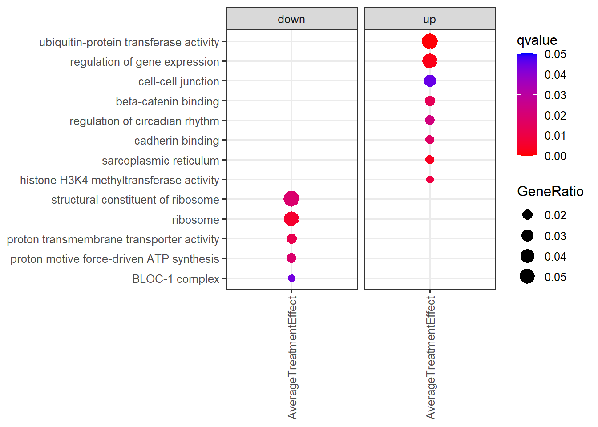

``` r
fetch_and_process_revigo(filtered_go_ora_res, cutoff = 0.5, enrich_cut = 0.05, contrasts = c("AverageDiseaseEffect"))
```

```
## [[1]]
```

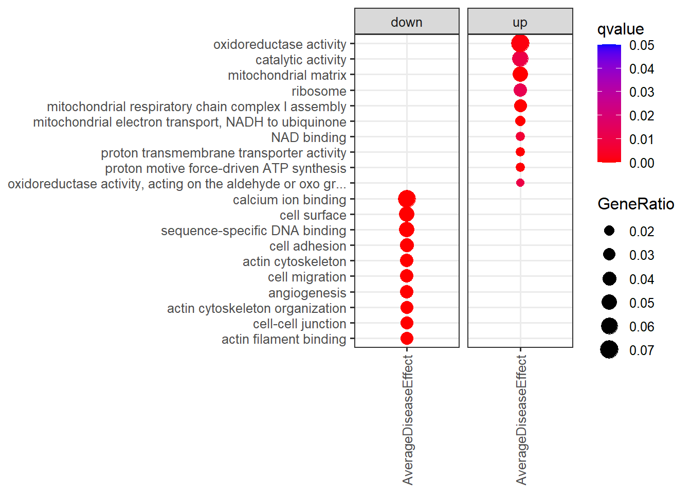


## GSEA

``` r
go_gsea <- list()

for (j in names(term2gene)){
    for (i in names(dge_split)){
      message(paste0("Running GO GSEA for '", i, "'", " within ", j))
      geneList <- dge_split[[i]]$logFC
      names(geneList) <- dge_split[[i]]$ENSEMBL
      geneList <- sort(geneList, decreasing = TRUE)
      
      go_gsea[[i]][[j]] <- GSEA(geneList = geneList, 
                 TERM2GENE = term2gene[[j]], 
                 TERM2NAME = term2name[[j]], 
                 pvalueCutoff = enrich_cut,
                 minGSSize = 10, 
                 maxGSSize = 500, 
                 eps = 0, 
                 nPermSimple = 10000 # TODO: set it to 1 million for robust results
                 )@result
      
      go_gsea[[i]][[j]]$Contrast <- i
      go_gsea[[i]][[j]]$Database <- j
      
    }
  }
```

```
## Running GO GSEA for 'AF_vs_sham_LA' within biological_process
```

```
## preparing geneSet collections...
```

```
## GSEA analysis...
```

```
## leading edge analysis...
```

```
## done...
```

```
## Running GO GSEA for 'AF_vs_sham_RA' within biological_process
```

```
## preparing geneSet collections...
```

```
## GSEA analysis...
```

```
## leading edge analysis...
```

```
## done...
```

```
## Running GO GSEA for 'AverageDiseaseEffect' within biological_process
```

```
## preparing geneSet collections...
```

```
## GSEA analysis...
```

```
## leading edge analysis...
```

```
## done...
```

```
## Running GO GSEA for 'AverageTreatmentEffect' within biological_process
```

```
## preparing geneSet collections...
```

```
## GSEA analysis...
```

```
## leading edge analysis...
```

```
## done...
```

```
## Running GO GSEA for 'met_vs_placebo_LA' within biological_process
```

```
## preparing geneSet collections...
```

```
## GSEA analysis...
```

```
## leading edge analysis...
```

```
## done...
```

```
## Running GO GSEA for 'met_vs_placebo_RA' within biological_process
```

```
## preparing geneSet collections...
```

```
## GSEA analysis...
```

```
## leading edge analysis...
```

```
## done...
```

```
## Running GO GSEA for 'AF_vs_sham_LA' within cellular_component
```

```
## preparing geneSet collections...
```

```
## GSEA analysis...
```

```
## leading edge analysis...
```

```
## done...
```

```
## Running GO GSEA for 'AF_vs_sham_RA' within cellular_component
```

```
## preparing geneSet collections...
```

```
## GSEA analysis...
```

```
## leading edge analysis...
```

```
## done...
```

```
## Running GO GSEA for 'AverageDiseaseEffect' within cellular_component
```

```
## preparing geneSet collections...
```

```
## GSEA analysis...
```

```
## leading edge analysis...
```

```
## done...
```

```
## Running GO GSEA for 'AverageTreatmentEffect' within cellular_component
```

```
## preparing geneSet collections...
```

```
## GSEA analysis...
```

```
## leading edge analysis...
```

```
## done...
```

```
## Running GO GSEA for 'met_vs_placebo_LA' within cellular_component
```

```
## preparing geneSet collections...
```

```
## GSEA analysis...
```

```
## Warning in fgseaMultilevel(pathways = pathways, stats = stats, minSize =
## minSize, : There were 1 pathways for which P-values were not calculated
## properly due to unbalanced (positive and negative) gene-level statistic values.
## For such pathways pval, padj, NES, log2err are set to NA. You can try to
## increase the value of the argument nPermSimple (for example set it nPermSimple
## = 100000)
```

```
## leading edge analysis...
```

```
## done...
```

```
## Running GO GSEA for 'met_vs_placebo_RA' within cellular_component
```

```
## preparing geneSet collections...
```

```
## GSEA analysis...
```

```
## leading edge analysis...
```

```
## done...
```

```
## Running GO GSEA for 'AF_vs_sham_LA' within molecular_function
```

```
## preparing geneSet collections...
```

```
## GSEA analysis...
```

```
## leading edge analysis...
```

```
## done...
```

```
## Running GO GSEA for 'AF_vs_sham_RA' within molecular_function
```

```
## preparing geneSet collections...
```

```
## GSEA analysis...
```

```
## leading edge analysis...
```

```
## done...
```

```
## Running GO GSEA for 'AverageDiseaseEffect' within molecular_function
```

```
## preparing geneSet collections...
```

```
## GSEA analysis...
```

```
## leading edge analysis...
```

```
## done...
```

```
## Running GO GSEA for 'AverageTreatmentEffect' within molecular_function
```

```
## preparing geneSet collections...
```

```
## GSEA analysis...
```

```
## leading edge analysis...
```

```
## done...
```

```
## Running GO GSEA for 'met_vs_placebo_LA' within molecular_function
```

```
## preparing geneSet collections...
```

```
## GSEA analysis...
```

```
## leading edge analysis...
```

```
## done...
```

```
## Running GO GSEA for 'met_vs_placebo_RA' within molecular_function
```

```
## preparing geneSet collections...
```

```
## GSEA analysis...
```

```
## leading edge analysis...
```

```
## done...
```

``` r
go_gsea_res <- do.call(rbind, go_gsea %>% unlist(recursive=FALSE)) %>% setDT
head(go_gsea_res)
```

```
##            ID                                 Description setSize
## 1: GO:0030198           extracellular matrix organization      88
## 2: GO:0016477                              cell migration     147
## 3: GO:0001525                                angiogenesis      99
## 4: GO:0007155                               cell adhesion     176
## 5: GO:0042127 regulation of cell population proliferation      77
## 6: GO:0001837        epithelial to mesenchymal transition      31
##    enrichmentScore       NES       pvalue     p.adjust       qvalue rank
## 1:      -0.6119365 -2.109163 1.311322e-07 9.605434e-05 8.213017e-05 1667
## 2:      -0.5378852 -1.984049 1.025015e-07 9.605434e-05 8.213017e-05 2053
## 3:      -0.5881220 -2.063752 2.009786e-07 9.814455e-05 8.391738e-05 1815
## 4:      -0.4960970 -1.864210 8.470450e-07 3.102302e-04 2.652588e-04 2194
## 5:      -0.6046762 -2.044062 1.481619e-06 4.341144e-04 3.711846e-04 1656
## 6:      -0.7341662 -2.110012 2.705873e-06 6.606840e-04 5.649104e-04 2321
##                      leading_edge
## 1: tags=45%, list=14%, signal=39%
## 2: tags=38%, list=17%, signal=32%
## 3: tags=43%, list=15%, signal=37%
## 4: tags=38%, list=18%, signal=31%
## 5: tags=32%, list=14%, signal=28%
## 6: tags=68%, list=19%, signal=55%
##                                                                                                                                                                                                                                                                                                                                                                                                                                                                                                                                                                                                                                                                                                                                                                                                                                                                                                                                                                                                                                                                                                                                                                                                                                                                                          core_enrichment
## 1:                                                                                                                                                                                                                                                                                                                                                                                                                                                                                                               ENSECAG00000019838/ENSECAG00000034852/ENSECAG00000038712/ENSECAG00000011459/ENSECAG00000011350/ENSECAG00000022944/ENSECAG00000019717/ENSECAG00000010830/ENSECAG00000033093/ENSECAG00000017912/ENSECAG00000021288/ENSECAG00000012799/ENSECAG00000000480/ENSECAG00000019880/ENSECAG00000025161/ENSECAG00000018176/ENSECAG00000008499/ENSECAG00000007527/ENSECAG00000024297/ENSECAG00000016210/ENSECAG00000021274/ENSECAG00000021211/ENSECAG00000010426/ENSECAG00000020193/ENSECAG00000007861/ENSECAG00000019593/ENSECAG00000018101/ENSECAG00000000953/ENSECAG00000020719/ENSECAG00000004158/ENSECAG00000059197/ENSECAG00000016339/ENSECAG00000011887/ENSECAG00000014155/ENSECAG00000024636/ENSECAG00000024172/ENSECAG00000013608/ENSECAG00000022037/ENSECAG00000014164/ENSECAG00000024993
## 2:                                                                                                                                                                                               ENSECAG00000022527/ENSECAG00000025133/ENSECAG00000008351/ENSECAG00000007589/ENSECAG00000011891/ENSECAG00000011111/ENSECAG00000019128/ENSECAG00000030452/ENSECAG00000017840/ENSECAG00000021310/ENSECAG00000016613/ENSECAG00000012072/ENSECAG00000019700/ENSECAG00000015858/ENSECAG00000042356/ENSECAG00000019633/ENSECAG00000005833/ENSECAG00000015550/ENSECAG00000012727/ENSECAG00000007189/ENSECAG00000026945/ENSECAG00000023970/ENSECAG00000028562/ENSECAG00000023879/ENSECAG00000025161/ENSECAG00000018176/ENSECAG00000014817/ENSECAG00000020592/ENSECAG00000029381/ENSECAG00000020173/ENSECAG00000011991/ENSECAG00000012973/ENSECAG00000011471/ENSECAG00000012668/ENSECAG00000026863/ENSECAG00000032992/ENSECAG00000007650/ENSECAG00000003315/ENSECAG00000009626/ENSECAG00000005957/ENSECAG00000002810/ENSECAG00000008170/ENSECAG00000009296/ENSECAG00000017587/ENSECAG00000013377/ENSECAG00000017104/ENSECAG00000014435/ENSECAG00000020971/ENSECAG00000036088/ENSECAG00000019429/ENSECAG00000008830/ENSECAG00000008923/ENSECAG00000051604/ENSECAG00000020468/ENSECAG00000016610/ENSECAG00000005814
## 3:                                                                                                                                                                                                                                                                                                                                                                                                                                                      ENSECAG00000007686/ENSECAG00000012670/ENSECAG00000019870/ENSECAG00000030065/ENSECAG00000004757/ENSECAG00000020716/ENSECAG00000021042/ENSECAG00000016168/ENSECAG00000009550/ENSECAG00000011459/ENSECAG00000007412/ENSECAG00000020338/ENSECAG00000015550/ENSECAG00000020093/ENSECAG00000012990/ENSECAG00000032285/ENSECAG00000016361/ENSECAG00000020856/ENSECAG00000021108/ENSECAG00000009818/ENSECAG00000022405/ENSECAG00000020173/ENSECAG00000018746/ENSECAG00000024979/ENSECAG00000024297/ENSECAG00000018600/ENSECAG00000000011/ENSECAG00000015865/ENSECAG00000013036/ENSECAG00000015006/ENSECAG00000015878/ENSECAG00000016824/ENSECAG00000028820/ENSECAG00000020193/ENSECAG00000028189/ENSECAG00000009159/ENSECAG00000022462/ENSECAG00000015894/ENSECAG00000019781/ENSECAG00000000942/ENSECAG00000019429/ENSECAG00000016610/ENSECAG00000019376
## 4: ENSECAG00000029412/ENSECAG00000023112/ENSECAG00000007848/ENSECAG00000016123/ENSECAG00000018814/ENSECAG00000018584/ENSECAG00000015153/ENSECAG00000009796/ENSECAG00000015369/ENSECAG00000007589/ENSECAG00000031230/ENSECAG00000017502/ENSECAG00000013616/ENSECAG00000004865/ENSECAG00000019870/ENSECAG00000012072/ENSECAG00000018619/ENSECAG00000016015/ENSECAG00000042356/ENSECAG00000020716/ENSECAG00000014290/ENSECAG00000005833/ENSECAG00000014680/ENSECAG00000016927/ENSECAG00000023022/ENSECAG00000001652/ENSECAG00000015550/ENSECAG00000012395/ENSECAG00000011993/ENSECAG00000026945/ENSECAG00000013011/ENSECAG00000010573/ENSECAG00000009829/ENSECAG00000019665/ENSECAG00000015760/ENSECAG00000040351/ENSECAG00000021969/ENSECAG00000012805/ENSECAG00000024973/ENSECAG00000020592/ENSECAG00000010178/ENSECAG00000024979/ENSECAG00000009027/ENSECAG00000003002/ENSECAG00000020731/ENSECAG00000006637/ENSECAG00000003573/ENSECAG00000022715/ENSECAG00000026863/ENSECAG00000020193/ENSECAG00000021122/ENSECAG00000016513/ENSECAG00000009296/ENSECAG00000012104/ENSECAG00000001064/ENSECAG00000028842/ENSECAG00000000599/ENSECAG00000011213/ENSECAG00000012348/ENSECAG00000008923/ENSECAG00000011581/ENSECAG00000013883/ENSECAG00000022564/ENSECAG00000016610/ENSECAG00000005814/ENSECAG00000024993
## 5:                                                                                                                                                                                                                                                                                                                                                                                                                                                                                                                                                                                                                                                                                                                                                                                                            ENSECAG00000009281/ENSECAG00000012328/ENSECAG00000020338/ENSECAG00000000836/ENSECAG00000024374/ENSECAG00000014981/ENSECAG00000053524/ENSECAG00000025161/ENSECAG00000008705/ENSECAG00000020592/ENSECAG00000018746/ENSECAG00000006609/ENSECAG00000019069/ENSECAG00000015029/ENSECAG00000012861/ENSECAG00000007010/ENSECAG00000011671/ENSECAG00000013998/ENSECAG00000003816/ENSECAG00000015864/ENSECAG00000051604/ENSECAG00000010613/ENSECAG00000024055/ENSECAG00000017181/ENSECAG00000022037
## 6:                                                                                                                                                                                                                                                                                                                                                                                                                                                                                                                                                                                                                                                                                                                                                                                                                                                                                        ENSECAG00000024935/ENSECAG00000011132/ENSECAG00000010774/ENSECAG00000025110/ENSECAG00000009787/ENSECAG00000026972/ENSECAG00000019700/ENSECAG00000004757/ENSECAG00000009550/ENSECAG00000013443/ENSECAG00000013283/ENSECAG00000022405/ENSECAG00000006518/ENSECAG00000020173/ENSECAG00000015006/ENSECAG00000020619/ENSECAG00000011671/ENSECAG00000008830/ENSECAG00000021201/ENSECAG00000051604/ENSECAG00000022037
##         Contrast           Database
## 1: AF_vs_sham_LA biological_process
## 2: AF_vs_sham_LA biological_process
## 3: AF_vs_sham_LA biological_process
## 4: AF_vs_sham_LA biological_process
## 5: AF_vs_sham_LA biological_process
## 6: AF_vs_sham_LA biological_process
```

``` r
go_gsea_res[qvalue < enrich_cut,]
```

```
##              ID                                                     Description
##   1: GO:0030198                               extracellular matrix organization
##   2: GO:0016477                                                  cell migration
##   3: GO:0001525                                                    angiogenesis
##   4: GO:0007155                                                   cell adhesion
##   5: GO:0042127                     regulation of cell population proliferation
##  ---                                                                           
## 788: GO:0003712                              transcription coregulator activity
## 789: GO:0008009                                              chemokine activity
## 790: GO:0004601                                             peroxidase activity
## 791: GO:0003713                              transcription coactivator activity
## 792: GO:0046933 proton-transporting ATP synthase activity, rotational mechanism
##      setSize enrichmentScore       NES       pvalue     p.adjust       qvalue
##   1:      88      -0.6119365 -2.109163 1.311322e-07 9.605434e-05 8.213017e-05
##   2:     147      -0.5378852 -1.984049 1.025015e-07 9.605434e-05 8.213017e-05
##   3:      99      -0.5881220 -2.063752 2.009786e-07 9.814455e-05 8.391738e-05
##   4:     176      -0.4960970 -1.864210 8.470450e-07 3.102302e-04 2.652588e-04
##   5:      77      -0.6046762 -2.044062 1.481619e-06 4.341144e-04 3.711846e-04
##  ---                                                                         
## 788:      97       0.4272020  1.594439 3.450579e-03 4.218333e-02 3.441498e-02
## 789:      10      -0.7214715 -1.956456 3.671296e-03 4.378692e-02 3.572326e-02
## 790:      16      -0.6214335 -1.952436 3.935867e-03 4.582474e-02 3.738581e-02
## 791:     156       0.3801838  1.491279 4.141007e-03 4.709191e-02 3.841962e-02
## 792:      12      -0.6819128 -1.958959 4.493743e-03 4.994183e-02 4.074471e-02
##      rank                   leading_edge
##   1: 1667 tags=45%, list=14%, signal=39%
##   2: 2053 tags=38%, list=17%, signal=32%
##   3: 1815 tags=43%, list=15%, signal=37%
##   4: 2194 tags=38%, list=18%, signal=31%
##   5: 1656 tags=32%, list=14%, signal=28%
##  ---                                    
## 788: 2210 tags=32%, list=18%, signal=26%
## 789:  738  tags=60%, list=6%, signal=56%
## 790: 1200 tags=50%, list=10%, signal=45%
## 791: 3269 tags=35%, list=27%, signal=26%
## 792: 2756 tags=75%, list=23%, signal=58%
##                                                                                                                                                                                                                                                                                                                                                                                                                                                                                                                                                                                                                                                                                                                                                                                                                                                                                                                                                                                                                                                                                                                                                                                                                                                                                            core_enrichment
##   1:                                                                                                                                                                                                                                                                                                                                                                                                                                                                                                               ENSECAG00000019838/ENSECAG00000034852/ENSECAG00000038712/ENSECAG00000011459/ENSECAG00000011350/ENSECAG00000022944/ENSECAG00000019717/ENSECAG00000010830/ENSECAG00000033093/ENSECAG00000017912/ENSECAG00000021288/ENSECAG00000012799/ENSECAG00000000480/ENSECAG00000019880/ENSECAG00000025161/ENSECAG00000018176/ENSECAG00000008499/ENSECAG00000007527/ENSECAG00000024297/ENSECAG00000016210/ENSECAG00000021274/ENSECAG00000021211/ENSECAG00000010426/ENSECAG00000020193/ENSECAG00000007861/ENSECAG00000019593/ENSECAG00000018101/ENSECAG00000000953/ENSECAG00000020719/ENSECAG00000004158/ENSECAG00000059197/ENSECAG00000016339/ENSECAG00000011887/ENSECAG00000014155/ENSECAG00000024636/ENSECAG00000024172/ENSECAG00000013608/ENSECAG00000022037/ENSECAG00000014164/ENSECAG00000024993
##   2:                                                                                                                                                                                               ENSECAG00000022527/ENSECAG00000025133/ENSECAG00000008351/ENSECAG00000007589/ENSECAG00000011891/ENSECAG00000011111/ENSECAG00000019128/ENSECAG00000030452/ENSECAG00000017840/ENSECAG00000021310/ENSECAG00000016613/ENSECAG00000012072/ENSECAG00000019700/ENSECAG00000015858/ENSECAG00000042356/ENSECAG00000019633/ENSECAG00000005833/ENSECAG00000015550/ENSECAG00000012727/ENSECAG00000007189/ENSECAG00000026945/ENSECAG00000023970/ENSECAG00000028562/ENSECAG00000023879/ENSECAG00000025161/ENSECAG00000018176/ENSECAG00000014817/ENSECAG00000020592/ENSECAG00000029381/ENSECAG00000020173/ENSECAG00000011991/ENSECAG00000012973/ENSECAG00000011471/ENSECAG00000012668/ENSECAG00000026863/ENSECAG00000032992/ENSECAG00000007650/ENSECAG00000003315/ENSECAG00000009626/ENSECAG00000005957/ENSECAG00000002810/ENSECAG00000008170/ENSECAG00000009296/ENSECAG00000017587/ENSECAG00000013377/ENSECAG00000017104/ENSECAG00000014435/ENSECAG00000020971/ENSECAG00000036088/ENSECAG00000019429/ENSECAG00000008830/ENSECAG00000008923/ENSECAG00000051604/ENSECAG00000020468/ENSECAG00000016610/ENSECAG00000005814
##   3:                                                                                                                                                                                                                                                                                                                                                                                                                                                      ENSECAG00000007686/ENSECAG00000012670/ENSECAG00000019870/ENSECAG00000030065/ENSECAG00000004757/ENSECAG00000020716/ENSECAG00000021042/ENSECAG00000016168/ENSECAG00000009550/ENSECAG00000011459/ENSECAG00000007412/ENSECAG00000020338/ENSECAG00000015550/ENSECAG00000020093/ENSECAG00000012990/ENSECAG00000032285/ENSECAG00000016361/ENSECAG00000020856/ENSECAG00000021108/ENSECAG00000009818/ENSECAG00000022405/ENSECAG00000020173/ENSECAG00000018746/ENSECAG00000024979/ENSECAG00000024297/ENSECAG00000018600/ENSECAG00000000011/ENSECAG00000015865/ENSECAG00000013036/ENSECAG00000015006/ENSECAG00000015878/ENSECAG00000016824/ENSECAG00000028820/ENSECAG00000020193/ENSECAG00000028189/ENSECAG00000009159/ENSECAG00000022462/ENSECAG00000015894/ENSECAG00000019781/ENSECAG00000000942/ENSECAG00000019429/ENSECAG00000016610/ENSECAG00000019376
##   4: ENSECAG00000029412/ENSECAG00000023112/ENSECAG00000007848/ENSECAG00000016123/ENSECAG00000018814/ENSECAG00000018584/ENSECAG00000015153/ENSECAG00000009796/ENSECAG00000015369/ENSECAG00000007589/ENSECAG00000031230/ENSECAG00000017502/ENSECAG00000013616/ENSECAG00000004865/ENSECAG00000019870/ENSECAG00000012072/ENSECAG00000018619/ENSECAG00000016015/ENSECAG00000042356/ENSECAG00000020716/ENSECAG00000014290/ENSECAG00000005833/ENSECAG00000014680/ENSECAG00000016927/ENSECAG00000023022/ENSECAG00000001652/ENSECAG00000015550/ENSECAG00000012395/ENSECAG00000011993/ENSECAG00000026945/ENSECAG00000013011/ENSECAG00000010573/ENSECAG00000009829/ENSECAG00000019665/ENSECAG00000015760/ENSECAG00000040351/ENSECAG00000021969/ENSECAG00000012805/ENSECAG00000024973/ENSECAG00000020592/ENSECAG00000010178/ENSECAG00000024979/ENSECAG00000009027/ENSECAG00000003002/ENSECAG00000020731/ENSECAG00000006637/ENSECAG00000003573/ENSECAG00000022715/ENSECAG00000026863/ENSECAG00000020193/ENSECAG00000021122/ENSECAG00000016513/ENSECAG00000009296/ENSECAG00000012104/ENSECAG00000001064/ENSECAG00000028842/ENSECAG00000000599/ENSECAG00000011213/ENSECAG00000012348/ENSECAG00000008923/ENSECAG00000011581/ENSECAG00000013883/ENSECAG00000022564/ENSECAG00000016610/ENSECAG00000005814/ENSECAG00000024993
##   5:                                                                                                                                                                                                                                                                                                                                                                                                                                                                                                                                                                                                                                                                                                                                                                                                            ENSECAG00000009281/ENSECAG00000012328/ENSECAG00000020338/ENSECAG00000000836/ENSECAG00000024374/ENSECAG00000014981/ENSECAG00000053524/ENSECAG00000025161/ENSECAG00000008705/ENSECAG00000020592/ENSECAG00000018746/ENSECAG00000006609/ENSECAG00000019069/ENSECAG00000015029/ENSECAG00000012861/ENSECAG00000007010/ENSECAG00000011671/ENSECAG00000013998/ENSECAG00000003816/ENSECAG00000015864/ENSECAG00000051604/ENSECAG00000010613/ENSECAG00000024055/ENSECAG00000017181/ENSECAG00000022037
##  ---                                                                                                                                                                                                                                                                                                                                                                                                                                                                                                                                                                                                                                                                                                                                                                                                                                                                                                                                                                                                                                                                                                                                                                                                                                                                                                      
## 788:                                                                                                                                                                                                                                                                                                                                                                                                                                                                                                                                                                                                                                                                                          ENSECAG00000009164/ENSECAG00000009552/ENSECAG00000002716/ENSECAG00000007687/ENSECAG00000023488/ENSECAG00000007993/ENSECAG00000009326/ENSECAG00000023836/ENSECAG00000020792/ENSECAG00000017895/ENSECAG00000004762/ENSECAG00000012941/ENSECAG00000008029/ENSECAG00000012230/ENSECAG00000000266/ENSECAG00000008226/ENSECAG00000026860/ENSECAG00000011291/ENSECAG00000009327/ENSECAG00000019769/ENSECAG00000024766/ENSECAG00000002816/ENSECAG00000018062/ENSECAG00000009106/ENSECAG00000013925/ENSECAG00000018858/ENSECAG00000023931/ENSECAG00000026954/ENSECAG00000007796/ENSECAG00000014191/ENSECAG00000008093
## 789:                                                                                                                                                                                                                                                                                                                                                                                                                                                                                                                                                                                                                                                                                                                                                                                                                                                                                                                                                                                                                                                                                                                                                                                     ENSECAG00000031387/ENSECAG00000024886/ENSECAG00000032357/ENSECAG00000024790/ENSECAG00000034282/ENSECAG00000010560
## 790:                                                                                                                                                                                                                                                                                                                                                                                                                                                                                                                                                                                                                                                                                                                                                                                                                                                                                                                                                                                                                                                                                                                                               ENSECAG00000031859/ENSECAG00000001989/ENSECAG00000008678/ENSECAG00000017747/ENSECAG00000025006/ENSECAG00000035469/ENSECAG00000023301/ENSECAG00000009707
## 791:                                                                                                                                                                                                                                     ENSECAG00000008394/ENSECAG00000014968/ENSECAG00000009164/ENSECAG00000025166/ENSECAG00000002400/ENSECAG00000020850/ENSECAG00000017946/ENSECAG00000022405/ENSECAG00000014537/ENSECAG00000009326/ENSECAG00000008927/ENSECAG00000022544/ENSECAG00000023836/ENSECAG00000017895/ENSECAG00000004762/ENSECAG00000004792/ENSECAG00000012230/ENSECAG00000020735/ENSECAG00000008226/ENSECAG00000008660/ENSECAG00000009327/ENSECAG00000011243/ENSECAG00000024212/ENSECAG00000023174/ENSECAG00000025110/ENSECAG00000019137/ENSECAG00000020172/ENSECAG00000024766/ENSECAG00000013925/ENSECAG00000011851/ENSECAG00000022110/ENSECAG00000021528/ENSECAG00000017819/ENSECAG00000023931/ENSECAG00000014191/ENSECAG00000006210/ENSECAG00000012229/ENSECAG00000024706/ENSECAG00000022440/ENSECAG00000015336/ENSECAG00000000550/ENSECAG00000018310/ENSECAG00000021613/ENSECAG00000015490/ENSECAG00000004159/ENSECAG00000020149/ENSECAG00000024419/ENSECAG00000017930/ENSECAG00000051427/ENSECAG00000021207/ENSECAG00000009381/ENSECAG00000019370/ENSECAG00000013563/ENSECAG00000013909
## 792:                                                                                                                                                                                                                                                                                                                                                                                                                                                                                                                                                                                                                                                                                                                                                                                                                                                                                                                                                                                                                                                                                                                            ENSECAG00000027671/ENSECAG00000024684/ENSECAG00000018599/ENSECAG00000009487/ENSECAG00000060119/ENSECAG00000002088/ENSECAG00000012169/ENSECAG00000023715/ENSECAG00000009059
##               Contrast           Database
##   1:     AF_vs_sham_LA biological_process
##   2:     AF_vs_sham_LA biological_process
##   3:     AF_vs_sham_LA biological_process
##   4:     AF_vs_sham_LA biological_process
##   5:     AF_vs_sham_LA biological_process
##  ---                                     
## 788: met_vs_placebo_RA molecular_function
## 789: met_vs_placebo_RA molecular_function
## 790: met_vs_placebo_RA molecular_function
## 791: met_vs_placebo_RA molecular_function
## 792: met_vs_placebo_RA molecular_function
```

``` r
go_gsea_res[, direction := ifelse(NES < 0, "down", "up")]

#Output data
go_gsea_res_split <- split(go_gsea_res, f = go_gsea_res$Contrast)

openxlsx::write.xlsx(x = go_gsea_res_split, file = "../output/GO_gsea.xlsx", asTable = TRUE)
fwrite(x = go_gsea_res_split, file = "../output/go_gsea.tsv.gz", sep = "\t")

# Loop through each contrast and plot results
for (contrast in contrasts) {
  # Check if the contrast exists in the split data
  if (contrast %in% names(go_gsea_res_split)) {
    dt <- go_gsea_res_split[[contrast]]
    
    # Check if there are significant terms
    if (nrow(dt) > 0) {
      print(aamisc::dotplotEnrich(dt = dt, 
                                  topn = 10, 
                                  topn.pref = "qval", 
                                  qcut = enrich_cut, 
                                  nchar = 60, 
                                  direction = "direction", 
                                  group = "Contrast", 
                                  dot = "NES", 
                                  qval = "qvalue", 
                                  term.id = "ID",
                                  term.name = "Description"))
    } else {
      message(paste("No significant terms for contrast:", contrast))
    }
  } else {
    message(paste("Contrast not found in the data:", contrast))
  }
}
```

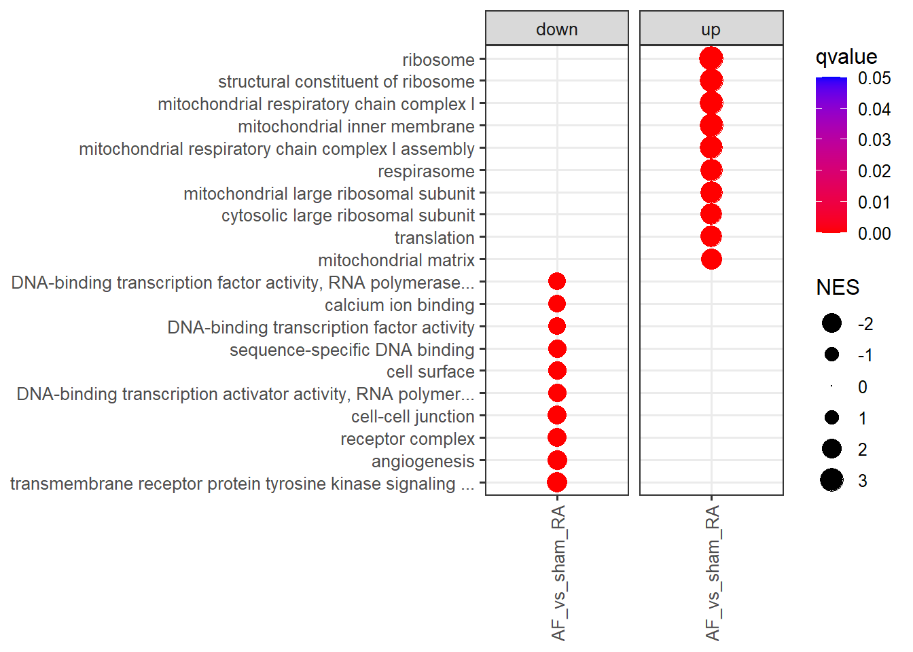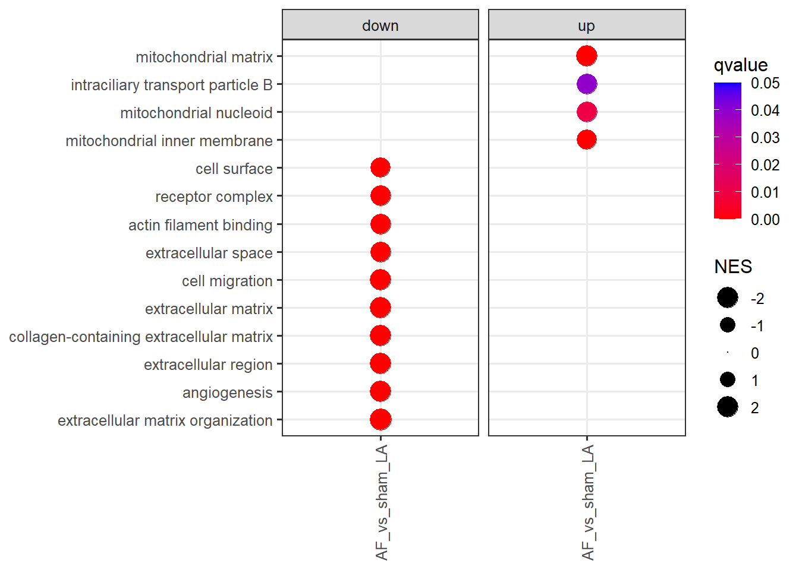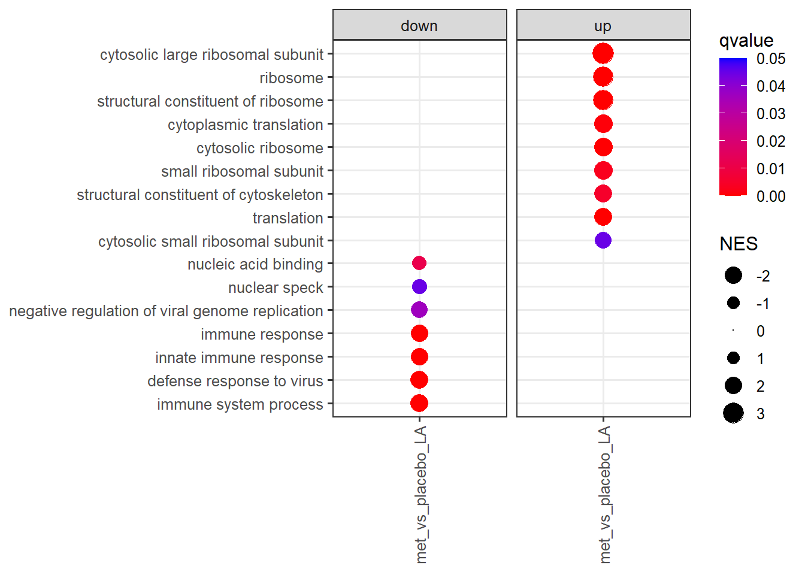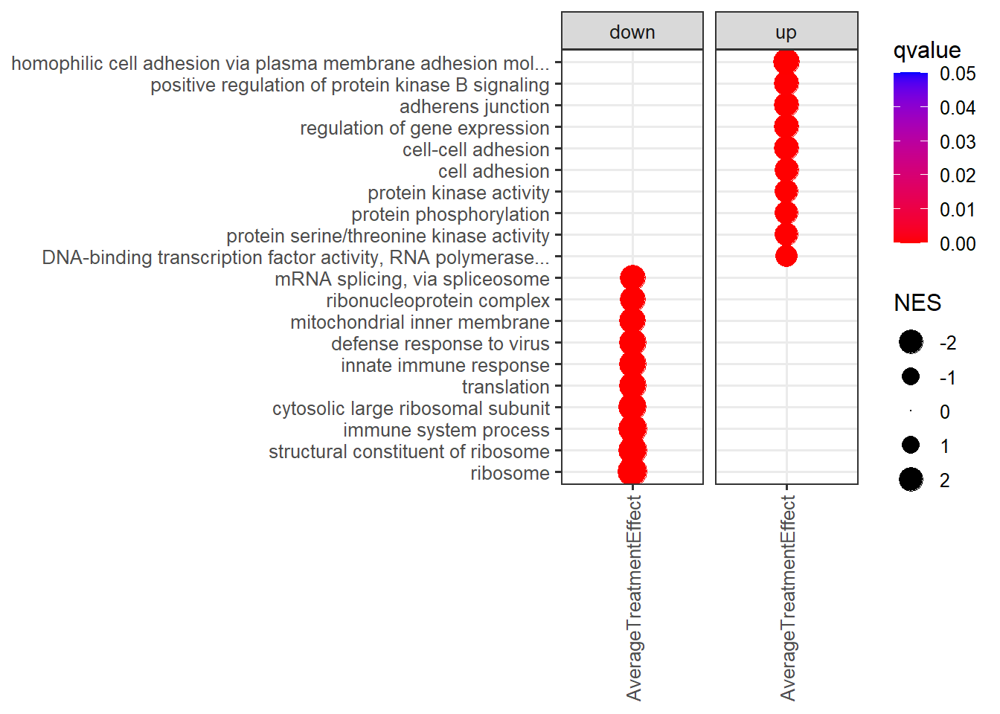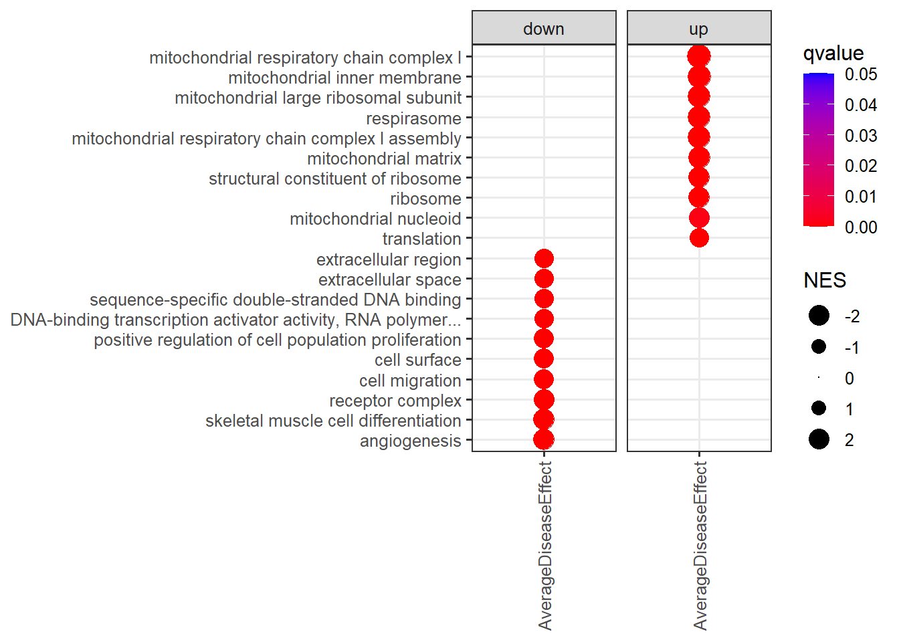

###Revigo - reduce redundant terms and plot

``` r
# Function to process GSEA data and submit to REVIGO, fetch results, and plot
process_gsea_data <- function(data, cutoff = 0.5, valueType = "pvalue", speciesTaxon = "0", measure = "Simrel", enrich_cut = 0.05) {
  # Filter significant terms and create submission string
  significant_terms <- data[p.adjust < 0.05, ]
  go_list_string <- paste(significant_terms$ID, significant_terms$p.adjust, sep=" ", collapse="\n")

  # Submit to Revigo and return job ID
  response <- POST("http://revigo.irb.hr/StartJob", body = list(
    cutoff = cutoff,
    valueType = valueType,
    speciesTaxon = speciesTaxon,
    measure = measure,
    goList = go_list_string
  ), encode = "form")
  job_id <- fromJSON(content(response, type = "text", encoding = "UTF-8"))$jobid

  # Wait for job completion
  running <- "1"
  while (running != "0") {
    response <- GET("http://revigo.irb.hr/QueryJob", query = list(jobid = job_id, type="jstatus"))
    running <- fromJSON(content(response, type = "text", encoding = "UTF-8"))$running
    Sys.sleep(1)
  }

  # Fetch and combine results from all namespaces
  namespaces <- c("1", "2", "3")
  results <- lapply(namespaces, function(ns) {
    response <- GET("http://revigo.irb.hr/QueryJob", query = list(jobid = job_id, namespace = ns, type = "table"))
    fread(text = content(response, type = "text", encoding = "UTF-8"))
  })
  combined_results <- rbindlist(results, use.names = TRUE, fill = TRUE)

  # Filter null terms and match with original data
  null_term_ids <- combined_results[Representative == "null", .(TermID)]
  reduced_terms <- data[ID %in% null_term_ids$TermID]

  # Plot results
  aamisc::dotplotEnrich(dt = reduced_terms, 
                topn = 10, 
                topn.pref = "qval", 
                qcut = enrich_cut, 
                nchar = 60, 
                direction = "direction",
                group = "Contrast", 
                dot = "NES", 
                qval = "qvalue", 
                term.id = "ID",
                term.name = "Description")
}

# Plot for LA and RA GO-GSEA
process_gsea_data(go_gsea_res_split[["AF_vs_sham_RA"]])
```


``` r
process_gsea_data(go_gsea_res_split[["AF_vs_sham_LA"]])
```

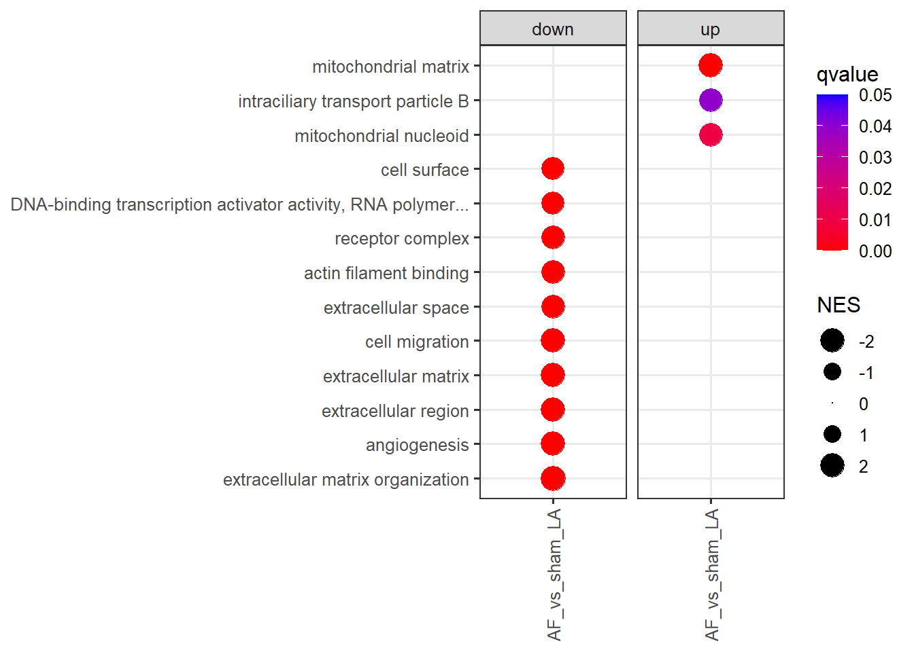

``` r
process_gsea_data(go_gsea_res_split[["met_vs_placebo_RA"]])
```

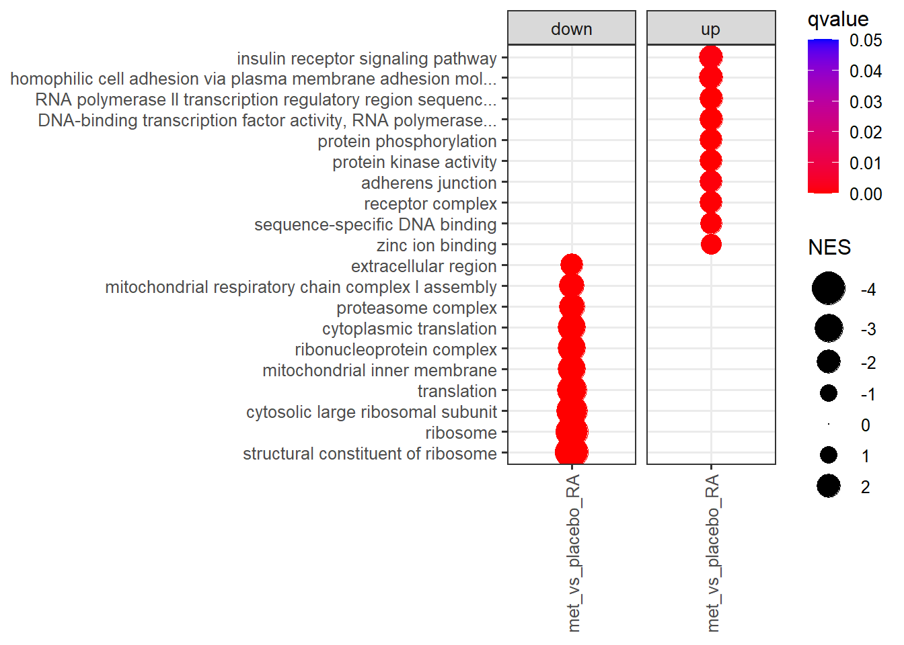

``` r
process_gsea_data(go_gsea_res_split[["met_vs_placebo_LA"]])
```

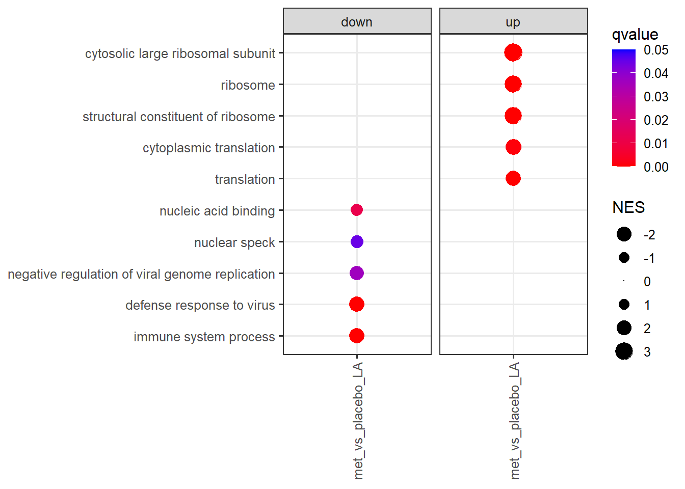

``` r
process_gsea_data(go_gsea_res_split[["AverageTreatmentEffect"]])
```

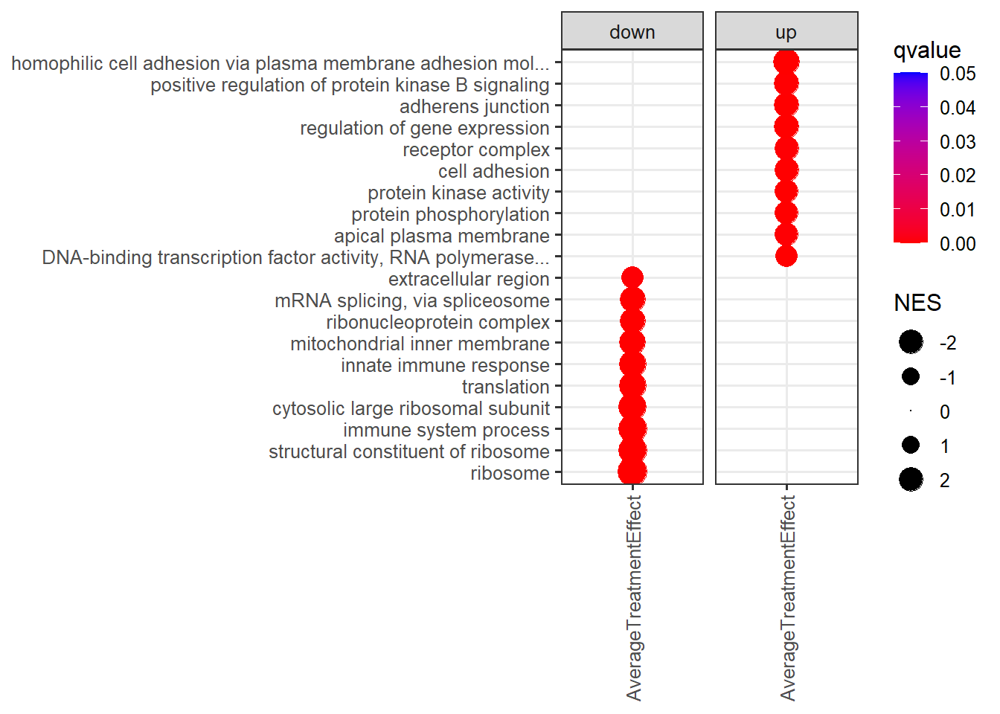

``` r
process_gsea_data(go_gsea_res_split[["AverageDiseaseEffect"]])
```

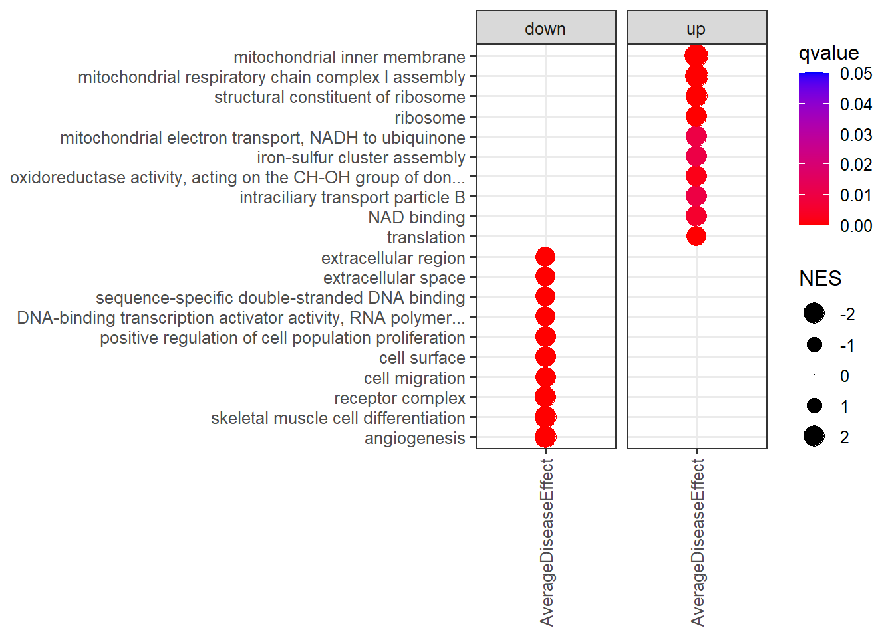

# KEGG
## ORA


``` r
KEGG_ora_all <- compareCluster(ENTREZID ~ Contrast, 
                          data          = dge_entrez[adj.P.Val < dge_cut,],
                          fun           = "enrichKEGG",
                          universe      = dge_entrez[, ENTREZID],
                          organism      = "ecb",
                          pAdjustMethod = "BH",
                          minGSSize     = 10,
                          maxGSSize     = 500,
                          pvalueCutoff  = enrich_cut,
                          qvalueCutoff  = enrich_cut)@compareClusterResult %>% setDT
KEGG_ora_all$Direction <- "all"
aamisc::moveMeDataTable(KEGG_ora_all, tomove = "Direction", where = "after", ba = "Contrast")
```

```
##                    Cluster               Contrast Direction
##  1:          AF_vs_sham_LA          AF_vs_sham_LA       all
##  2:          AF_vs_sham_RA          AF_vs_sham_RA       all
##  3:          AF_vs_sham_RA          AF_vs_sham_RA       all
##  4:          AF_vs_sham_RA          AF_vs_sham_RA       all
##  5:          AF_vs_sham_RA          AF_vs_sham_RA       all
##  6:          AF_vs_sham_RA          AF_vs_sham_RA       all
##  7:   AverageDiseaseEffect   AverageDiseaseEffect       all
##  8:   AverageDiseaseEffect   AverageDiseaseEffect       all
##  9:   AverageDiseaseEffect   AverageDiseaseEffect       all
## 10:   AverageDiseaseEffect   AverageDiseaseEffect       all
## 11: AverageTreatmentEffect AverageTreatmentEffect       all
## 12:      met_vs_placebo_RA      met_vs_placebo_RA       all
## 13:      met_vs_placebo_RA      met_vs_placebo_RA       all
## 14:      met_vs_placebo_RA      met_vs_placebo_RA       all
## 15:      met_vs_placebo_RA      met_vs_placebo_RA       all
## 16:      met_vs_placebo_RA      met_vs_placebo_RA       all
## 17:      met_vs_placebo_RA      met_vs_placebo_RA       all
## 18:      met_vs_placebo_RA      met_vs_placebo_RA       all
## 19:      met_vs_placebo_RA      met_vs_placebo_RA       all
## 20:      met_vs_placebo_RA      met_vs_placebo_RA       all
## 21:      met_vs_placebo_RA      met_vs_placebo_RA       all
## 22:      met_vs_placebo_RA      met_vs_placebo_RA       all
##                    Cluster               Contrast Direction
##                                 category                      subcategory
##  1:                           Metabolism          Carbohydrate metabolism
##  2: Environmental Information Processing              Signal transduction
##  3:                           Metabolism                Energy metabolism
##  4:                       Human Diseases                 Cancer: overview
##  5:                   Cellular Processes  Cellular community - eukaryotes
##  6: Environmental Information Processing              Signal transduction
##  7:                   Cellular Processes  Cellular community - eukaryotes
##  8:                           Metabolism          Carbohydrate metabolism
##  9:                                 <NA>                             <NA>
## 10:                           Metabolism          Carbohydrate metabolism
## 11:                   Organismal Systems         Environmental adaptation
## 12:       Genetic Information Processing                      Translation
## 13:                       Human Diseases        Neurodegenerative disease
## 14:                       Human Diseases        Neurodegenerative disease
## 15:                   Organismal Systems         Environmental adaptation
## 16:                       Human Diseases        Neurodegenerative disease
## 17:                       Human Diseases           Cardiovascular disease
## 18:                           Metabolism                Energy metabolism
## 19:                       Human Diseases        Neurodegenerative disease
## 20:                       Human Diseases        Neurodegenerative disease
## 21:                       Human Diseases           Cardiovascular disease
## 22:       Genetic Information Processing Folding, sorting and degradation
##                                 category                      subcategory
##           ID                                     Description GeneRatio  BgRatio
##  1: ecb00010                    Glycolysis / Gluconeogenesis     9/209  25/3577
##  2: ecb04022                      cGMP-PKG signaling pathway    30/622  85/3577
##  3: ecb00190                       Oxidative phosphorylation    20/622  53/3577
##  4: ecb05200                              Pathways in cancer    68/622 267/3577
##  5: ecb04510                                  Focal adhesion    36/622 121/3577
##  6: ecb04371                        Apelin signaling pathway    23/622  67/3577
##  7: ecb04510                                  Focal adhesion    40/638 121/3577
##  8: ecb00010                    Glycolysis / Gluconeogenesis    12/638  25/3577
##  9: ecb04820                    Cytoskeleton in muscle cells    40/638 136/3577
## 10: ecb00640                           Propanoate metabolism    11/638  22/3577
## 11: ecb04714                                   Thermogenesis    21/261 113/3577
## 12: ecb03010                                        Ribosome   55/1330  60/3577
## 13: ecb05020                                   Prion disease   68/1330 115/3577
## 14: ecb05016                              Huntington disease   76/1330 139/3577
## 15: ecb04714                                   Thermogenesis   61/1330 113/3577
## 16: ecb05010                               Alzheimer disease   90/1330 182/3577
## 17: ecb05415                         Diabetic cardiomyopathy   53/1330  98/3577
## 18: ecb00190                       Oxidative phosphorylation   32/1330  53/3577
## 19: ecb05014                   Amyotrophic lateral sclerosis   83/1330 170/3577
## 20: ecb05012                               Parkinson disease   60/1330 117/3577
## 21: ecb05412 Arrhythmogenic right ventricular cardiomyopathy   28/1330  47/3577
## 22: ecb03050                                      Proteasome   16/1330  23/3577
##           ID                                     Description GeneRatio  BgRatio
##           pvalue     p.adjust       qvalue
##  1: 6.019876e-06 1.649446e-03 1.552494e-03
##  2: 4.626506e-05 1.397205e-02 1.256462e-02
##  3: 3.112934e-04 3.390585e-02 3.049045e-02
##  4: 3.493273e-04 3.390585e-02 3.049045e-02
##  5: 4.597241e-04 3.390585e-02 3.049045e-02
##  6: 5.613552e-04 3.390585e-02 3.049045e-02
##  7: 2.916400e-05 8.807529e-03 8.104523e-03
##  8: 5.042469e-04 4.223274e-02 3.886178e-02
##  9: 5.059509e-04 4.223274e-02 3.886178e-02
## 10: 5.593741e-04 4.223274e-02 3.886178e-02
## 11: 4.626126e-05 1.193541e-02 1.017748e-02
## 12: 6.932518e-19 2.142148e-16 2.094350e-16
## 13: 9.955526e-07 1.538129e-04 1.503808e-04
## 14: 1.416727e-05 1.459229e-03 1.426669e-03
## 15: 1.638356e-04 1.265630e-02 1.237390e-02
## 16: 3.514135e-04 2.056908e-02 2.011012e-02
## 17: 4.112452e-04 2.056908e-02 2.011012e-02
## 18: 4.659662e-04 2.056908e-02 2.011012e-02
## 19: 9.835189e-04 3.748820e-02 3.665172e-02
## 20: 1.091889e-03 3.748820e-02 3.665172e-02
## 21: 1.407175e-03 4.348170e-02 4.251149e-02
## 22: 1.590716e-03 4.468467e-02 4.368762e-02
##           pvalue     p.adjust       qvalue
##                                                                                                                                                                                                                                                                                                                                                                                                                                                                                                                                                                                                                                                                                                                                                                                                                                                                                                                            geneID
##  1:                                                                                                                                                                                                                                                                                                                                                                                                                                                                                                                                                                                                                                                                                                                                                                                                                                     100070818/100073165/100065115/100057725/100033997/100052671/100063687/100034116/100050920
##  2:                                                                                                                                                                                                                                                                                                                                                                                                                                                                                                                                                                                                                      100056559/100055231/100073014/100055447/100063339/100052496/100054961/100053312/100065153/100034056/100057315/100069551/100055407/100070482/100062810/100062972/100054305/100146249/100053019/100062779/100069474/100070498/100060005/100064234/100071324/791234/100033875/100058160/100053856/100049920
##  3:                                                                                                                                                                                                                                                                                                                                                                                                                                                                                                                                                                                                                                                                                                                       100065070/100053634/111767815/100057698/100068855/100069079/100064992/100070815/100057691/100067936/100053347/100052802/100630758/100058223/100052131/100051878/100629334/106783042/100146660/100052170
##  4:                                                                                                                                                                                                                       100063598/100067469/100059388/100068622/100055447/100053898/100066148/100058245/100060112/100146771/100069015/100054961/100064559/100071403/100066875/100068636/100057483/100034056/100064056/100054545/100066264/100051360/100057315/100058549/100053784/100068764/100069715/100055407/100062972/100054305/100146215/100033960/100146791/100072356/100058514/100055241/100060371/100073195/100055238/100066282/100070498/100060005/100059157/100147353/102150569/100070283/100050351/100056042/100070861/100059178/100069613/100064289/100050465/100061273/100054274/100049850/100050377/100009704/100068065/100055626/100061244/100060902/100062485/100050227/100051000/100066590/100033875/100049872
##  5:                                                                                                                                                                                                                                                                                                                                                                                                                                                                                                                                                       100056559/100057963/100033959/100067469/100055447/100066148/100058245/100060112/100009713/100054961/100066343/100073261/100066875/100034056/100064056/100054545/100066264/100070482/100059655/100069527/100055697/100051266/100072356/100055241/100055238/100066282/100070283/100063668/100061273/100064165/100058256/100050227/100066590/100051370/100058160/100055975
##  6:                                                                                                                                                                                                                                                                                                                                                                                                                                                                                                                                                                                                                                                                                         102147730/100056559/100063339/100055716/100146771/100051252/100073098/100054961/100056933/100053312/100065153/100057315/100055407/100070482/100062810/100062972/100054305/100067014/100053019/100062779/100070498/100064289/100064234
##  7:                                                                                                                                                                                                                                                                                                                                                                                                                                                                                                               100057963/100067469/100033959/100055447/100060112/100009713/100066343/100051266/100056559/100058245/100066148/100050227/100054961/100073261/100054545/100051370/100058160/100066875/100066282/100059655/100061273/100073067/100053070/100063668/100064056/100070482/100072356/100055238/100056202/100070283/100034056/100051679/102149085/100055241/100058256/100052025/100069527/100055975/100066264/100057478
##  8:                                                                                                                                                                                                                                                                                                                                                                                                                                                                                                                                                                                                                                                                                                                                                                                                       100057725/100070818/100033997/100052671/100065115/100073165/100063687/100054562/100033897/100050920/100034116/100053339
##  9:                                                                                                                                                                                                                                                                                                                                                                                                                                                                                                               100056473/100073014/100055231/100066500/100060112/100055451/100009713/100052695/100051266/100056943/100071234/100059687/100066148/100059397/100066945/100073261/100065641/100054545/100062708/100057663/102148544/100054194/100051203/100054482/100063967/100073067/100055812/100064056/100064021/100056202/100070700/100066038/100057678/100051679/100071760/100055363/100066264/100057478/100071701/100066334
## 10:                                                                                                                                                                                                                                                                                                                                                                                                                                                                                                                                                                                                                                                                                                                                                                                                                 100057725/100070049/100033997/100147113/100054562/100050920/100059601/100051470/100071381/100061000/100071472
## 11:                                                                                                                                                                                                                                                                                                                                                                                                                                                                                                                                                                                                                                                                                                                100034095/100034159/100063125/100066615/106783320/100064992/100053634/100052205/100065070/100055716/100051878/100064828/100068855/100053889/102150457/100064473/100630758/807849/100052131/100051125/100064440
## 12:                                                                                                                                                                                                                                                                                                                                                         111770632/100058163/100050007/100054974/100630373/100067678/100052055/100071885/100630744/111774431/100069911/100060920/100050572/100052525/100068442/111774189/100052531/100054027/100052952/100034008/100066211/100629497/100055298/100068030/100065572/100052668/100073005/100070944/100057320/100050173/100072913/100051780/100055593/100055584/100051571/100064489/100055400/100062602/100034005/100630893/100060177/100033985/100059868/100059037/100055158/100071004/100064378/100053273/100054560/100059927/111771932/100055367/111771933/111771923/100063102
## 13:                                                                                                                                                                                                                          100052131/100064992/100065070/100058141/100064557/100067317/100053634/100058223/100055447/100051798/100051878/100055269/100068855/111767815/100066388/100064828/100630758/100067363/100072870/100064131/100057691/100067936/100063168/100064192/106783042/100057623/100057701/100052170/100053347/100058658/807849/100070815/100072862/100069978/100055325/100050987/100147612/111775959/100068764/100057828/100629515/100051409/100065904/100071136/100064293/100050227/100051787/100068477/100062573/100051840/100065940/100069079/100054674/100061457/100057357/100058097/100052552/100055290/100067434/100055100/100629334/100053304/100057698/100053958/100052828/100066330/100053417/100050036
## 14:                                                                                                                                          100629527/100063136/100052131/100064992/100065070/100055716/100067317/100055626/100053634/100058223/100051798/100051878/100068855/111767815/100066388/100064828/100061280/100055375/100069613/100630758/100051558/100068546/100058152/100067363/100072870/100064131/100054652/100057691/100067936/100063168/100064192/106783042/100064339/100057623/100052170/100053347/100058961/100073154/807849/100070815/100069978/100055325/100050327/100054935/100050987/100051341/100147612/100059115/100058618/111775959/100057828/100052647/100629515/100050368/100064447/100051409/100052064/100068882/100064293/100062689/100068477/100062573/100051840/100065940/100069079/100054674/100061457/100052552/100055290/100069214/100629334/100057698/100053958/100061177/100066330/100050036
## 15:                                                                                                                                                                                                                                                                                                100034159/100034095/100066615/100052131/100064992/100065070/106783320/100055716/100052205/100053634/100064473/100053889/100058223/100063288/100051878/100068855/111767815/100066388/100064828/100066282/100051125/100066046/100630758/100064131/100063125/100064440/100057691/100067936/100063168/106783042/100057623/100052170/100053347/100055250/807849/100070815/100061001/102150457/100056933/100071048/100060721/100053005/100069978/100070498/100064650/100051341/111775959/100056521/100629515/100058911/100054459/100065940/100069079/100057925/100009716/100629334/100053304/100063169/100057698/100052828/100066330
## 16: 100066248/100033897/100063136/100063409/100050465/100052131/100064992/100065070/100058141/100064431/100064557/791242/100067317/100066612/100053634/100064473/100058223/100055447/100051798/100051878/100068855/111767815/111773414/100630758/100051558/100065760/100067363/100072870/100064131/100054652/100057691/100067936/100063168/100064192/106783042/100064339/100057623/100057701/100052170/100053347/100058658/100073154/807849/100146215/100070815/100054961/100072862/100053161/100069978/100055358/100055325/100050327/100050987/100051341/100147612/111775959/100057828/100052647/100146878/100629515/100051409/100064293/100051106/100062689/100050227/100068477/100060556/100062573/100051840/100065940/100071137/100147463/100069079/100147353/100061457/100057357/100052552/100055290/100067434/100629334/100072684/100057698/100146249/100053958/100065481/100066330/100053417/100052385/100068314/100050036
## 17:                                                                                                                                                                                                                                                                                                                                                                                   100049840/100066248/100060791/100061157/100629527/100033897/100630668/100052131/100064992/100065070/100058141/100051815/791242/100053634/100058223/100051798/100051878/100059233/100068855/111767815/100630758/100051558/100064131/100057691/100067936/100063168/106783042/100057623/100052170/100053347/100063318/807849/100070815/100049847/100054961/100147514/100052078/100069978/100059734/100051341/111775959/100629515/100050227/100051787/100065940/100069079/100063339/100629334/100072684/100057698/100034117/100066330/100050036
## 18:                                                                                                                                                                                                                                                                                                                                                                                                                                                                                                                                                                                                  100052131/100064992/100065070/100053634/100058223/100051878/100068855/111767815/100630758/100064131/100057691/100067936/100063168/106783042/100057623/100052170/100053347/807849/100070815/100060721/100069978/100052659/111775959/100629515/100073049/100065940/100052802/100069079/100629334/100057698/100053958/100066330
## 19:                                                                    100060826/100052131/100066679/100064992/100065070/100059114/100067317/100053634/100629759/100058223/100055447/100051878/100068855/111767815/111773414/100066250/100630758/100068546/100067363/100072870/100064131/100054652/100057691/100067936/100063168/100049850/100146715/100064192/106783042/100064339/100057623/100050558/100052170/100053347/100073154/807849/100070815/100050934/100072862/102149448/100069978/100061295/100055325/100060547/100066078/100050327/100050987/100061320/100051341/100147612/111775959/100057828/100052647/100629515/100050368/100051409/100052064/100064293/100065427/100062689/100068477/100062573/100051840/100065940/100069079/100052986/100064995/100054674/100061457/100051482/100057357/100050182/100052552/100055290/100067434/100068507/100629334/100057698/100053958/100061177/100066330/100053417/100056253
## 20:                                                                                                                                                                                                                                                                                                          100052131/100064992/100065070/100064557/100067317/100053634/100058223/100051798/100051878/100068855/111767815/111773414/100630758/100067363/100072870/100064131/100057691/100067936/100063168/100064192/106783042/100064339/100057623/100052170/100053347/807849/100070815/100052123/100053161/100069978/100070498/100055325/100050987/100147612/111775959/100055966/100057828/100146878/100629515/100051409/100064293/100068477/100062573/100051840/100065940/100147463/100069079/100054674/100061457/100052552/100055290/100070545/100629334/100057698/100053958/100052828/100066330/100053417/100052385/100050036
## 21:                                                                                                                                                                                                                                                                                                                                                                                                                                                                                                                                                                                                                                          100062915/100057533/100059936/100033870/100066038/100034157/791242/100051515/100061514/100052566/100065078/100063434/100053150/100055971/100054374/100056285/100068995/100066500/100065829/100051367/100055024/100064056/100057663/100073067/100069074/100067427/100072684/100050428
## 22:                                                                                                                                                                                                                                                                                                                                                                                                                                                                                                                                                                                                                                                                                                                                                               100067317/100067363/100072870/100066381/100051789/100064192/100055325/100050987/100147612/100057828/100051409/100064293/100068477/100062573/100061457/100052481
##                                                                                                                                                                                                                                                                                                                                                                                                                                                                                                                                                                                                                                                                                                                                                                                                                                                                                                                            geneID
##     Count
##  1:     9
##  2:    30
##  3:    20
##  4:    68
##  5:    36
##  6:    23
##  7:    40
##  8:    12
##  9:    40
## 10:    11
## 11:    21
## 12:    55
## 13:    68
## 14:    76
## 15:    61
## 16:    90
## 17:    53
## 18:    32
## 19:    83
## 20:    60
## 21:    28
## 22:    16
##     Count
```

``` r
KEGG_ora_upDown <- compareCluster(ENTREZID ~ Contrast + Direction, 
                             data          = dge_entrez[adj.P.Val < dge_cut,],
                             fun           = "enrichKEGG",
                             universe      = dge_entrez[, ENTREZID],
                             organism      = "ecb",
                             pAdjustMethod = "BH",
                             pvalueCutoff  = enrich_cut,
                             qvalueCutoff  = enrich_cut)@compareClusterResult %>% setDT

KEGG_ora <- rbindlist(list(KEGG_ora_all, KEGG_ora_upDown))
fwrite(x = KEGG_ora, file = "../output/kegg_ora.tsv.gz", sep = "\t")

KEGG_ora_split <- split(KEGG_ora, f = KEGG_ora$Contrast)
openxlsx::write.xlsx(x = KEGG_ora_split, file = "../output/kegg_ora.xlsx", asTable = TRUE)

# Plot results
aamisc::dotplotEnrich(dt = KEGG_ora, 
                      topn = 10, 
                      topn.pref = "qval", 
                      qcut = enrich_cut, 
                      nchar = 60, 
                      direction = "Direction", 
                      group = "Contrast", 
                      dot = "GeneRatio", 
                      qval = "qvalue", 
                      term.id = "ID",
                      term.name = "Description")
```

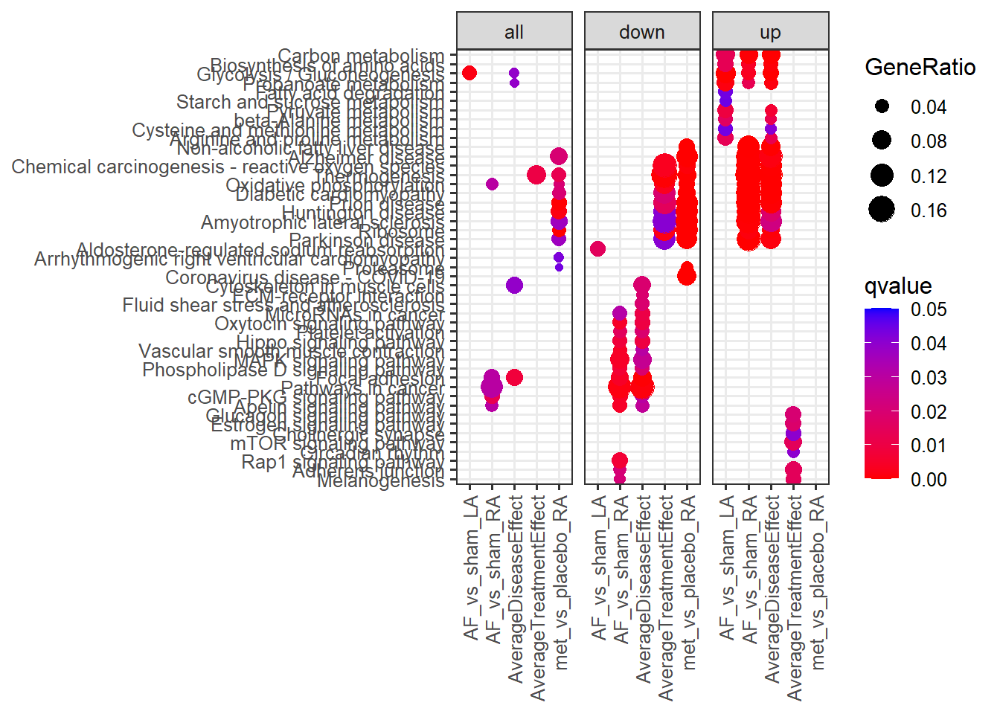

``` r
# Plot seperate regions
filtered_KEGG_ora  <- KEGG_ora  %>% 
  filter(Direction != "all")

aamisc::dotplotEnrich(dt = filtered_KEGG_ora %>% 
                        filter(Contrast == "AF_vs_sham_RA"), 
                      topn = 10, 
                      topn.pref = "qval", 
                      qcut = enrich_cut, 
                      nchar = 60, 
                      direction = "Direction", 
                      group = "Contrast", 
                      dot = "GeneRatio", 
                      qval = "qvalue", 
                      term.id = "ID",
                      term.name = "Description")
```

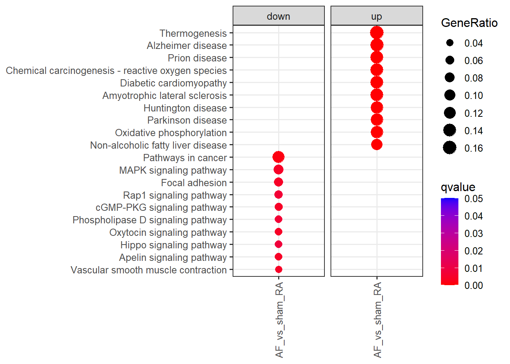

``` r
aamisc::dotplotEnrich(dt = filtered_KEGG_ora %>% 
                        filter(Contrast == "AF_vs_sham_LA"), 
                      topn = 10, 
                      topn.pref = "qval", 
                      qcut = enrich_cut, 
                      nchar = 60, 
                      direction = "Direction", 
                      group = "Contrast", 
                      dot = "GeneRatio", 
                      qval = "qvalue", 
                      term.id = "ID",
                      term.name = "Description")
```


``` r
aamisc::dotplotEnrich(dt = filtered_KEGG_ora %>% 
                        filter(Contrast == "met_vs_placebo_RA"), 
                      topn = 10, 
                      topn.pref = "qval", 
                      qcut = enrich_cut, 
                      nchar = 60, 
                      direction = "Direction", 
                      group = "Contrast", 
                      dot = "GeneRatio", 
                      qval = "qvalue", 
                      term.id = "ID",
                      term.name = "Description")
```

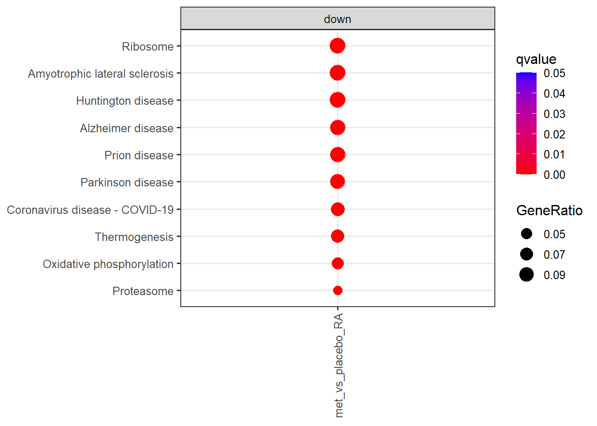

``` r
aamisc::dotplotEnrich(dt = filtered_KEGG_ora %>% 
                        filter(Contrast == "AverageTreatmentEffect"), 
                      topn = 10, 
                      topn.pref = "qval", 
                      qcut = enrich_cut, 
                      nchar = 60, 
                      direction = "Direction", 
                      group = "Contrast", 
                      dot = "GeneRatio", 
                      qval = "qvalue", 
                      term.id = "ID",
                      term.name = "Description")
```

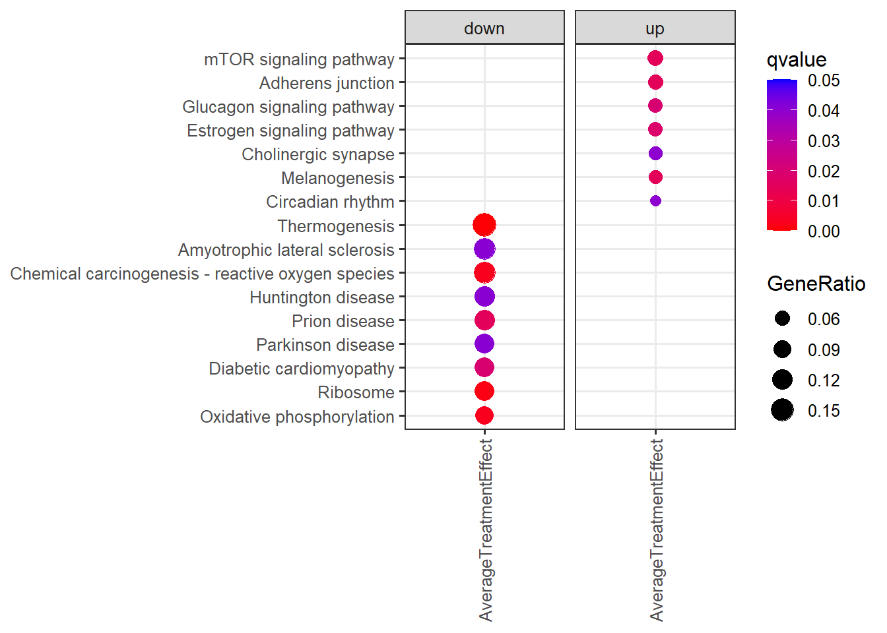

``` r
aamisc::dotplotEnrich(dt = filtered_KEGG_ora %>% 
                        filter(Contrast == "AverageDiseaseEffect"), 
                      topn = 10, 
                      topn.pref = "qval", 
                      qcut = enrich_cut, 
                      nchar = 60, 
                      direction = "Direction", 
                      group = "Contrast", 
                      dot = "GeneRatio", 
                      qval = "qvalue", 
                      term.id = "ID",
                      term.name = "Description")
```


## GSEA 

``` r
dge_split <- split(dge_entrez, f = dge_entrez$Contrast)
kegg_gsea <- list()

for (i in names(dge_split)){
  geneList <- dge_split[[i]]$logFC
  names(geneList) <- dge_split[[i]]$ENTREZID
  geneList <- sort(geneList, decreasing = TRUE)
  
  kegg_gsea[[i]] <-  gseKEGG(geneList     = geneList,
                        organism     = 'ecb',
                        pvalueCutoff = enrich_cut,
                        minGSSize = 10, 
                        maxGSSize = 500, 
                        eps = 0, 
                        nPermSimple = 10000, # TODO: set it to 1 million for robust results
                        verbose      = TRUE
                        )@result %>% setDT
  kegg_gsea[[i]][, Direction := ifelse(test = NES > 0, yes = "up", no = "down"), ]
  kegg_gsea[[i]]$Contrast <- i
}
```

```
## preparing geneSet collections...
```

```
## GSEA analysis...
```

```
## Warning in preparePathwaysAndStats(pathways, stats, minSize, maxSize,
## gseaParam, : There are duplicate gene names, fgsea may produce unexpected
## results.
```

```
## leading edge analysis...
```

```
## done...
```

```
## preparing geneSet collections...
```

```
## GSEA analysis...
```

```
## Warning in preparePathwaysAndStats(pathways, stats, minSize, maxSize,
## gseaParam, : There are duplicate gene names, fgsea may produce unexpected
## results.
```

```
## leading edge analysis...
```

```
## done...
```

```
## preparing geneSet collections...
```

```
## GSEA analysis...
```

```
## Warning in preparePathwaysAndStats(pathways, stats, minSize, maxSize,
## gseaParam, : There are duplicate gene names, fgsea may produce unexpected
## results.
```

```
## leading edge analysis...
```

```
## done...
```

```
## preparing geneSet collections...
```

```
## GSEA analysis...
```

```
## Warning in preparePathwaysAndStats(pathways, stats, minSize, maxSize,
## gseaParam, : There are duplicate gene names, fgsea may produce unexpected
## results.
```

```
## leading edge analysis...
```

```
## done...
```

```
## preparing geneSet collections...
```

```
## GSEA analysis...
```

```
## Warning in preparePathwaysAndStats(pathways, stats, minSize, maxSize,
## gseaParam, : There are duplicate gene names, fgsea may produce unexpected
## results.
```

```
## leading edge analysis...
```

```
## done...
```

```
## preparing geneSet collections...
```

```
## GSEA analysis...
```

```
## Warning in preparePathwaysAndStats(pathways, stats, minSize, maxSize,
## gseaParam, : There are duplicate gene names, fgsea may produce unexpected
## results.
```

```
## leading edge analysis...
```

```
## done...
```

``` r
openxlsx::write.xlsx(x = kegg_gsea, file = "../output/kegg_gsea.xlsx", asTable = TRUE)
kegg_gsea <- rbindlist(kegg_gsea)
fwrite(x = kegg_gsea, file = "../output/kegg_gsea.tsv.gz", sep = "\t")

#Output data
kegg_gsea_res_split <- split(kegg_gsea, f = kegg_gsea$Contrast)

# Loop through each contrast and plot results for kegg_gsea_res_split
for (contrast in contrasts) {
  # Check if the contrast exists in the split data
  if (contrast %in% names(kegg_gsea_res_split)) {
    dt <- kegg_gsea_res_split[[contrast]]
    
    # Check if there are significant terms
    if (nrow(dt) > 0) {
      print(aamisc::dotplotEnrich(dt = dt, 
                                  topn = 10, 
                                  topn.pref = "qval", 
                                  qcut = enrich_cut, 
                                  nchar = 60, 
                                  direction = "Direction", 
                                  group = "Contrast", 
                                  dot = "NES", 
                                  qval = "qvalue", 
                                  term.id = "ID",
                                  term.name = "Description"))
    } else {
      message(paste("No significant terms for contrast:", contrast))
    }
  } else {
    message(paste("Contrast not found in the data:", contrast))
  }
}
```

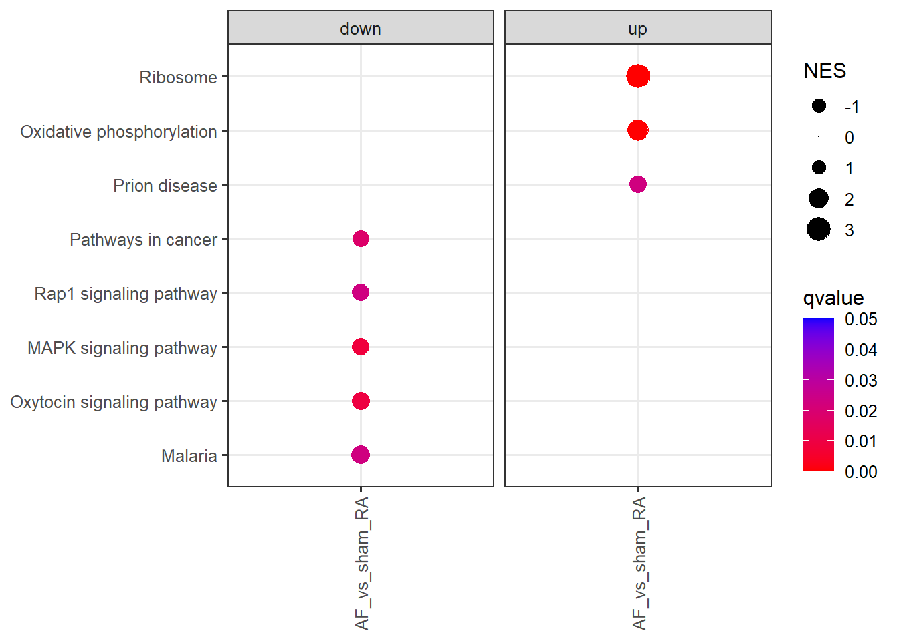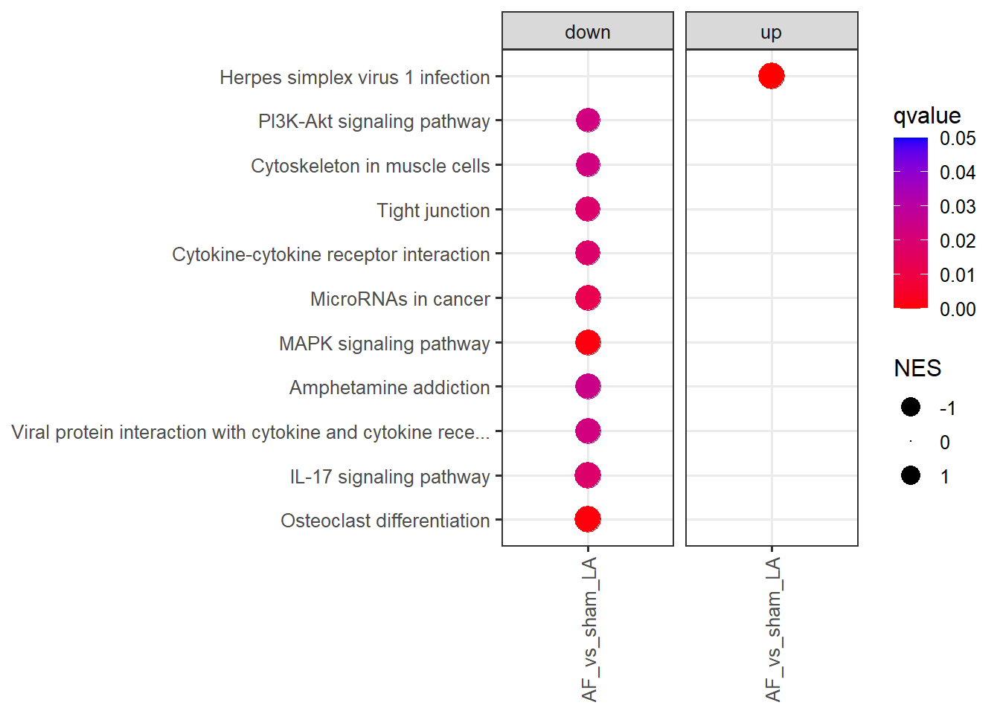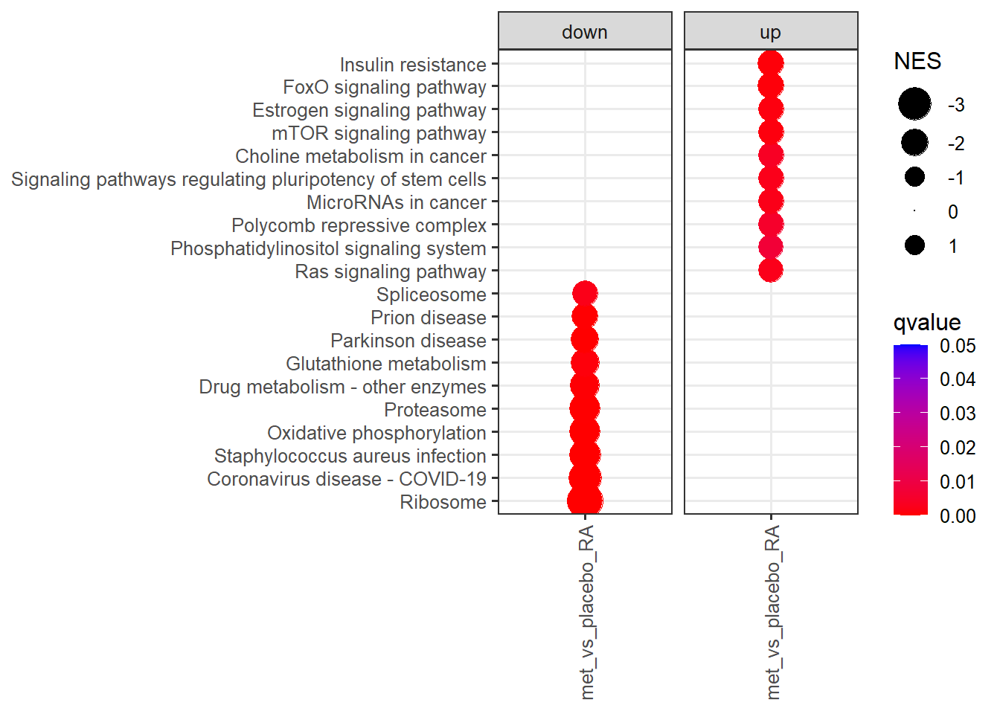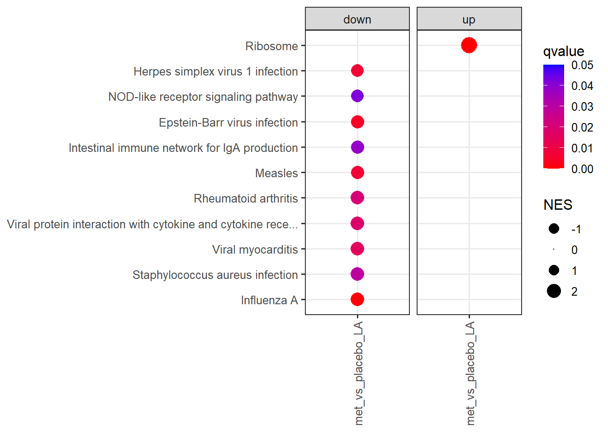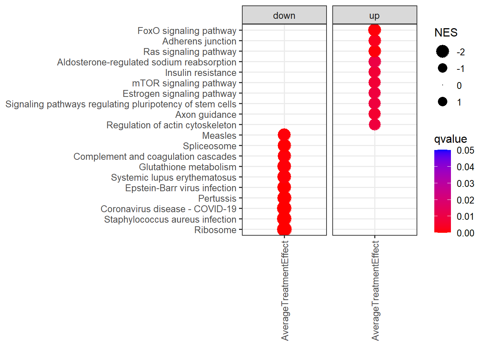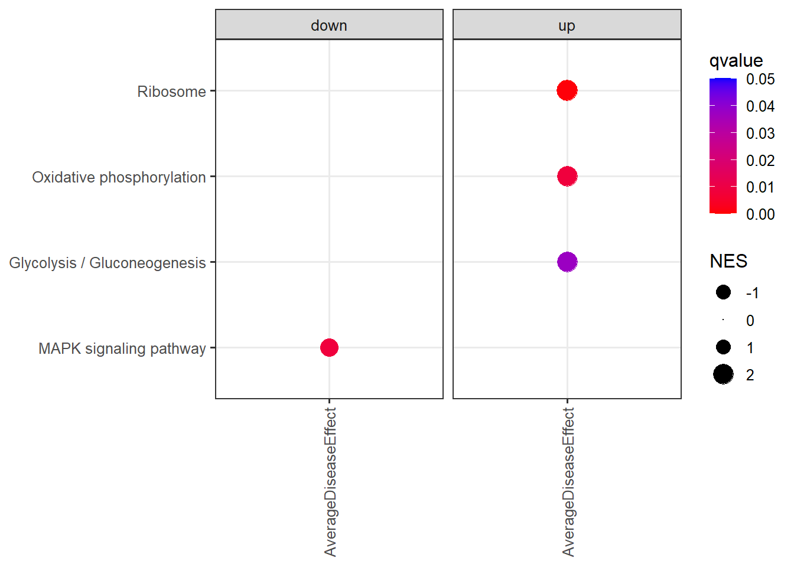


# Verdict
There were multiple enrichments observed in GO and KEGG pathways (not wiki), in particular in RA, where multiple genes exhibited differential expression, using obth ORA and GSEA. 


